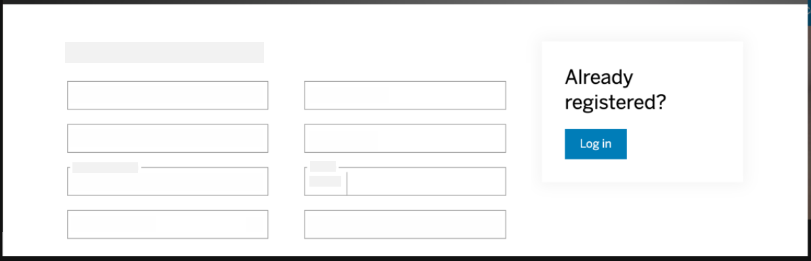
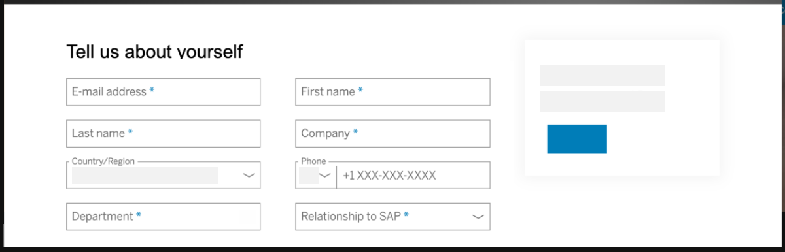
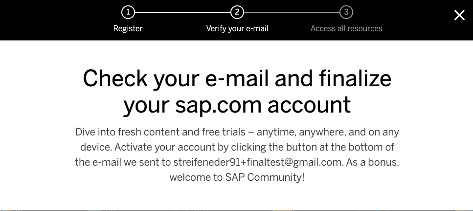
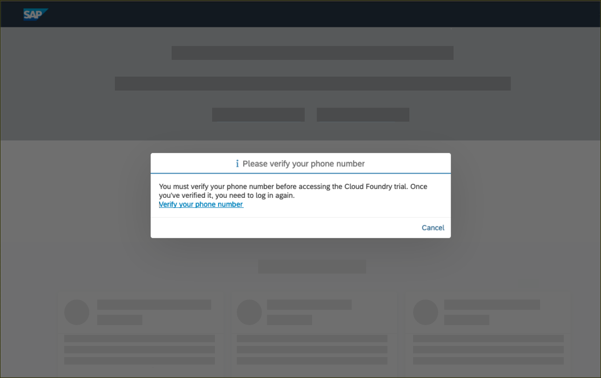
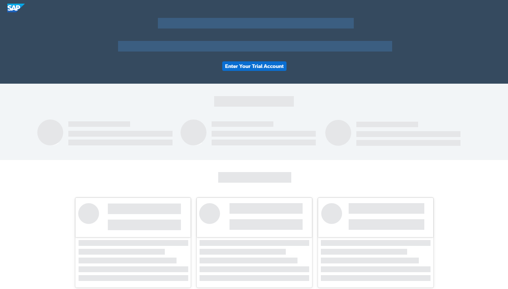
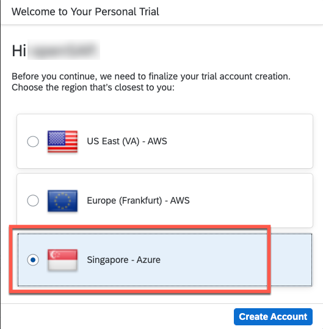
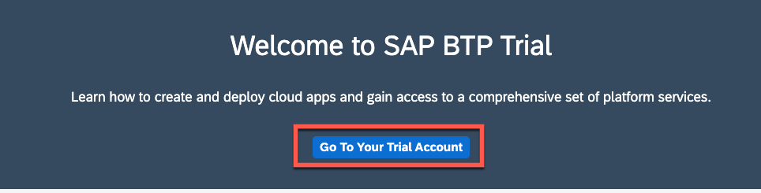
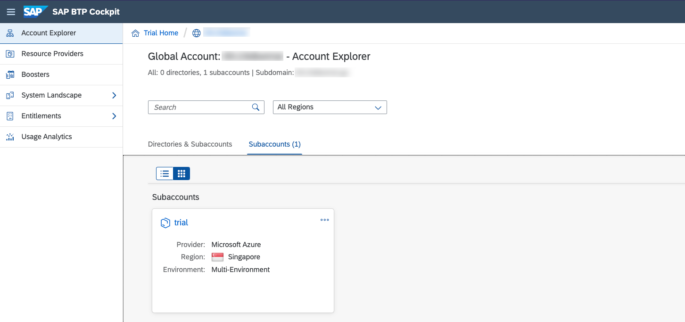

This exercise is part of the openSAP course [Building applications on SAP Business Technology Platform with Microsoft services](https://open.sap.com/courses/btpma1) - there you will find more information and context. 

# Setting up SAP BTP Trial

The objective of the exercise is to create a SAP BTP Trial account that you can further use throughout this course and beyond. 

If you already have an SAP BTP Trial account, you don't need to create a new one or move its content to a subaccount in another region! You can then skip this whole unit.

## Problems
> If you have any issues with the exercises, don't hesitate to open a question in the openSAP Discussion forum for this course. Provide the exact step number: "Week2Unit1, Step 1.1: Command cannot be executed. My expected result was [...], my actual result was [...]". Logs, etc. are always highly appreciated. 
 

## Step 1 - Setting up BTP Trial

In this unit we lay the foundation for the other weeks in this course. You will frequently use SAP Business Technology Platform services that are part of the SAP Business Technology Platform Trial. In the following you will create your own trial account. 

---

**IMPORTANT:** If you already have an SAP BTP Trial account, you don't need to create a new one or move its content to a subaccount in another region! You can then skip this whole unit. 

1.1 Visit [SAP Log On Screen](https://www.sap.com) and click the Log On icon in the upper-right corner.

> **IMPORTANT: In Week 4 of this openSAP course you will register for an SAP Analytics Cloud trial account - these can only be created with sap.com accounts and ensure you’re using a business email. In case you have a sap.com account with a Gmail or Yahoo mail address, we advise you to create a new one with a business email ID** 

> If you don’t need to register with sap.com, you can skip to Step 1.4. 

1.2 <a name="btptrial">If you don’t have an account you will see a register dialog on the left-hand side of the dialog. Fill in the required fields, and click Submit.</a>

You will see a message that an activation link has been sent to you.

1.3 Check your emails to find the activation button **Click to activate your account**.

You will see a success message after activating your account.

1.4 After activation, or if you already had an SAP account, go to the [SAP BTP Trial page](https://account.hanatrial.ondemand.com/) and click **Log On**.

You will see an dialog to confirm the terms and condition for the SAP BTP Trial. **Check the check boxes** and click **Accept**. This simply adds the SAP.com registration to your login account on SAP Cloud Identity.

1.5 Enter your phone number and click **New Code** to retrieve a code. Please enter this code and click **Continue** to verify your account. After the verification, you will be logged off automatically.

1.6 Click on **Log on** to log on to your verified account.

You will see one main button on the welcome screen of the SAP BTP Cockpit. Click on **Enter Your Trial Account** to navigate to your global account.

> Bookmark the link for fast and quick access to the cockpit.

1.7 Here, you can now create a subaccount that lives in a geographic region. Choose **Singapore - Azure** from this list and click **Create Account** to trigger the provisioning process.

1.8 You will then see a dialog box while the account is set up. When complete, click **Continue** to close to popup and to navigate to the new account.

1.9 Select **Go To Your Trial Account**. 

1.10 The global trial account contains **one** subaccount and space. Navigate to subaccount by clicking on the tile named **trial** (this name may vary if you created the subaccount manually).

> Make yourself familiar with the [basic concepts of SAP Business Technology Platform](https://developers.sap.com/tutorials/cp-trial-quick-onboarding.html) to make the most of your trial experience.

This page will display the current state of the subaccount. You can manage your subscriptions and jump into the different runtime environments. It also shows you fundamental information of the Cloud Foundry environment, such as the API endpoint and the available spaces.

## Summary

Congratulations! You have succesfully created your personal SAP BTP trial account! You will use this account through the next weeks of this course to build custom extension scenarios, integration scenarios and data-to-value scenarios.
