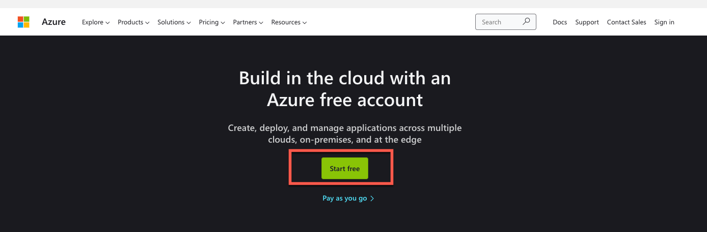
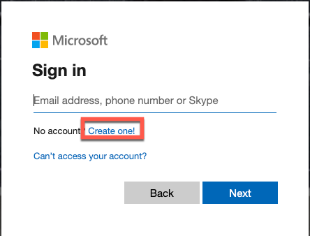
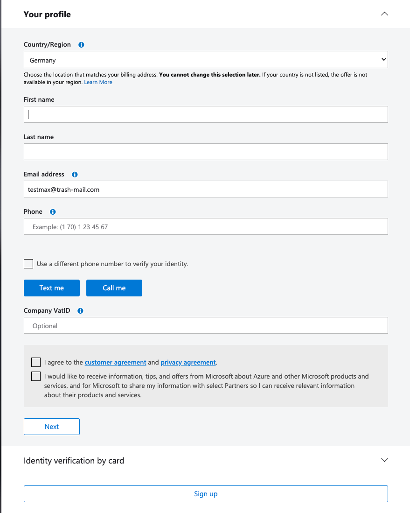
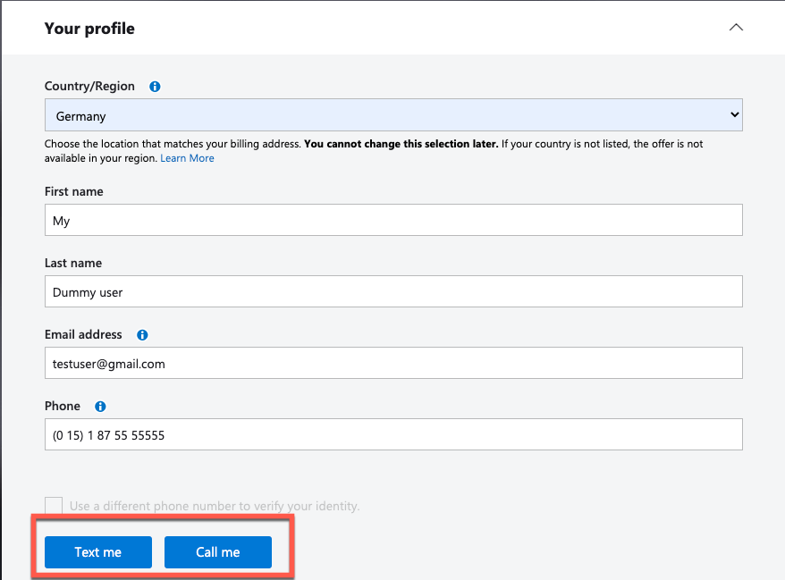
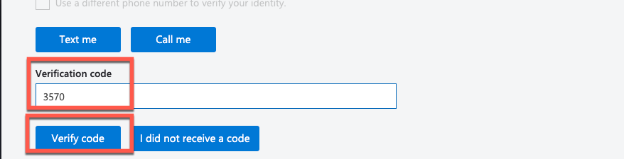
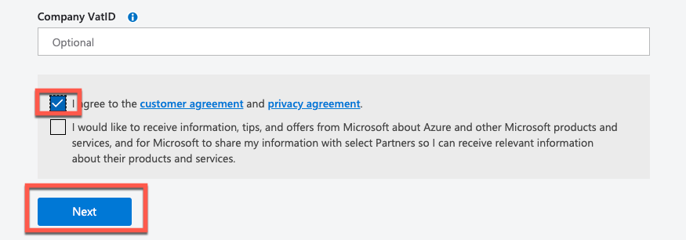
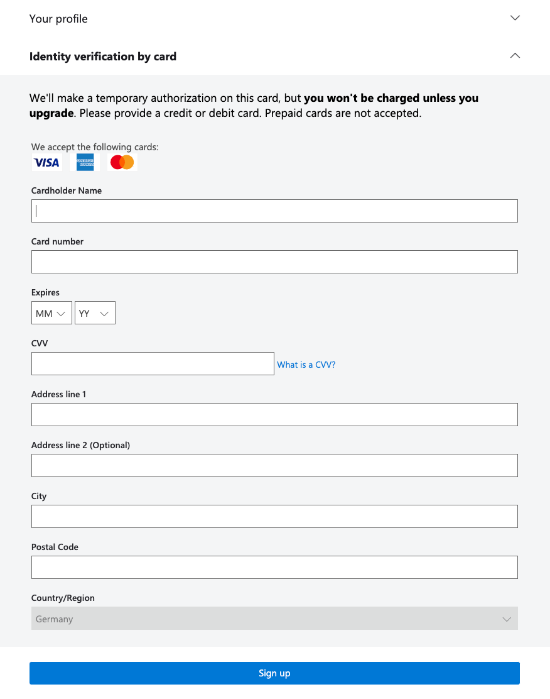
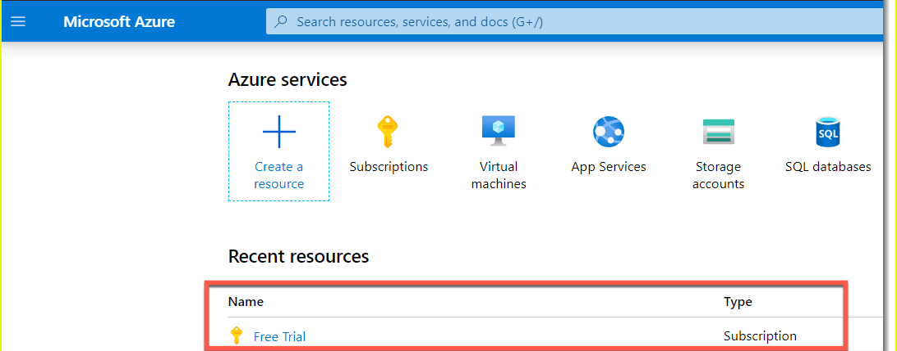

This exercise is part of the openSAP course [Building applications on SAP Business Technology Platform with Microsoft services](https://open.sap.com/courses/btpma1) - there you will find more information and context. 

# Setup Free Microsoft Azure Account

The objective of the exercise is to create a free Microsoft Azure subscription that you will use throughout this course for various tasks. 

**Do not use your corporate email address for this openSAP course, as you may have limited permissions in the associated Subscription or Azure Active Directory Tenant.**

Important: There are no costs involved! Even if your credit card information is required, it will only be used to verify your identity and to check whether you have already received Free Credits before. Your credit card will not be charged!

## Problems
> If you have any issues with the exercises, don't hesitate to open a question in the openSAP Discussion forum for this course. Provide the exact step number: "Week2Unit1, Step 1.1: Command cannot be executed. My expected result was [...], my actual result was [...]". Logs, etc. are always highly appreciated. 
 

## Step 1 - Create a new Azure Account

1.1 Visit <https://azure.microsoft.com/en-us/free/> and click the **Start free** button.

1.2 Register for a new account. If you already have a Microsoft account (e.g. Outlook.com), just log on with this user. Otherweise hit **Create one!** to create a new account.

1.3 Use your **personal** (e.g. outlook.com, gmail.com) mail adress and proceed through the next steps where you will be asked to define a password and provide your birth date.

**IMPORTANT: Using your corporate mail address will most likely cause issues later on when it comes to permissions in the Azure Active Directory your company might already have in place. That's why we highly recommend using your personal accounts!**

## Step 2 - Provide Personal Information

2.1 You will then be redirected to a page where more information about you is requested in four sections. Enter the following mandatory information and click on Next:
- Country
- First name
- Last name
- email address
- Phone

2.2 Entering the mobile phone number enables the mandatory multi-factor authentication at a later date. Make sure that the data is correct and click either **Text me** or **Call me** to get the corresponding verification code. This will ensure that your number will be used for multifactor authentication later on.

2.3 Enter the verification code (e.g. 3570 in this demo case) and hit **Verify Code**. 

2.4 set the check mark at 'I agree to the customer agreement and privacy statement'. 

2.5 Select **Next** after you have succesfully finished the phone number verification. 

## Step 3 - Credit Card Verification

In the following your credit card information is requested. As already mentioned, this information is only used to ensure that you only receive Azure Free Credits once and cannot benefit from the offer more than once. Your credit card will not be charged!

3.1 Enter the information for your credit card. 

3.2 Finish the registration with **Sign up**. 

3.3 Go to <https://portal.azure.com> and log in with the mail address you have used in the previous steps. 

## Summary

Congratulations! You should now have a free Azure subscription. 

