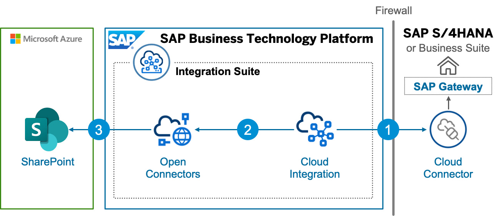
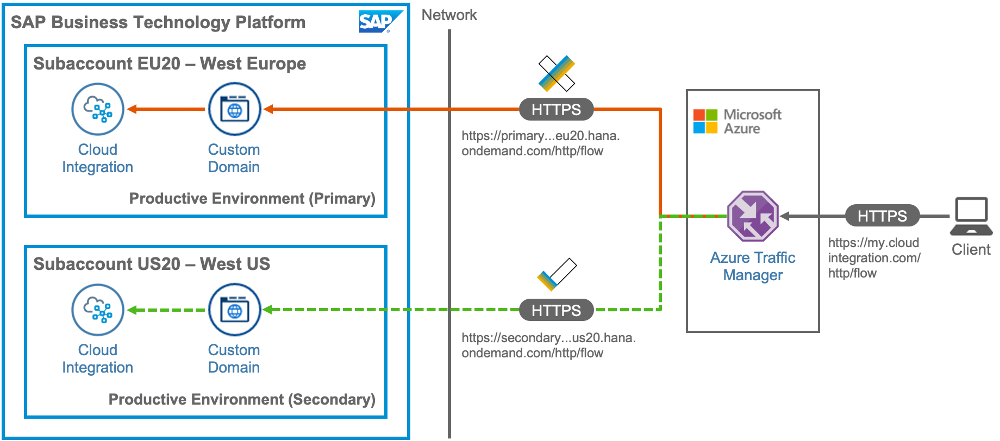

# OpenSAP - Building Applications on SAP BTP with Microsoft Services - Building Integration Scenarios

This repository contains code samples and step by step instructions 

## Description
Integrate SAP systems with non-SAP systems using SAP Integration Suite and its capabilities like SAP Cloud Integration and SAP Open Connectors. 

The objective of this weeks is to get your hands "dirty" and develop the target scenario, using the development environment which you will set up in the beginning of the week. You will configure your Open Connectors instance to communicate with your SharePoint instance, and integrate the Connector into your Integration Flow. The integration flow (which you will develop end-to-end in this week), contains all the steps and logic required, to extract the PDF files from an S/4HANA system and send it to a SharePoint page using your Open Connectors instance.  

**For users with a SAP BTP enterprise account:**
You are going to use Azure Traffic Manager to route traffic intelligently to multiple SAP Cloud Integration tenants. This unit (Unit4) cannot be done with SAP BTP Trial accounts. 

## Unit Overview

### [Unit 1: Setting up the development environment](./Unit1/README.md)
### [Unit 2: Setting up the SAP Integration Suite](./Unit2/README.md)
### [Unit 3: Publish documents from SAP S/4HANA to SharePoint](./Unit3/README.md)
### [Unit 4: Set up SAP Cloud Integration and Azure Traffic Manager](./Unit4/README.md)

