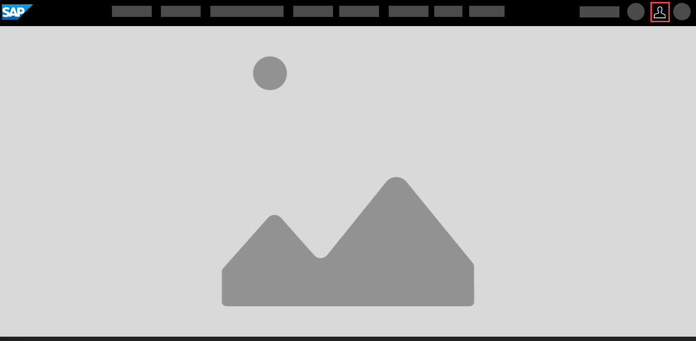
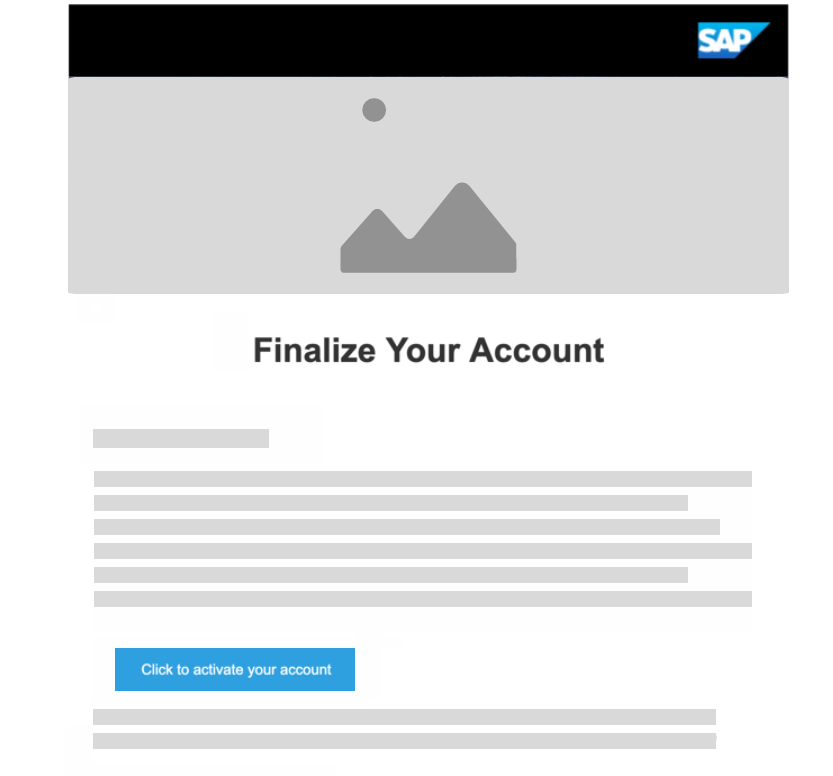
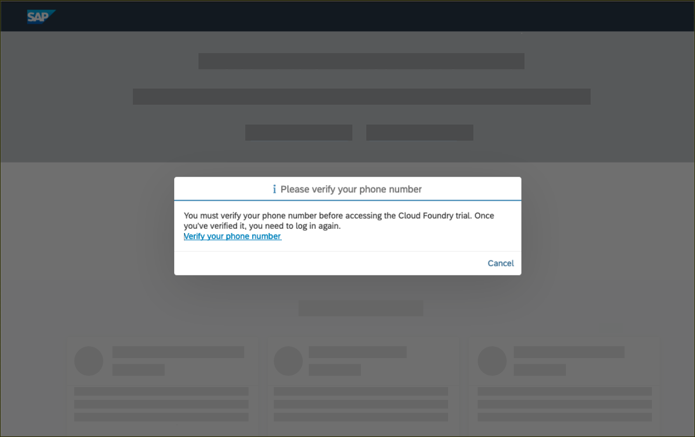
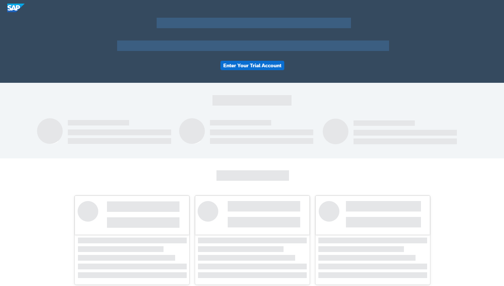
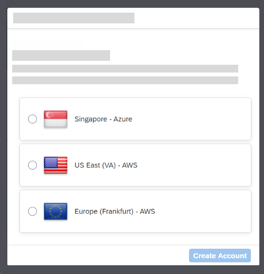
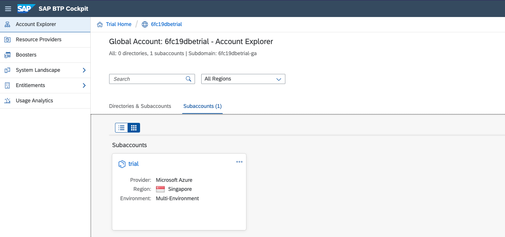

This exercise is part of the openSAP course [Building applications on SAP Business Technology Platform with Microsoft services](https://open.sap.com/courses/btpma1) - there you will find more information and context. 

# Setting up the development environment

The objective of the exercise is to setup the development environment for the following units and weeks. 

....

## Problems
> If you have any issues with the exercises, don't hesitate to open a question in the openSAP Discussion forum for this course. Provide the exact step number: "Week2Unit1, Step 1.1: Command cannot be executed. My expected result was [...], my actual result was [...]". Logs, etc. are always highly appreciated. 
 

## Step 1 - "Setting up BTP Trial"

[Week2 Unit1 - Step 1](Week2/Unit1/README.md#Lorem-Ipsum)

### 1.1. Log into the SAP website 

Visit [SAP Log On Screen](https://www.sap.com) and click the Log On icon in the upper-right corner.

If you have an account on www.sap.com (e.g. a P, S, C, D or I number) you can enter it or the associated email along with your password. If you don’t have an account yet, you can select one of the other login methods or click Register to create an account.

If you don’t need to register with sap.com, you can skip to Step 1.4. 

### 1.2. Register at sap.com

If you don’t have an account you will see a register dialog on the left-hand side of the dialog. Fill in the required fields, and click Submit.

You will see a message that an activation link has been sent to you.

### 1.3. Activate your account

Check your emails to find the activation button **Click to activate your account**.

You will see a success message after activating your account.

### 1.4. Log on to SAP BTP Trial

After activation, or if you already had an SAP account, go to the [SAP BTP Trial page](https://https://account.hanatrial.ondemand.com/) and click **Log On**.

You will see an dialog to confirm the terms and condition for the SAP BTP Trial. **Check the check boxes** and click **Accept**. This simply adds the SAP.com registration to your login account on SAP Cloud Identity.

### 1.5. Verify your phone number

You will see an screen, asking you to verify your account with a valid phone number. 

Enter your phone number and click **New Code** to retrieve a code. Please enter this code and click **Continue** to verify your account. After the verification, you will be logged off automatically.

### 1.6. Access the welcome screen

Click on Log on to log on to your verified account.

You will see one main button on the welcome screen of the SAP BTP Cockpit. Click on Enter Your Trial Account to navigate to your global account.

> Bookmark the link for fast and quick access to the cockpit.

### 1.7. Navigate to the subaccount

Here, you can now create a subaccount that lives in a geographic region. Choose any region from this list and click Create Account to trigger the provisioning process.

You will then see a dialog box while the account is set up. When complete, click **Continue** to close to popup and to navigate to the new account.

The global trial account contains **one** subaccount and space. Navigate to subaccount by clicking on the tile named **trial** (this name may vary if you created the subaccount manually).

This page will display the current state of the subaccount. You can manage your subscriptions and jump into the different runtime environments. It also shows you fundamental; information of the Cloud Foundry environment, such as the API endpoint and the available spaces.

