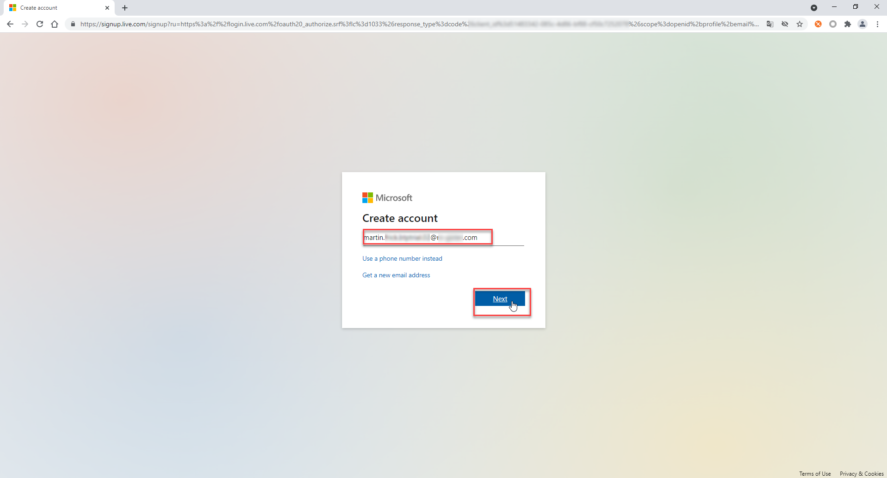
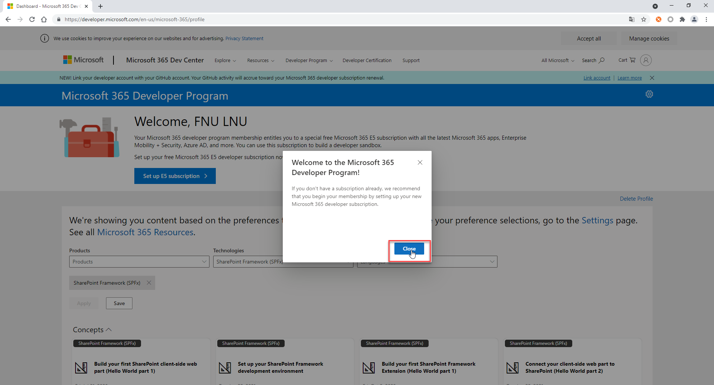
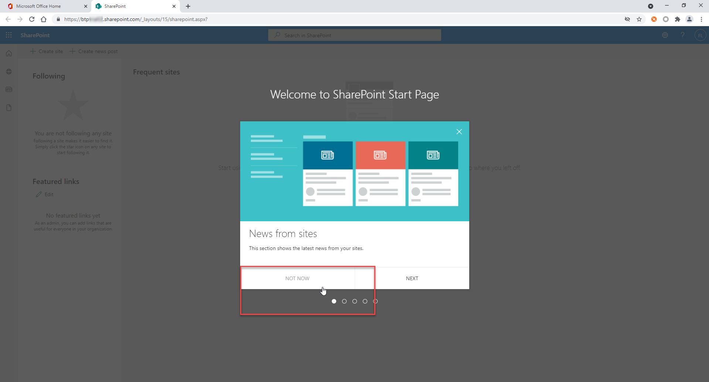
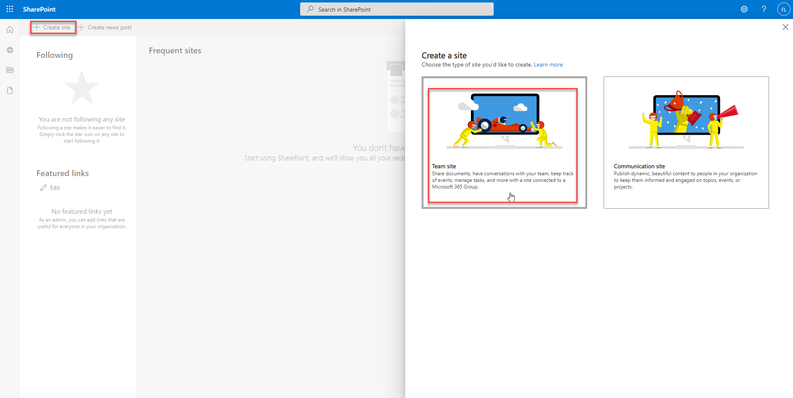
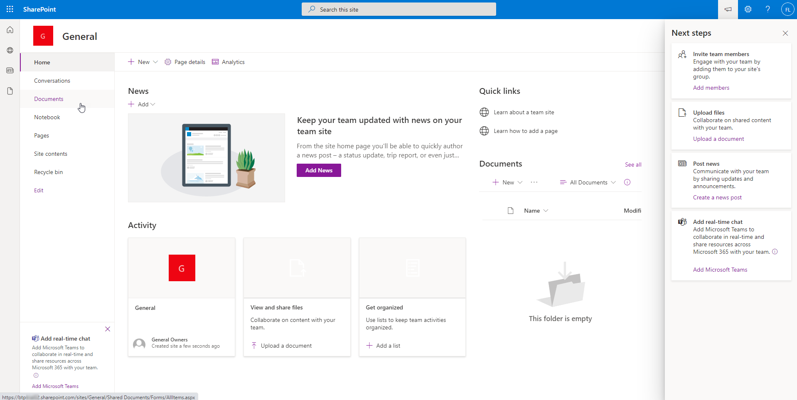
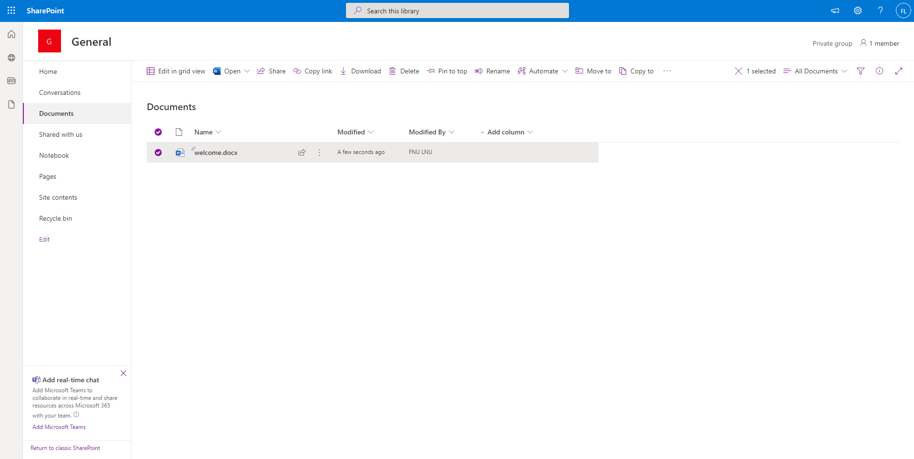
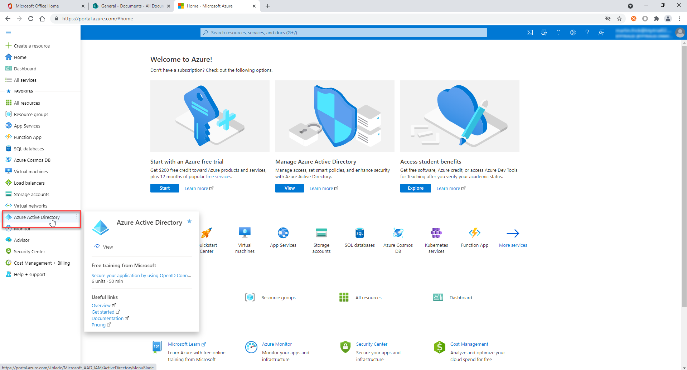
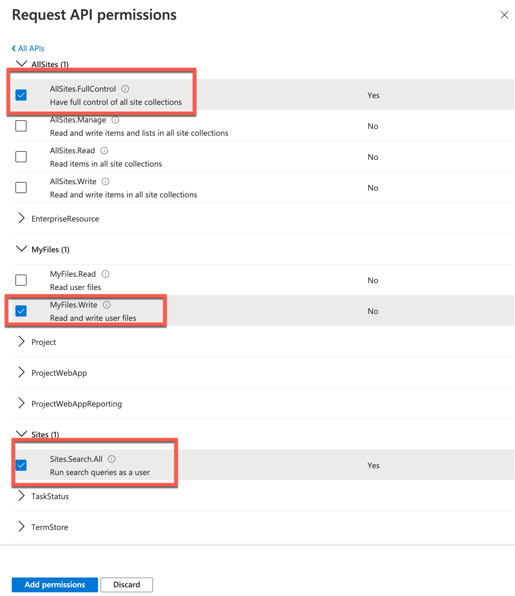
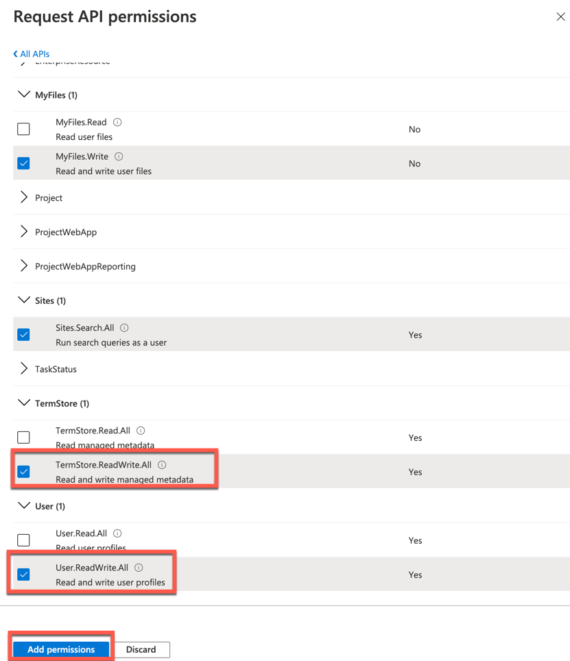

This exercise is part of the openSAP course [Building applications on SAP Business Technology Platform with Microsoft services](https://open.sap.com/courses/btpma1) - there you will find more information and context. 

# Setting up the development environment

The objective of the exercise is to setup the development environment for the following units and weeks. Specifically, for this Unit, this means that you will sign up for the Microsoft365 program and create a SharePoint page, which is required for Unit 2. PDF files coming from a S/4HANA system will be stored there.

Additionally, you are going to add the Microsoft365 Developer account as an administrator to the Azure subscription. With the Microsoft365 Developer Account you have access to Microsoft Teams but to use the Microsoft Bot channel (that's coming with the Azure trial subscription) a Azure subscription is necessary. 

## Problems
> If you have any issues with the exercises, don't hesitate to open a question in the openSAP Discussion forum for this course. Provide the exact step number: "Week2Unit1, Step 1.1: Command cannot be executed. My expected result was [...], my actual result was [...]". Logs, etc. are always highly appreciated. 
 

## Step 1 - Create a Microsoft365 Developer Account

To get access to Microsofts365 Office products for free, you need to sign up for their Microsoft365 Developer program.

---

1.1 Go to [Microsoft 365 Dev Center](https://developer.microsoft.com/en-us/microsoft-365/dev-program) and click on **Join now** to create a new account.

1.2 Enter a private mail address (the one that you have also used to create a free Microsoft Azure Account) and click on **Next**.

1.3 Enter a password of your choice and click on **Next**.

1.4 Select your country/region, enter your birth date click on **Next**.

1.5 You should have received a confirmation mail for the mail address you recently provided. Within this mail you can find a security code. **Copy** this security code for the next step of the process. 

1.6 **Paste** the copied security code into the respective field, to verify your mail address. Then click on **Next**. 

1.7 You might be asked to solve a challenge like a puzzle, to verify you're not a robot. Click on **Next** to proceed with the next step afterwards. 

## Step 2 - Provide details for the Microsoft Developer Program

After creating your Microsoft profile, you're asked to provide some further information to join the Microsoft 365 Developer program. 

---

2.1 Select your country/region, enter a company name and decide your preferred language. Accept the Terms & Conditions and click on **Next** afterwards.

2.2 Decide for the primary purpose of using the respective Developer program subscription. Click on **Next**.

2.3 Select the areas of Microsoft 365 development, which you're personally most interested in (e.g., SharePoint Framework). Click on **Save** to finish the process.

2.4 You will see a message, that you have successfully joined the Microsoft 365 Developer Program. You can close this message to see your profile page.

You have successfully joined the Microsoft 365 Developer Program. 

## Step 3 - Add a Microsoft 365 E5 subscription to your Developer account

You can now add a free Microsoft 365 E5 subscription to your account, which allows you to work with latest Microsoft 365 apps like **SharePoint** and **Azure AD**.

---

3.1 To do so, click on **Set up E5 subscription**.

3.2 <a name="domain"> Enter a username and decide for a domain. This is required to setup your subscription and a subdomain will be created in the **\<domain\>.onmicrosoft.com** environment. Decide for a password and click on **Continue**.</a>

3.3 You need to provide a phone number in the following screen, which will be verified by an SMS which is sent you, once you click on **Send Code**. Make sure, that you provide your phone number **without the country code and without a leading 0**.

3.4 Enter the code which you received via SMS, to verify your phone number. Click on **Set up** afterwards.

Your Microsoft 365 E5 subscription will be set up. 

3.5 <a name="microsoft365">Once the subscription is set up, you will see your profile, showing the remaining days of the subscription. You have successfully added the required Microsoft 365 E5 subscription to your Developer account.</a>

**!!!IMPORTANT:** The mail shown in your dashboard (combination of your username & domain) is your Microsoft365 Developer mail address that you will need throughout many of the exercises. 

### Step 4 - Add Microsoft365 Developer Account as Co-Administrator in your Azure Trial subscription

We now want to invite the Microsoft365 developer account to the Azure Trial account so that you can carry out all activities with your Microsoft365 developer account in the further stages of this course and do not have to work with several login information.

---

4.1 Open the [Azure Portal](http://portal.azure.com) with your **Azure account** (the one you have created in [Week 1, Unit3](../../Week1/Unit3/README.md)) and search for Azure Active Directory in the search bar. Click on the corresponding entry to navigate there.

4.2 Choose **Users** in the side menu. 

4.3 Select **New user**. 

4.4 Select the option **Invite User** to prepare an invitation to your Microsoft65 developer account. Provide the right mail address of the Microsoft365 developer account (*<youruser@yourdomain.onmicrosoft.com*, you can find it [here](#microsoft365)) and provide a name for the user in the Azure Active Directory, which will be displayed at certain views.

4.5 To ensure that the user then also has the appropriate permissions, you can add them in the same view. Click on **User** (next to Roles).

4.6 You should then get a list of available administrator roles for your Azure Active Directory tenant. Select **Global Administrator** and continue with **Select** on the bottom of the page.

4.7 Send out the invitation mail to the user by clicking on the **Invite** button.

Your Microsoft365 account will now receive a mail with an activation link.

4.8 Go to [https://outlook.com](outlook.com) in order to accept the Azure Active Directory invitation. 

4.9 **Login** with your Microsoft365 Developer account (*youruser@yourdomain.onmicrosoft.com*). 

4.10 You should have received a mail with the subject 'Default Directory invited you to access applications within their organization'. Open the mail and click on **Accept invitation**.

4.11 The Azure Active Directory of your Azure Trial account is asking for permissions to read information of your Microsoft365 developer account. Click on **Accept** to finish the invitation process.

4.12 You should get forwarded to a page with an overview of apps of that recently joined Azure Active Directory you where you have access. There are no apps yet, so that's all fine.

 

---
**Continue with your Azure account here**
---

4.13  Open the [Azure Portal](http://portal.azure.com) with your **Azure account** (the one you have created in [Week 1, Unit3](../../Week1/Unit3/README.md)) and search for Subscription in the search bar. Click on the corresponding entry to navigate there.
 
 
4.14 Select the Subscription that you are using. (in case you are using the Azure Free Trial, the subscription should be called _Free Trial_)
 

4.15 Select Access Control (IAM)
 

4.16 Select Add Co-Administrator
 

4.17 Now search for your Microsoft 365 Developer account and click on add to add this user as Co-Administrator. From now on, always use the Microsoft 365 Developer account to log on to your Azure subscription. 
 

 ---

**IMPORTANT: Congratulations! You can now use the Azure subscription with your Microsoft365 developer account. Please do not log on with any other credentials in the subsequent weeks and units!**

---
 ### Step 5 - Create your first SharePoint site

You will now setup your first SharePoint site. In Unit 2 of this week SAP Cloud Integration in conjunction with SAP Open Connectors will store PDF files from S/4HANA here. 

---

5.1 Go to [Microsoft365 Developer Dashboard](https://developer.microsoft.com/en-us/microsoft-365/profile).

5.2 To create your first SharePoint site, now click on **Go to subscription**. 

5.3 Login with your Microsoft365 Developer Account. Click on **Sign in**.

5.4 You should now see the **Microsoft Office Home** screen. Click on the **SharePoint icon** on the left side of the screen to jump to your SharePoint instance. 

5.5 In case a welcome popup appears, you can click on **Not now** to continue. 

5.6 Select **+Create site** and select option **Team site** from section Create a site.

5.7 Enter a site name (e.g., **General**). This site name will be used later while accessing files from Open Connectors capability of SAP Business Technology Platform Integration Suite. Select **Next**.

5.8 You can optionally add additional owners or members which is not required for our use case. Select **Finish** to create the team site.

5.9 With this a site named **General** will be created for you. You can optionally customize the default Home Page.

## Step 6 - Add a sample file to your SharePoint site

To showcase the reading of the documents stored in SharePoint via Open Connectors you can add a sample document named **welcome.docx** which will be used for testing purpose.

---

6.1 To add a new document, select **Document -> + New** and select **Word document** from the dropdown.

6.2 This will launch Microsoft Word in new browser tab. Add any text of your choice like **Hello from SharePoint**.  Wait for the status to change to **Saved** for the changes to be persisted. The status can be found on the top left of the screen. Saving the document may take some time.

6.3 This will create a word document named **Document.docx**. To view your document, click on your open SharePoint session from the Browser tab. In case you cannot see the document, reload the page. 

6.4 To rename the newly created document to e.g. **welcome.docx**, select your document click "Rename" in the toolbar. Alternatively, you can select your document and do a right-click. 

6.5 Rename your document **welcome.docx** and click on **Rename**. The file name will be changed to welcome.docx

With this a SharePoint team site named General has been successfully created. 

## Step 7 - Create an Azure AD app registration

For using the SharePoint connector from Open Connectors capability of SAP Business Technology Platform Integration Suite, you will need an OAuth key and Secret to connect to your SharePoint account. In this step, configurations required to connect to your SharePoint Online account are covered.

---

7.1 Logon to your [Azure Portal](https://portal.azure.com/) with your Microsoft365 Developer Account.

7.2 Navigate to Azure Active Directory (Azure AD).

7.3 Select **App Registrations**. Click **New registration** to create an OAuth application.

7.4 In the application registration prompt, enter an application name say SharePointOAuthApp, select the supported account types and in the Redirect URI enter the redirect URI for SAP Business Technology Platform Open Connectors, which is https://auth.cloudelements.io/oauth. Click on **Register**. 

## Step 8 - Add the required app permissions for SharePoint access

The registered application by default only has the User.Read permission from Microsoft Graph APIs and you will need to add in the required permission to access SharePoint REST APIs. 

---

8.1 Select **API permissions** tab and then click on **Add a permission** to add in the permissions for SharePoint REST APIs.

8.2 Select SharePoint to add in the API permissions for SharePoint.

8.3 In SAP Business Technology Platform Open Connectors, access to the API is via the signed-in user. Select **Delegated Permissions** for accessing APIs as signed-in user.

8.4 Select the Permissions as shown in the following screenshots and select **Add permissions**.

8.5 Some of the selected permissions require administrator consent. After the permissions are selected, click on **Grant admin consent**. The permission may take some time to updated as shown in the warning, so wait for few minutes before selecting the Grant admin consent option.

8.6 You may be prompted to confirm the administrator consent. Select **Yes**.

8.7 After successful operation, the status will change to Granted for your user.

## Step 9 - Create an OAuth secret for your app

For connecting to your SharePoint from SAP BTP Open Connectors, an OAuth secret is required. 

---

9.1 To get your OAuth Secret, select **Certificates & secrets** tab, click on **New client secret**.

9.2 Enter a description for your OAuth secret say OAuthSecret, select the expiry time, select **Add**.

9.3 Copy and note down the generated client secret, you will need to provide this while creating a SharePoint connector instance from SAP BTP Open Connectors. The generated client secret cannot be retrieved later.

9.4 For connecting to your SharePoint Online account from SAP BTP Open Connectors, an OAuth client ID is required. To get your OAuth client ID , select the Overview tab and copy the Application (client) ID value.

## Summary

Congratulations! You've successfully created an App Registration within Azure Active Directory, which contains the required permissions, to interact with your SharePoint teams site. You also invited your Microsoft365 Developer account to the Azure Trial account and SAP BTP Trial account. 
That means, you can now work with the Microsoft365 Developer mail address both for the Azure Trial and SAP BTP Trial. 
