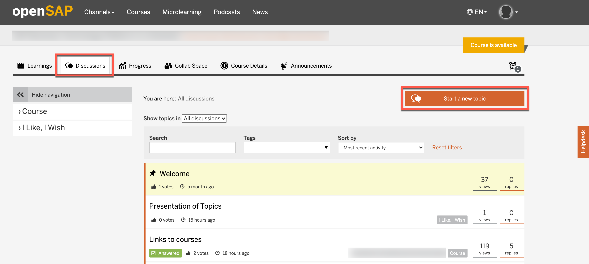
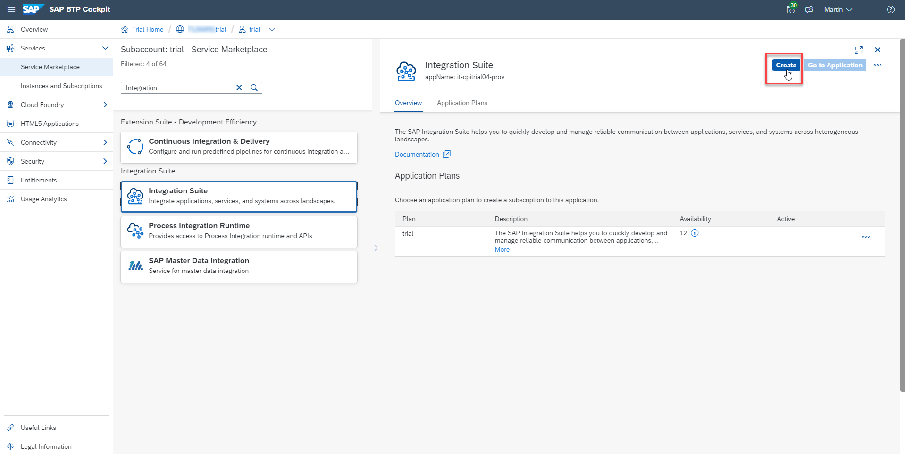
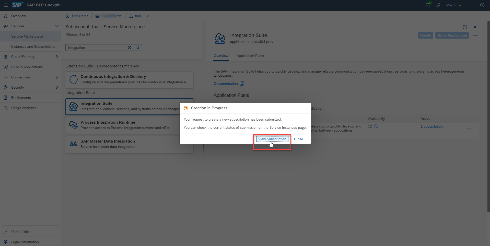
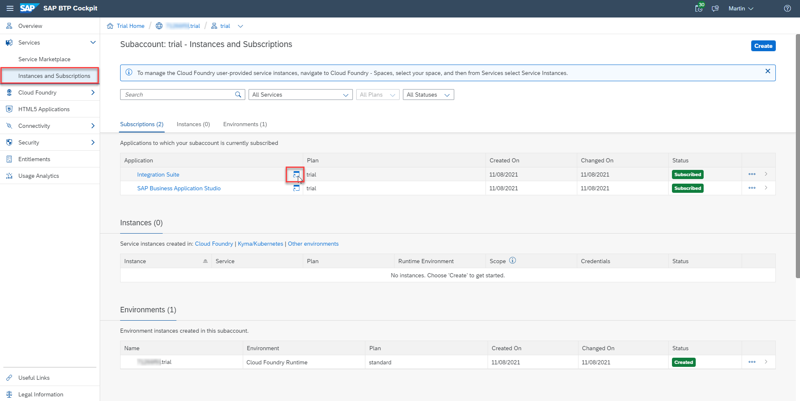

This exercise is part of the openSAP course [Building applications on SAP Business Technology Platform with Microsoft services](https://open.sap.com/courses/btpma1) - there you will find more information and context. 

# S/4HANA Cloud Extension: Posting documents to Microsoft SharePoint

The objective of the exercise is to create an S/4HANA Cloud extension, which allows posting documents to Microsoft SharePoint, deploy and run it on BTP. 

From a service perspective, you'll be using a number of SAP BTP and Microsoft services:
* **SAP API Business Hub**: The SAP API Business Hub is a web application hosted by SAP to discover, explore, and test SAP and partner APIs. 
* **SAP Integration Suite**: The SAP Integration Suite helps you to quickly develop and manage reliable communication between applications, services, and systems.
* **Azure Active Directory**: The Azure Active Directory enterprise identity service provides single sign-on and multi-factor authentication.
* **Microsoft SharePoint**: Microsoft SharePoint allows you to manage content, knowledge, and applications for teamwork and collaboration across the organization.

## Problems
> If you have any issues with the exercises, don't hesitate to open a question in the openSAP Discussion forum for this course. Provide the exact step number: "Week2Unit1, Step 1.1: Command cannot be executed. My expected result was [...], my actual result was [...]". Logs, etc. are always highly appreciated. 
 

## Step 1 - Subscribe to Integration Suite SaaS

[Week2 Unit1 - Step 2](Week1/Unit1/README.md#Step-2---Lorem-Ipsum)

### 1.1. Subscribe to the Integration Suite SaaS

In your BTP Trial account go to **"Services" -> "Service Marketplace"**. Search for **Integration** and select the **Integration Suite** from the search results. 

Click on **Create** on the right side of your screen. 

In the popup, select the service plan **trial** for the service type **Integration Suite** and click on **Create**.

### 1.2. Check the Integration Suite SaaS subscription status

Your request for a new subscription is submitted and you can watch the status by clicking on **View Subscriptions**.

Check your **Integration Suite** subscription in the **Instances and Subscriptions** menu. Once the status changes to **Subscribed**, the Integration Suite instance is ready to be used. 

