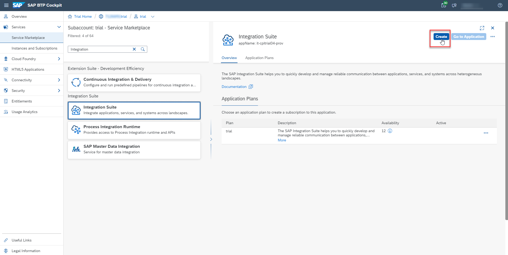
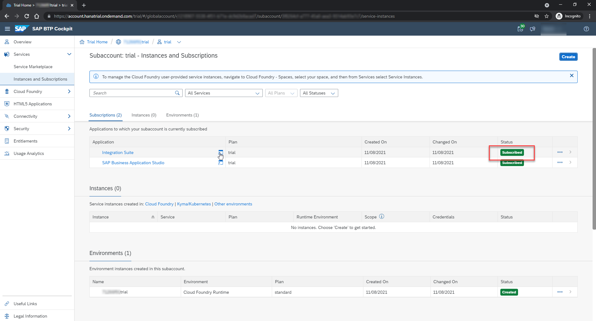
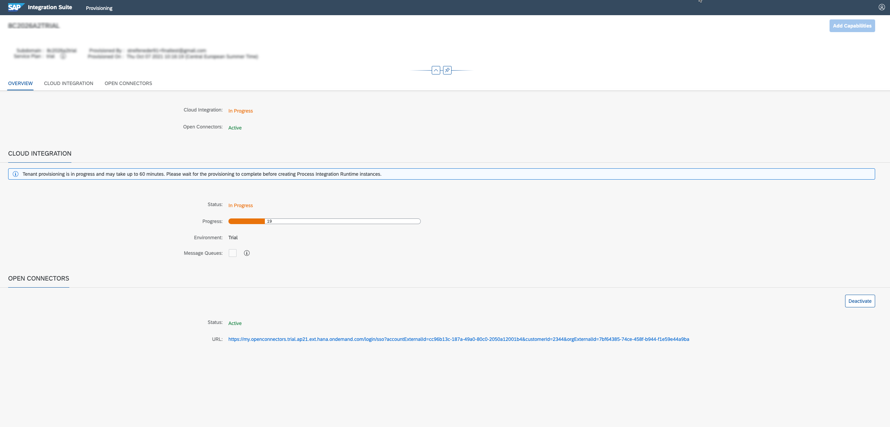
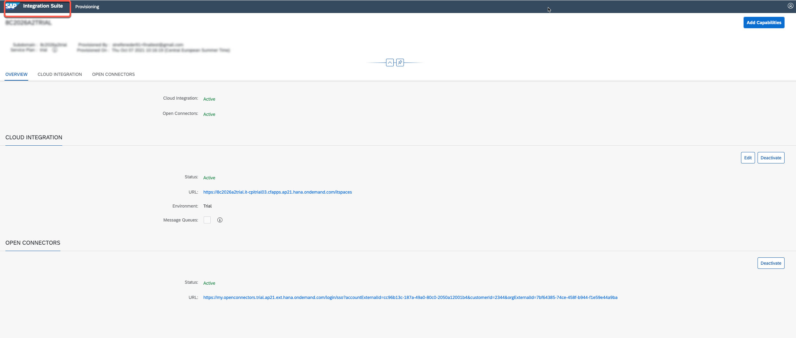
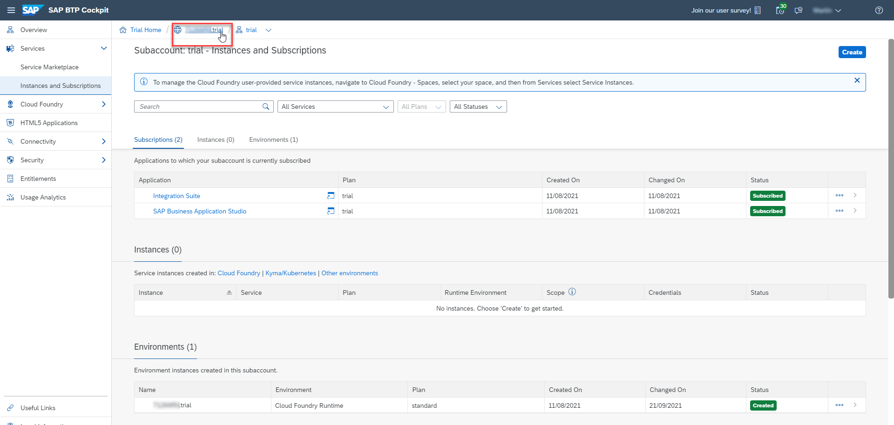
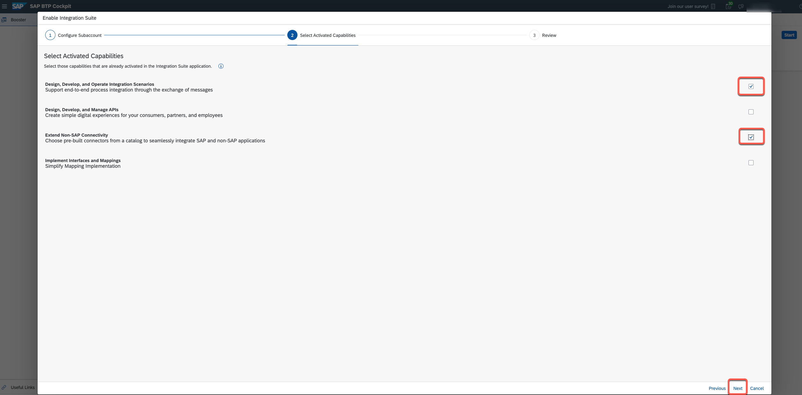
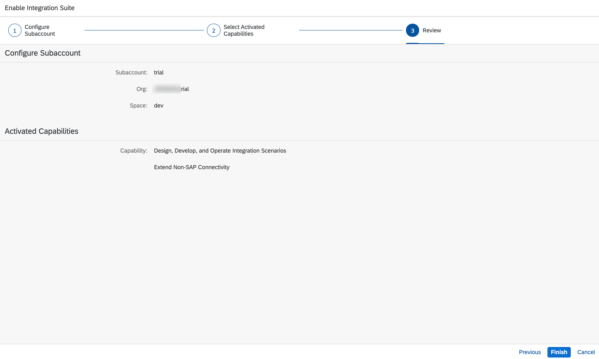

This exercise is part of the openSAP course [Building applications on SAP Business Technology Platform with Microsoft services](https://open.sap.com/courses/btpma1) - there you will find more information and context. 

# Setting up the SAP Integration Suite

The objective of this exercise is to set up your Integration Suite instance within your Business Technology Platform subaccount. This is another part of your development environment, which will be required in the upcoming course units. The Integration Suite contains the **Cloud Integration** and the **Open Connectors** component, which you will use to extract PDF files from an S/4HANA system and to send them to the relevant SharePoint page. 

## Problems
> If you have any issues with the exercises, don't hesitate to open a question in the openSAP Discussion forum for this course. Provide the exact step number: "Week2Unit2, Step 1.1: Command cannot be executed. My expected result was [...], my actual result was [...]". Logs, etc. are always highly appreciated. 
 

## Step 1 - Subscribe to Integration Suite SaaS

Welcome to the Unit 2 of Week 2. In this first step, you will add an **Integration Suite Application Subscription** to your BTP subaccount. This will be the central entry point for all required Integration Suite components like Cloud Integration or Open Connectors.  

---

1.1. In your BTP Trial account go to **"Services" -> "Service Marketplace"**. Search for **Integration** and select the **Integration Suite** from the search results. 

1.2 Click on **Create** on the right side of your screen. 

1.3 In the popup, select the service plan **trial** for the service type **Integration Suite** and click on **Create**.

1.4 Your request for a new subscription is submitted and you can watch the status by clicking on **View Subscriptions**.

1.5 Check your **Integration Suite** subscription in the **Instances and Subscriptions** menu of your BTP cockpit. Once the status changes to **Subscribed**, the Integration Suite instance is ready to be used. 

**Congratulations! You have successfully created an Integration Suite application subscription. In the next steps you will learn how to enable the different components of the Integration Suite and how to assign the required authorizations to your user.**

## Step 2 - Provision the required Integration Suite components 

In this step, you will use the **Integration Suite Provisioning** tool, to enable the required capabilities within your Integration Suite instance. This includes Cloud Integration and Open Connectors, which will be used in the subsequent steps and weeks of this course. 

---

2.1 In the **Instances and Subscriptions** menu, click on **Integration Suite** or the small icon next to Integration Suite application subscription, to open the respective application (The visibility of the icon might depend on your screen size).

2.2 This will launch the **Integration Suite Launchpad** in a new browser tab, where you need to add the required **capabilities** like Open Connectors. Therefor click on **Add Capabilities**.

2.3 Select the following capabilities and click on **Next**: 

* Design, Develop and Operate Integration Scenarios
* Extend Non-SAP Connectivity

2.4 Click on **Next**.

2.5 Click on **Activate** to provision your required capabilities. 

2.6 On the following page, you can see the provisioning **status** of the Integration Suite components. 

2.7 Wait until all components are in state **Active**. You might need to refresh your page to update the status.

2.8 From the Provisioning application you can navigate back to the **Integration Suite Launchpad** by choosing the **Integration Suite button** on the header.

**Congratulations! You have successfully provisioned the Integration Suite components. In the next step you will learn, how to assign your user the required authorizations, to access the various Integration Suite components.**

## Step 3 - Assign roles and create service instances

In this step, you will execute a Booster that assigns your user the necessary roles to access the activated capabilities from Step 2. Furthermore, the Booster will create additional service instances like the **Process Integration Runtime**. This service instance defines, how the Process Integration Runtime service can be called from a remote component. In case of Cloud Integration, a service instance is an OAuth client. The service instance allows you to create Service Keys, containing credentials and other information, required to call integration flows.

---

3.1. Navigate to the Overview page of your SAP BTP global account by using the breadcrumb navigation.

3.2 Choose **Boosters** on the left navigation menu. From the available of Boosters, find the **Enable Integration Suite** tile, by using the search field. You can start the Booster clicking on the tile or on **Start**. 

3.3 Read the information and choose **Start** in the Booster page.

3.4 In the **Configure Subaccount** tab, select the subaccount, organization, and space in which you've subscribed for the Integration Suite before. Choose **Next**.

3.5 In the **Select Activated Capabilities** tab, select all available capabilities. Choose **Next**.
> If you haven't activated all Integration Suite capabilities in step 2.1, only select the components which you enabled during the provisioning process. 

3.6 In the **Review** tab, check your selections and click on **Finish**. The Booster is now being processed.

3.7 After the booster has been successfully executed, you can go back to your subaccount by clicking on **Navigate to Subaccount**. This allows you to review the recently created **service instances**.

3.8 In the Instances and Subscriptions menu of your subaccount, you should now see the additional service instances created by the booster. 

3.9 In the **Instances and Subscriptions** menu of your subaccount, open your **Integration Suite** application subscription, by clicking on **Integration Suite**. This will open the **Integration Suite Launchpad** in a new browser tab.   

3.10 From the **Integration Suite Launchpad**, you should now be able to open any of the assigned capabilities without authorization errors. 

**In case of authorization errors:** Please use the logout button on the upper right corner of the page and login again! 

3.11 Make sure, that you can e.g. open the **Cloud Integration** component (Design, Develop, and Operate Integration Scenarios) without any authorization error. 

## Summary

Congratulations! You have successfully configured your Integration Suite including the required authorizations for your user. This allows you to start development within the different components like Cloud Integration or API Management. This concludes the exercise content of Week 2 - Unit 2. You can continue with the content of Week 2 - Unit 3.
