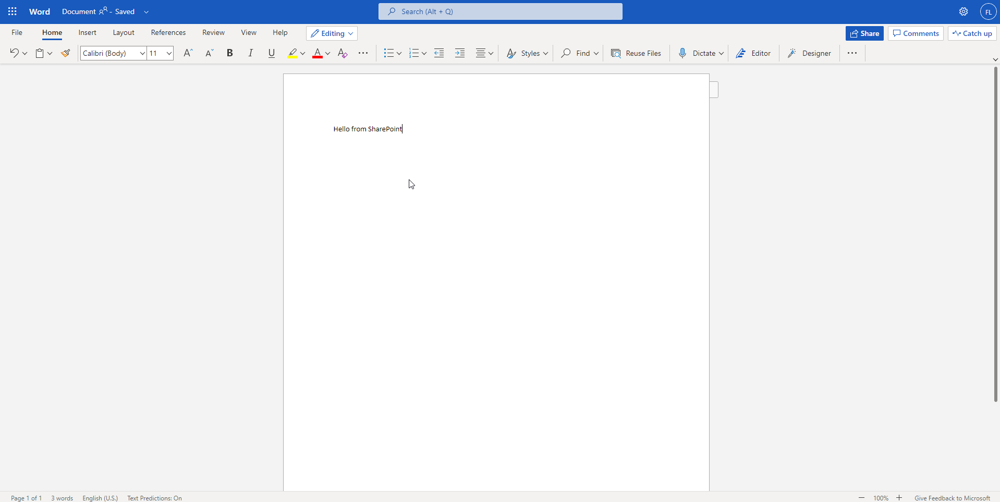

This exercise is part of the openSAP course [Building applications on SAP Business Technology Platform with Microsoft services](https://open.sap.com/courses/btpma1) - there you will find more information and context. 

# S/4HANA Cloud Extension: Posting documents to Microsoft SharePoint

The objective of the exercise is to create an S/4HANA Cloud extension, which allows posting documents to Microsoft SharePoint, deploy and run it on BTP. 

From a service perspective, you'll be using a number of SAP BTP and Microsoft services:
* **SAP API Business Hub**: The SAP API Business Hub is a web application hosted by SAP to discover, explore, and test SAP and partner APIs. 
* **SAP Integration Suite**: The SAP Integration Suite helps you to quickly develop and manage reliable communication between applications, services, and systems.
* **Azure Active Directory**: The Azure Active Directory enterprise identity service provides single sign-on and multi-factor authentication.
* **Microsoft SharePoint**: Microsoft SharePoint allows you to manage content, knowledge, and applications for teamwork and collaboration across the organization.

## Problems
> If you have any issues with the exercises, don't hesitate to open a question in the openSAP Discussion forum for this course. Provide the exact step number: "Week2Unit1, Step 1.1: Command cannot be executed. My expected result was [...], my actual result was [...]". Logs, etc. are always highly appreciated. 
 

## Step 1 - Setup SAP Cloud Integration 

[Week2 Unit3 - Step 1](Week2/Unit3/README.md#Step-1---Lorem-Ipsum)

Welcome to the third unit of Week 2. In the comprehensive exercise of this unit, you will build up an end-to-end scenario, which allows you to store billing documents from S/4HANA Cloud to your SharePoint team site. To achieve this scenario, you will make use of different SAP Integration Suite components like Cloud Integration and Open Connectors, as well as Microsoft tools like SharePoint and Azure.

### 1.1. Create your first SharePoint site

To create your first SharePoint site go to your [Microsoft 365 DEV Center](https://developer.microsoft.com/en-us/microsoft-365/profile), sign in whith the account you created in Week1 and click on **Go to subscription**. 

You might be asked to login to you're subscription domain. You've defined the respective credentials a few steps before, when you set up the subscription. The mail address of the initial subscription user (Administrator), is the username combined with the new domain which was set up in the onmicrosoft.com environment (e.g. testuser@demotrial.onmicrosoft.com). Click on **Sign in**.

You should now see the **Microsoft Office Home** screen. Click on the **SharePoint icon** on the left side of the screen to jump to your SharePoint instance. 

In case a welcome popup appears, you can click on **Not now** to continue. 

Select **+Create site** and select option **Team site** from section Create a site.

Enter a site name (e.g. **General**). This site name will be used later while accessing files from Open Connectors capability of SAP Business Technology Platform Integration Suite. Select **Next**.

You can optionally add additional owners or members which is not required for our use case. Select **Finish** to create the team site.

With this a site named **General** will be created for you. You can optionally customize the default Home Page.

### 1.2. Add a sample file to your SharePoint site

To showcase the reading of the documents stored in SharePoint via Open Connectors you can add a sample document named **welcome.docx** which will be used for testing purpose.
To add a new document, select **Document -> + New** and from the dropdown select **Word document**.

This will launch Word in new browser tab. Add any text of your choice like **Hello from SharePoint**.  Wait for the status to change to **Saved** for the changes to be persisted. The status can be found on the top left of the screen. Saving the document may take some time.

This will create a word document named **Document.docx**. To view your document, click on your open SharePoint session from Browser tab. In case you cannot see the document, reload the page. 

To rename the newly created document to e.g. **welcome.docx**, select your document click "Rename" in the toolbar. Alternatively you can slect your document and do a right-click. 

Rename your document **welcome.docx** and click on **Rename**. The file name will be changed to welcome.docx

With this a SharePoint team site named General has been successfully created. 

## Step 2 - Create an Azure AD app registration

[Week2 Unit3 - Step 2](Week2/Unit3/README.md#Step-2---Lorem-Ipsum)

For using the SharePoint connector from Open Connectors capability of SAP Business Technology Platform Integration Suite, you will need an OAuth key and Secret to connect to your SharePoint account. In this step, configurations required to connect to your SharePoint Online account are covered.

### 2.1. Create a new app registration in Azure AD

Logon to your [Azure Portal](https://portal.azure.com/) using your subscription credentials. You defined these, during the set up of your Microsoft 365 E5 subscription (e.g. testuser@demotrial.onmicrosoft.com). In case you own multiple Microsoft accounts, select the respective subscription account. 

Navigate to Azure Active Directory (Azure AD).

Select **App Registrations**. Click **New registration** to create an OAuth application.

In the application registration prompt, enter an application name say SharePointOAuthApp, select the supported account types and in the Redirect URI enter the redirect URI for SAP Business Technology Platform Open Connectors, which is https://auth.cloudelements.io/oauth. Click on **Register**. 

### 2.2. Add the reuqired app permissions for SharePoint access

The registered application by default only has the User.Read permission from Microsoft Graph APIs and you will need to add in the required permission to access SharePoint REST APIs. Select **API permissions** tab and then click on **Add a permission** to add in the permissions for SharePoint REST APIs.

Select SharePoint to add in the API permissions for SharePoint.

In SAP Business Technolgy Platform Open Connectors, access to the API is via the signed-in user. Select **Delegated Permissions** for accessing APIs as signed-in user.

Select the Permissions as shown in the following screenshots and select **Add permissions**.

Some of the selected permissions  require administrator consent. After the permissions are selected, click on **Grant admin consent**. The permission may take some time to updated as shown in the warning, so wait for few minutes before selecting the Grant admin consent option.

You may be prompt to confirm the administrator consent. Select **Yes**.

After successful operation, the status will change to Granted for your user.

### 2.3. Create an OAuth secret for your app

For connecting to your SharePoint from SAP BTP Open Connectors, an OAuth secret is required. To get your OAuth Secret, select **Certificates & secrets** tab, click on **New client secret**.

Enter a description for your OAuth secret say OAuthSecret, select the expiry time, select **Add**.

Copy and note down the generated client secret, you will need to provide this while creating a SharePoint connector instance from SAP BTP Open Connectors. The generated client secret cannot be retrieved later.

For connecting to your SharePoint Online account from SAP BTP Open Connectors, an OAuth client ID is required. To get your OAuth client ID , select the Overview tab and copy the Application (client) ID value.

You have successfully configured your Azure AD for the usage with SAP Business Technology Platform Open Connectors. 

## Step 3 - Configure Integration Suite Open Connectors

[Week2 Unit1 - Step 5](Week2/Unit1/README.md#Step-5---Lorem-Ipsum)

### 3.1. Create an Open Connectors SharePoint connector

Go to your BTP Cockpit and open your **Integration Suite** application subscription. It will open in a new browser tab. 

You should now see your capabilites in the **Integration Suite Launchpad**. Select **Extend Non-SAP Connectivity** to open the Open Connectors application. 

In case you are required to login again, use your **sap.com** credentials. 

You will be redirected to the **Open Connectors** Home page.

Within Open Connectors, click on the **Connectors tab** to view all the available pre-built connectors. 

Search for the SharePoint connector by typing SharePoint in the search region (top right). Hover over the Sharepoint connector and select the option Authenticate to connect to your own SharePoint account.

In the connection wizard, enter a name for your connector instance like **SharePointApp**, enter your SharePoint address in the format {your_sharepoint_domain}.sharepoint.com, enter your copied OAuth client ID in the API Key text field, enter your copied OAuth secret in the API Secret text field (both credentials from Azure AD step) and select **Show Optional Fields**. 

During the creation of the OAuth client & Secret in the Azure portal, you selected the **Delegated user access** approached. This is why, the **Delegate User** flag has to be set to **true** in Open Connectors as well.

Select **Create Instance** to create SharePoint connector instance.

> You may be prompted to enter your Microsoft subscription user credentials. In case, you are already logged into your SharePoint the logged in session may be automatically taken by the browser.

> You may be prompted to trust the SharePoint OAuth application. Select **Trust It**

### 3.2. Test your Open Connectors SharePoint connector instance

After the authenticated connection to your Microsoft account has been created successfully, you will be able to test out the connection from SAP BTP Open Connectors. To try out the SharePoint connector APIs, click on the option **Test in the API Docs**.

This will launch the integrated OpenAPI specification based on the API documentation for your SharePoint connector, so that you can test and try out the connector from SAP BTP Open Connectors.

Select the available resource **GET /files** to read files from your SharePoint.

To read files from SharePoint, the information about your teams site has to be provided in the field Subsite in the format **/sites/{your_site_name}** and the path to your file has to be passed in the format **/{your_directory}/{your_filename}**. 

In our example, the name of the SharePoint teams site used was **General** and name of the filename was **docx**. Enter **/welcome.docx** in the path field and **/sites/General** in the Subsite field. 

Select **Execute**.

Your API request should return with a Code **200**. If not, check if the Subsite and the path are provided correctly! Click on the **Download file** link, to download and view your file from SharePoint.

In the **Curl** subsection, please copy the values in the Authorization header, like you can see in the screenshot. Note down these values, as you will need them later on, when calling the API from SAP BTP Cloud Integration.

With this you have successfully created a SharePoint connector instance from Open Connectors capability of SAP Integration Suite. You will be able to use this connector instance in Cloud Integration to integrate data from SAP system to SharePoint or build an application connecting to your SharePoint account.

## Step 4 - Check out SAP API Business Hub and fetch API Key

[Week2 Unit1 - Step 6](Week2/Unit1/README.md#Step-6---Lorem-Ipsum)

The SAP API Business Hub is the central catalog of all SAP and partner APIs for developers to build sample apps, extensions and open integrations with SAP. In this tutorial, [Billing Document – Read, Cancel, GetPDF](https://api.sap.com/api/API_BILLING_DOCUMENT_SRV/resource) from SAP S/4HANA Cloud APIs has been used.

### 4.1. Discover the Billing Document API in the SAP API Business Hub

To discover and explore SAP S/4HANA Cloud APIs navigate to [SAP API Business Hub](https://api.sap.com).

Select "Login" on the top right of the screen, to be able to retreive your API Key later on.

Enter your credentials, if required, accept the Terms & Conditions for the SAP API Business Hub and click on **Accept**.

Select the S/4HANA Cloud.

Go to APIs, ODATA V2, search for **GetPdf** and select the **Billing Document - Read, Cancel, GetPDF** API. 

In the Overview tab of the respective API, click on **Try Out**.

For this integration scenario, a service operation named GetPDF will be used. Select the GET request for **GetPdf** on the left side of the screen. 

This API endpoint returns the billing document information in a PDF format. The document identifier needs to be passed as query parameter named BillingDoument in the format **BillingDocument= 'document_id'**.  

Enter '9002930' (including the single quotes) into the **BillingDocument** field. Click on **Execute** to test your request. 

### 4.2. Get your SAP API Business Hub API Key

Your request should return with a **200** return code. To make use of the sample API within your Cloud Integration flow, you need to retrieve your API key. Therefor, click on **Show API key** on the top right of your screen.

Select **Copy Key and Close** to copy this API Key. This API Key will be used from Cloud Integration to get the billing document.

## Step 5 - Create your SharePoint Integration Flow

[Week2 Unit1 - Step 7](Week2/Unit1/README.md#Step-7---Lorem-Ipsum)

### 5.1. Open SAP Cloud Integration 

Go to your BTP subaccount using [https://hanatrial.ondemand.com](https://hanatrial.ondemand.com/). Select the **Instances and Subscriptions** menu on left and click on your **Integration Suite** application subscription. This will open the **Integration Suite Launchpad** in a new browser tab. 

In the **Integration Suite Launchpad** please click on the **Cloud Integration** capability. This will open the required component in the same window.
> In case you're facing authorization errors, please ensure that you've successfully executed the Booster described in Week 2 - Unit 2.

### 5.2. Create your SharePoint Integration Flow 

Once you opened the Cloud Integration component, you can close the **What's New?** popup and start working on your first integration flow. 

From the Cloud Integration workspace, Navigate to Design tab, click Create to create an integration package.

Enter the integration package details like name, description as provided in below and select **Save**. The technical name is created automatically. 

* Name:	SAP and Microsoft Azure Integration Scenarios
* Short Description: Package showcasing SAP and Microsoft Azure integration

Navigate to the Artifacts tab, select **Integration Flow** from **Add** action to add in a new Integration flow.

In the **Add integration flow** artifact dialog enter integration flow name and select **OK**.
* Name: Post Billing Document to SharePoint
* Description: Integration Flow showcasing posting of billing document files from SAP S/4HANA Cloud to SharePoint

Select the newly created Integration Flow named **Post Billing Document to SharePoint** and then select Edit to start editing the integration flow.

### 5.3. Define a Start object for your integration flow

Since a timer-based integration flow will be used the default start message can be deleted. Select the default start message and select **Delete**.

Select and add the Timer integration step. The default property of timer integration step is to execute the integration flow immediately after you deploy the integration flow. More about the available timer configurations is available in the [help documentation](https://help.sap.com/viewer/368c481cd6954bdfa5d0435479fd4eaf/Cloud/en-US/ae14ad7916c04ecbaba3d26e2404410a.html).

### 5.4. Add a Content Modifier to provided S/4HANA Cloud API properties

To set values like API key and the billing document id to read data from SAP S/4HANA Cloud API Sandbox from SAP API Business Hub, a Content Modifier can be used. Select the **Content Modifier** integration step from the integration palette and drop it into the Integration Process canvas.

Select the **Start Timer** integration step and then drag the **arrow** icon to point towards the **Connect Modifier** step to connect the timer and content modifier integration steps.

Change the name of the content modifier step to **Initialize S4HC Value** in the **General** tab, to improve readability.

Select the **Message Header** tab and select **Add**. From the action drop down select **Create**, enter **apiKey** as the **Name** of the property, select **Constant** from the drop down for **Type** and enter your copied API Key from SAP API Business Hub in the value field. This will set the request message header named apiKey with the value set by you, to be passed to API Sandbox from SAP API Business Hub.

Select the **Exchange Property** tab and click on **Add**. From the action dropdown select **Create**, enter **doc_id** as the **Name** of the property, select **Constant** from the dropdown for **Type** and enter **90002930** in the value This will result in a property field named doc_id to be created which will be passed as the parameter to fetch the billing document for id 90002930.

### 5.5. Add a Request Reply object to allow a call to the S/4HANA Cloud API

To read the billing document in PDF format, the [Request Reply](https://blogs.sap.com/2015/01/05/blog-2-request-reply-pattern-in-integration-flows-hci-pi/) integration pattern with a HTTP Receiver adapter can be used. Select **Request Reply** from External Call integration palette and drop it into Integration Process canvas.

Change the name of the Request Reply step to **Fetch Billing Document** in the **General** tab to improve readability.

Select and connect the **Initialize S4HC Value** integration step with the **Fetch Billing Document** step.

### 5.6. Add a Receiver object reflecting your S/4HANA Cloud system and configure the HTTP API call

Add an **Receiver** integration step to invoke the SAP S/4HANA Cloud OData API.

The name of the Receiver can be set to **S4HC** to improve readability.

Select and connect the **Fetch Billing Document** request reply step to the newly added Receiver. 

This will open the Adapter list, where you can select **HTTP** from the available adapters.

In the **Connection** tab, enter details as follows.
* Address :- https://sandbox.api.sap.com/s4hanacloud/sap/opu/odata/sap/API_BILLING_DOCUMENT_SRV/GetPDF
* Query :- BillingDocument=%27${property.doc_id}%27
* Method :- GET
* Authentication :- None
* Request Headers : *
* Response Headers : *

> In the query parameter you can notice that property doc_id is referenced dynamically as ${property.doc_id}. Since the apikey is passed via the message header set in the Initialize S4HC Value integration step the authentication type is selected to None.

Extend the size of your **Integration Process** area by moving the **End** button over the edge ob the box.

### 5.7. Add a filter object to process the API response

The **GetPDF service operation** of the SAP S/4HANA Cloud ODataAPI, returns the PDF document in the base64 encoded format.
Add a Filter step to read this file content with XPath expression.

Change the name of the Filter step to **Read File Data** in the **General** tab to improve readability.

Select the **Processing** tab and enter **d:GetPDF/d:BillingDocumentBinary/text()** in **XPath Expression** and select **String** from the Value Type dropbox.

Select and connect Fetch Billing Document to Read File Data integration step.

### 5.8. Configure your Integration Flow XML namespace property

Since the XPath Expression uses XML namespaces, this namespace needs to be defined or declared at the Integration flow.
To declare the namespace, click anywhere within your integration flow. This allows you to configure the Integration flow settings at the bottom of your page.

Switch the selected tab and then select **Runtime Configuration**. 
Enter **xmlns:d=http://schemas.microsoft.com/ado/2007/08/dataservices** in the namespace mapping.

### 5.9. Convert your S/4HANA Cloud document to a multipart form request

The SharePoint connector of Open Connectors requires the file content to be passed as a [multipart form request](https://www.ietf.org/rfc/rfc2388.txt). To create the required multipart form request a Groovy Script is leveraged.

Change the name of Groovy Script step to **Convert to File Format** in the General tab to improve readability.

Click on the **Create** button of the newly added Groovy script step to create a new script file.

Copy & paste the below code snippet to the created script page. Select **Ok** to persist the script changes.

    /*
    The integration developer needs to create the method processData 
    This method takes Message object of package com.sap.gateway.ip.core.customdev.util 
    which includes helper methods useful for the content developer:
    The methods available are:
    public java.lang.Object getBody()
    public void setBody(java.lang.Object exchangeBody)
    public java.util.Map<java.lang.String,java.lang.Object> getHeaders()
    public void setHeaders(java.util.Map<java.lang.String,java.lang.Object> exchangeHeaders)
    public void setHeader(java.lang.String name, java.lang.Object value)
    public java.util.Map<java.lang.String,java.lang.Object> getProperties()
    public void setProperties(java.util.Map<java.lang.String,java.lang.Object> exchangeProperties) 
    public void setProperty(java.lang.String name, java.lang.Object value)
    */
    import com.sap.gateway.ip.core.customdev.util.Message;
    import java.util.HashMap;

    def Message setHeader(Message message, String id) {

    message.setHeader("content-type","multipart/form-data; boundary=--------------------------" + id);

    return message;

    }

    def ByteArrayOutputStream getMultiPartBody(payload, filename, id) {

    String charset = "UTF-8";
    def LINEFEED = "\r\n";

    def output = new ByteArrayOutputStream();
    output.write(("----------------------------"+ id).getBytes(charset));
    output.write(LINEFEED.getBytes(charset));
    output.write(("Content-Disposition: form-data; name=\""+filename+"\"; filename=\""+filename+"\"").getBytes(charset));
    output.write(LINEFEED.getBytes(charset));

    output.write("Content-Type: application/pdf".getBytes(charset));
    output.write(LINEFEED.getBytes(charset));
    output.write(LINEFEED.getBytes(charset));

    output.write( payload );
    output.write(LINEFEED.getBytes(charset));

    output.write(("----------------------------"+ id + "--").getBytes(charset));
    output.write(LINEFEED.getBytes(charset));
    return output;

    }

    def Message processData(Message message) {

    String charset = "UTF-8";
    def id = "238360769909770904663504";

    def map = message.getProperties();
    def filename = "billing_" + map.get("doc_id") + ".pdf";

    def payload = message.getBody(String.class).decodeBase64();
    message.setProperty("byteSize",payload.length);

    def ByteArrayOutputStream output = getMultiPartBody(payload,filename,id);
    message = setHeader(message, id);
    message.setBody(output.toByteArray());

    return message;
    }

>In this script, the multipart format request is created from the incoming response data. For posting a file to SharePoint, the size of the uploaded documented is also required. The size of the incoming byte[] data is read and stored in a property named byteSize.

Select and connect the **Read File Data** to the **Convert to File Format** integration step.

### 5.10. Add the required request parameters to call your Open Connectors SharePoint API

Add a **Content Modifier** step, to initialize the SharePoint connector instance authorization token and the SharePoint team site, where the document will be posted.

Change the name to **Initialize SP Values** in the **General** tab to improve readability.

Navigate to the Message Header tab.

Select **Add** to add new message header. Enter **Subsite** in the Name field and enter your SharePoint team site name in the format **/sites/{your_teamsite}**. 
In this tutorial, a team site named General was used therefore the value of **Subsite** field is **/sites/General**.

>Note :- If your team site contains spaces , then enter the site name without any spaces in the Subsite field.

Select and connect the **Convert to File Format** and **Initialize SP Values** integration step.

### 5.11. Add a Request Reply to allow the usage of the Open Connectors SharePoint API 

To post a file document to SharePoint via Open Connectors an HTTP Receiver adapter can be used. Select the **Request Reply** from the **External Call** integration palette and drop it into the Integration Process canvas.

Change the name of the added **Request Reply** step to **Post File to SharePoint** to improve readability.

Select and connect the **Initialize SP Values** and **Post File to SharePoint** integration steps.

### 5.12. Add a Receiver object reflecting your Open Connectors SharePoint API

Add a receiver from the Participants integration palette and place it below the **Post File to SharePoint** integration step. Alternatively, you can also take the existing receiver from your canvas and place it below the respective integration step.

Change the name of the added **Receiver** step to **SharePoint** to improve readability.

### 5.13. Configure the details of your HTTP API call to the Open Connectors SharePoint API

Select and connect the **Post File to SharePoint** Request Reply step to the recently placed **Receiver**. 

This will open the Adapter list, where you need to select HTTP from the available adapters.

Under the Connection tab, enter details as follows.
* Address :-  https://api.openconnectors.trial.eu10.ext.hana.ondemand.com/elements/api-v2/files
* Query :- size=${property.byteSize}&path=%2Fbilling_${property.doc_id}.pdf&overwrite=true
* Method :- POST
* Authentication :- None
* Request Headers : *

>In the query parameters, you can notice the usage of the property.byteSize field. The property **byteSize** is set in the Groovy Script step. To dynamically set the document id, you can notice the usage of the property.doc_id field. The property doc_id is set in the **Initialize SP Values** integration step. The overwrite query parameter is set to true, to override existing files in SharePoint. Setting it to false, would ensure that files are not overwritten and may result in a **429 file already exists** error.

Select and connect the **Post File to SharePoint** to the **End message** to complete the integration process flow.

### 5.14. Save, deploy and monitor the execution of your Integration Flow

Select **Save** and then click the **Deploy** button to deploy this integration flow to SAP BTP Integration tenant.

>Note, the first-time deployment might take some time before the changes are fully deployed.

With this step, an integration flow that queries a billing document from the SAP S/4HANA Cloud system and saves the document into SharePoint (via Open Connectors) has been successfully created.

Navigate to the **Monitor**, to check the status of the deployed integration flow. Click on the **All** tile below **Manage Integration Content**, to see all available intergration flows. 

Select and check the status of your integration flow, and wait until it has been **successfully deployed**. You might need to reload the page. 

Select **Monitor Message Processing**  to view the successfully executed integration flow. 

Since the integration flow was designed as a Run immediate timer-based integration, the flow will be executed as soon as it deployed. If status is **Completed**, then the billing document read from SAP S/4HANA Cloud system was posted to your SharePoint team site.

Congratulations! You've successfully deployed your first Integration Flow, which will be used to store billing documents coming from S/4HANA Cloud, in your SharePoint team site. In the next step, you will check if the document was successfully uploaded to Share Point, to validate if your Integration Flow is working properly.

## Step 6 - Review result in SharePoint

[Week2 Unit1 - Step 8](Week2/Unit1/README.md#Step-8---Lorem-Ipsum)

### 6.1. Check the uploaded document in SharePoint

Go to your SharePoint site once again and check if the PDF billing document is available. 

Open the billing document and check if the PDF document can be opened as desired. 

Congratulations! Your Integration Flow is working properly and has successfully uploaded the billing document to SharePoint. 

## Special Thanks

A special thanks to [Divya Mary](https://people.sap.com/divya.mary), who has written an excellent blog series, which this tutorial is based on.
https://blogs.sap.com/2020/09/29/blog-series-posting-documents-to-sharepoint/

## Summary

Congratulations! You've successfully accomplished this unit's quite comprehensive exercise. You've learned how to configure and develop within two components of the SAP Integration Suite (Open Connectors & Cloud Integration). Furthermore you've implemented one approach, how these services can interact with Microsoft products like SharePoint. This concludes the exercise content of Week 2. 

