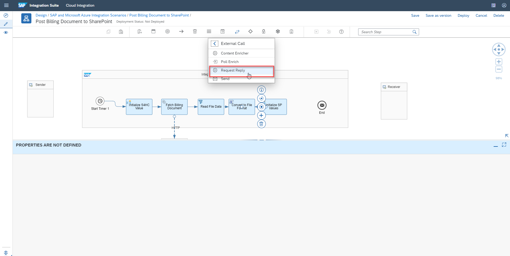

This exercise is part of the openSAP course [Building applications on SAP Business Technology Platform with Microsoft services](https://open.sap.com/courses/btpma1) - there you will find more information and context. 

# Publish documents from SAP S/4HANA to SharePoint

The objective of this exercise is to get your hands "dirty" and develop the target scenario, using the development environment which you've set up in the last two units. You will configure your Open Connectors instance to communicate with your SharePoint instance, and integrate the Connector into your Integration Flow. The integration flow (which you will develop end-to-end in this unit), contains all the steps and logic required, to extract the PDF files from an S/4HANA system and send it to a SharePoint page using your Open Connectors instance. 


## Problems
> If you have any issues with the exercises, don't hesitate to open a question in the openSAP Discussion forum for this course. Provide the exact step number: "Week2Unit3, Step 1.1: Command cannot be executed. My expected result was [...], my actual result was [...]". Logs, etc. are always highly appreciated. 
 


Welcome to Unit 3 of Week 2. In the comprehensive exercise of this unit, you will build up an end-to-end scenario, which allows you to store billing documents from S/4HANA Cloud to your SharePoint team site. To achieve this scenario, you will make use of different SAP Integration Suite components like Cloud Integration and Open Connectors, as well as Microsoft tools like SharePoint and Azure.

## Step 1 - Configure Integration Suite Open Connectors

The Open Connectors component of the SAP Integration Suite, simplifies the connectivity to a lot of different resources like in this case **Microsoft SharePoint**. You will create a respective Open Connectors instance in this step, which will be used in the upcoming steps of this unit. So make sure your Connector is working properly before continuing with the next step. 

---

1.1 To create a connector for SharePoint within Open Connectors, go to your BTP Cockpit and open your **Integration Suite** application subscription. It will open in a new browser tab. 


1.2 You should now see your capabilities in the **Integration Suite Launchpad**. Select **Extend Non-SAP Connectivity** to open the Open Connectors application. 


1.3 In case you are required to login again, use your **sap.com** credentials. 


1.4 You will be redirected to the **Open Connectors** Home page.


1.5 Within Open Connectors, click on the **Connectors tab** to view all the available pre-built connectors. 


1.6 Search for the SharePoint connector by typing **SharePoint** in the search region (top right). Hover over the SharePoint connector and select the option Authenticate to connect to your own SharePoint account.


1.7 In the connection wizard: 

* enter a name for your connector instance like **SharePointApp**
* enter your SharePoint address in the format {your_sharepoint_domain}.sharepoint.com
* enter your copied Application (client) ID from the Azure app registration in the API Key text field, 
* enter your copied secret from the Azure app registration in the API Secret text field and select **Show Optional Fields**. 


1.8 During the creation of the client & Secret in the Azure App registration, you selected the **Delegated user access** approached. Therefore, the **Delegate User** flag has to be set to **true** in Open Connectors as well.

1.9 Select **Create Instance** to create SharePoint connector instance.


> You may be prompted to enter your Microsoft subscription user credentials. In case, you are already logged into your SharePoint the logged in session may be automatically taken by the browser. 
> **IMPORTANT:** In any case, make sure you are logged in with your Microsoft365 Developer account. 


> You may be prompted to trust the SharePoint OAuth application. Select **Trust It**


1.10 After the authenticated connection to your Microsoft account has been created successfully, you will be able to test out the connection from SAP BTP Open Connectors. To try out the SharePoint connector APIs, click on the option **Test in the API Docs**.


1.11 This will launch the integrated OpenAPI specification based on the API documentation for your SharePoint connector, so that you can test and try out the connector from SAP BTP Open Connectors.

Select the available resource **GET /files** to read files from your SharePoint.


1.12 To read files from SharePoint, the information about your teams site has to be provided in the field Subsite in the format **/sites/{your_site_name}** and the path to your file has to be passed in the format **/{your_directory}/{your_filename}**. 

In our example, the name of the SharePoint teams site used was **General** and name of the filename was **docx**. Enter **/welcome.docx** in the path field and **/sites/General** in the Subsite field. 

1.13 Select **Execute**.


1.14 Your API request should return with a Code **200**. If not, check if the Subsite and the path are provided correctly! Click on the **Download file** link, to download and view your file from SharePoint.

1.15 In the **Curl** subsection, please copy the values in the Authorization header, like you can see in the screenshot. Note down these values, as you will need them later, when calling the API from SAP BTP Cloud Integration.


**Congratulations! With this step, you have successfully created a SharePoint connector instance from Open Connectors capability of SAP Integration Suite. You will be able to use this connector instance in Cloud Integration to integrate data from SAP system to SharePoint or build an application connecting to your SharePoint account.**


## Step 2 - Check out SAP API Business Hub and fetch API Key

The SAP API Business Hub is the central catalog of all SAP and partner APIs for developers to build sample apps, extensions and open integrations with SAP. In this tutorial, [Billing Document – Read, Cancel, GetPDF](https://api.sap.com/api/API_BILLING_DOCUMENT_SRV/resource) from SAP S/4HANA Cloud APIs has been used.

---

2.1 To discover and explore SAP S/4HANA Cloud APIs navigate to [SAP API Business Hub](https://api.sap.com).


2.2 Select "Login" on the top right of the screen, to be able to retrieve your personal API Key.


2.3 Enter your credentials, if required, accept the Terms & Conditions for the SAP API Business Hub and click on **Accept**.


2.4 Select the S/4HANA Cloud.


2.5 Go to APIs, ODATA V2, search for **GetPdf** and select the **Billing Document - Read, Cancel, GetPDF** API. 


2.6 In the Overview tab of the respective API, click on **Try Out**.


2.7 For this integration scenario, a service operation named GetPDF will be used. Select the GET request for **GetPdf** on the left side of the screen. 

2.8 This API endpoint returns the billing document information in a PDF format. The document identifier needs to be passed as query parameter named BillingDoument in the format **BillingDocument= 'document_id'**.  

2.9 Enter '90002930' (including the single quotes) into the **BillingDocument** field. Click on **Execute** to test your request. 


2.10 Your request should return with a **200** return code. To make use of the sample API within your Cloud Integration flow, you need to retrieve your API key. Therefor, click on **Show API key** on the top right of your screen.


2.11 Select **Copy Key and Close** to copy this API Key. This API Key will be used from Cloud Integration to get the billing document.


**Congratulations! You've learned how to navigate within and how to use the SAP API Business Hub in this step and you obtained an API key. This can be used in the following steps to call the S/4HANA Cloud Sandbox API provided by the API Business Hub.**


## Step 3 - Create your SharePoint Integration Flow

In this comprehensive step, you will create an Integration Flow within SAP Cloud Integration. This Integration Flow will be responsible for extracting the S/4HANA PDF files and sending it to SharePoint via your Open Connectors instance. It contains a major part of your extension logic and gives you a first impression of the advanced features provided by the Integration Suite. As SAP Cloud Integration is a very powerful tool with a lot of features and configuration options, make sure you read all instructions carefully before development. This prevents you from missing any detail, which might cause you analysis effort in the end. 

---

3.1 Go to your BTP subaccount using [https://hanatrial.ondemand.com](https://hanatrial.ondemand.com/). Select the **Instances and Subscriptions** menu on left and click on your **Integration Suite** application subscription. This will open the **Integration Suite Launchpad** in a new browser tab. 


3.2 In the **Integration Suite Launchpad** please click on the **Cloud Integration** capability. This will open the required component in the same window.
> In case you're facing authorization errors, please ensure that you've successfully executed the Booster described in Week 2 - Unit 2.


3.3 Once you opened the Cloud Integration component, you can close the **What's New?** popup and start working on your first integration flow. 


3.4 From the Cloud Integration workspace, Navigate to Design tab, click Create to create an integration package.


3.5 Enter the integration package details like name, description as provided in below and select **Save**. The technical name is created automatically. 

* Name:	SAP and Microsoft Azure Integration Scenarios
* Short Description: Package showcasing SAP and Microsoft Azure integration


3.6 Navigate to the Artifacts tab, select **Integration Flow** from **Add** action to add in a new Integration flow.


3.7 In the **Add integration flow** artifact dialog enter integration flow name and select **OK**.
* Name: Post Billing Document to SharePoint
* Description: Integration Flow showcasing posting of billing document files from SAP S/4HANA Cloud to SharePoint


3.8 Select the newly created Integration Flow named **Post Billing Document to SharePoint** and then select Edit to start editing the integration flow.


3.9 Since a timer-based integration flow will be used the default start message can be deleted. Select the default start message and select **Delete**.


3.10 Select and add the Timer integration step. The default property of timer integration step is to execute the integration flow immediately after you deploy the integration flow. More about the available timer configurations is available in the [help documentation](https://help.sap.com/viewer/368c481cd6954bdfa5d0435479fd4eaf/Cloud/en-US/ae14ad7916c04ecbaba3d26e2404410a.html).


3.11 To set values like API key and the billing document id to read data from SAP S/4HANA Cloud API Sandbox from SAP API Business Hub, a Content Modifier can be used. Select the **Content Modifier** integration step from the integration palette and drop it into the Integration Process canvas.


3.12 Select the **Start Timer** integration step and then drag the **arrow** icon to point towards the **Connect Modifier** step to connect the timer and content modifier integration steps.


3.13 Change the name of the content modifier step to **Initialize S4HC Value** in the **General** tab, to improve readability.


3.14 Select the **Message Header** tab and select **Add**. From the action drop down select **Create**, enter **apiKey** as the **Name** of the property, select **Constant** from the drop down for **Type** and enter your copied API Key from SAP API Business Hub in the value field. This will set the request message header named apiKey with the value set by you, to be passed to API Sandbox from SAP API Business Hub.


3.15 Select the **Exchange Property** tab and click on **Add**. From the action dropdown select **Create**, enter **doc_id** as the **Name** of the property, select **Constant** from the dropdown for **Type** and enter **90002930** in the value This will result in a property field named doc_id to be created which will be passed as the parameter to fetch the billing document for id 90002930.


3.16 To read the billing document in PDF format, the [Request Reply](https://blogs.sap.com/2015/01/05/blog-2-request-reply-pattern-in-integration-flows-hci-pi/) integration pattern with a HTTP Receiver adapter can be used. Select **Request Reply** from External Call integration palette and drop it into Integration Process canvas.


3.17 Change the name of the Request Reply step to **Fetch Billing Document** in the **General** tab to improve readability.


3.18 Select and connect the **Initialize S4HC Value** integration step with the **Fetch Billing Document** step.


3.19 Add an **Receiver** integration step to invoke the SAP S/4HANA Cloud OData API.


3.20 The name of the Receiver can be set to **S4HC** to improve readability.


3.21 Select and connect the **Fetch Billing Document** request reply step to the newly added Receiver. 


3.22 This will open the Adapter list, where you can select **HTTP** from the available adapters.


3.23 In the **Connection** tab, enter details as follows.
* Address :- https://sandbox.api.sap.com/s4hanacloud/sap/opu/odata/sap/API_BILLING_DOCUMENT_SRV/GetPDF
* Query :- BillingDocument=%27${property.doc_id}%27
* Method :- GET
* Authentication :- None
* Request Headers : *
* Response Headers : *

> In the query parameter you can notice that property doc_id is referenced dynamically as ${property.doc_id}. Since the apikey is passed via the message header set in the Initialize S4HC Value integration step the authentication type is selected to None.


3.24 Extend the size of your **Integration Process** area by moving the **End** button over the edge of the box.


3.25 The **GetPDF service operation** of the SAP S/4HANA Cloud ODataAPI, returns the PDF document in the base64 encoded format. Add a Filter step to read this file content with XPath expression.


3.26 Change the name of the Filter step to **Read File Data** in the **General** tab to improve readability.


3.27 Select the **Processing** tab and enter **d:GetPDF/d:BillingDocumentBinary/text()** in **XPath Expression** and select **String** from the Value Type drop box.


3.28 Select and connect Fetch Billing Document to Read File Data integration step.


3.29 Since the XPath Expression uses XML namespaces, this namespace needs to be defined or declared at the Integration flow.
To declare the namespace, click anywhere within your integration flow. This allows you to configure the Integration flow settings at the bottom of your page.


3.30 Switch the selected tab and then select **Runtime Configuration**. 
Enter **xmlns:d=http://schemas.microsoft.com/ado/2007/08/dataservices** in the namespace mapping.


3.31 The SharePoint connector of Open Connectors requires the file content to be passed as a [multipart form request](https://www.ietf.org/rfc/rfc2388.txt). To create the required multipart form request a Groovy Script is leveraged.


3.32 Change the name of Groovy Script step to **Convert to File Format** in the General tab to improve readability.


3.33 Click on the **Create** button of the newly added Groovy script step to create a new script file.


3.34 Copy & paste the below code snippet to the created script page. Select **Ok** to persist the script changes.

    /*
    The integration developer needs to create the method processData 
    This method takes Message object of package com.sap.gateway.ip.core.customdev.util 
    which includes helper methods useful for the content developer:
    The methods available are:
    public java.lang.Object getBody()
    public void setBody(java.lang.Object exchangeBody)
    public java.util.Map<java.lang.String,java.lang.Object> getHeaders()
    public void setHeaders(java.util.Map<java.lang.String,java.lang.Object> exchangeHeaders)
    public void setHeader(java.lang.String name, java.lang.Object value)
    public java.util.Map<java.lang.String,java.lang.Object> getProperties()
    public void setProperties(java.util.Map<java.lang.String,java.lang.Object> exchangeProperties) 
    public void setProperty(java.lang.String name, java.lang.Object value)
    */
    import com.sap.gateway.ip.core.customdev.util.Message;
    import java.util.HashMap;

    def Message setHeader(Message message, String id) {

    message.setHeader("content-type","multipart/form-data; boundary=--------------------------" + id);

    return message;

    }

    def ByteArrayOutputStream getMultiPartBody(payload, filename, id) {

    String charset = "UTF-8";
    def LINEFEED = "\r\n";

    def output = new ByteArrayOutputStream();
    output.write(("----------------------------"+ id).getBytes(charset));
    output.write(LINEFEED.getBytes(charset));
    output.write(("Content-Disposition: form-data; name=\""+filename+"\"; filename=\""+filename+"\"").getBytes(charset));
    output.write(LINEFEED.getBytes(charset));

    output.write("Content-Type: application/pdf".getBytes(charset));
    output.write(LINEFEED.getBytes(charset));
    output.write(LINEFEED.getBytes(charset));

    output.write( payload );
    output.write(LINEFEED.getBytes(charset));

    output.write(("----------------------------"+ id + "--").getBytes(charset));
    output.write(LINEFEED.getBytes(charset));
    return output;

    }


    def Message processData(Message message) {

    String charset = "UTF-8";
    def id = "238360769909770904663504";

    def map = message.getProperties();
    def filename = "billing_" + map.get("doc_id") + ".pdf";

    def payload = message.getBody(String.class).decodeBase64();
    message.setProperty("byteSize",payload.length);

    def ByteArrayOutputStream output = getMultiPartBody(payload,filename,id);
    message = setHeader(message, id);
    message.setBody(output.toByteArray());

    return message;
    }

>In this script, the multipart format request is created from the incoming response data. For posting a file to SharePoint, the size of the uploaded documented is also required. The size of the incoming byte[] data is read and stored in a property named byteSize.


3.35 Select and connect the **Read File Data** to the **Convert to File Format** integration step.


### Add the required request parameters to call your Open Connectors SharePoint API

3.36 Add a **Content Modifier** step, to initialize the SharePoint connector instance authorization token and the SharePoint team site, where the document will be posted.


3.37 Change the name to **Initialize SP Values** in the **General** tab to improve readability.


3.38 Navigate to the Message Header tab. Select **Add** to add new message header. Enter **Subsite** in the Name field and enter your SharePoint team site name in the format **/sites/{your_teamsite}**. In this tutorial, a team site named General was used therefore the value of **Subsite** field is **/sites/General**. Select **Add** to add another message header. Enter **Authorization** in the Name field. As a value copy the Authorization header noted down in **Step 1.15**.

> The Authorization header value does have the following format: "User xyz123, Organization xyz456, Element xyz789". 

>Note :- If your team site contains spaces , then enter the site name without any spaces in the Subsite field.


3.39 Select and connect the **Convert to File Format** and **Initialize SP Values** integration step.


3.40 To post a file document to SharePoint via Open Connectors an HTTP Receiver adapter can be used. Select the **Request Reply** from the **External Call** integration palette and drop it into the Integration Process canvas.





3.41 Change the name of the added **Request Reply** step to **Post File to SharePoint** to improve readability.


3.42 Select and connect the **Initialize SP Values** and **Post File to SharePoint** integration steps.


3.44 Add a receiver from the Participants integration palette and place it below the **Post File to SharePoint** integration step. Alternatively, you can also take the existing receiver from your canvas and place it below the respective integration step.


3.45 Change the name of the added **Receiver** step to **SharePoint** to improve readability.


3.46 Select and connect the **Post File to SharePoint** Request Reply step to the recently placed **Receiver**. 


3.47 This will open the Adapter list, where you need to select HTTP from the available adapters.


3.48 Under the Connection tab, enter details as follows.
* Address :- ```https://api.openconnectors.trial.<BTP Trial Region e.g. ap21>.ext.hana.ondemand.com/elements/api-v2/files```
* Query :- size=${property.byteSize}&path=%2Fbilling_${property.doc_id}.pdf&overwrite=true
* Method :- POST
* Authentication :- None
* Request Headers : *


>In the query parameters, you can notice the usage of the property.byteSize field. The property **byteSize** is set in the Groovy Script step. To dynamically set the document id, you can notice the usage of the property.doc_id field. The property doc_id is set in the **Initialize SP Values** integration step. The overwrite query parameter is set to true, to override existing files in SharePoint. Setting it to false, would ensure that files are not overwritten and may result in a **429 file already exists** error.


3.49 Select and connect the **Post File to SharePoint** to the **End message** to complete the integration process flow.


3.50 Select **Save** and then click the **Deploy** button to deploy this integration flow to SAP BTP Integration tenant.

>Note, the first-time deployment might take some time before the changes are fully deployed.


With this step, an integration flow that queries a billing document from the SAP S/4HANA Cloud system and saves the document into SharePoint (via Open Connectors) has been successfully created.


3.51 Navigate to the **Monitor**, to check the status of the deployed integration flow. Click on the **All** tile below **Manage Integration Content**, to see all available integration flows. 


3.52 Select and check the status of your integration flow, and wait until it has been **successfully deployed**. You might need to reload the page. 


3.53 Select **Monitor Message Processing**  to view the successfully executed integration flow. 


3.54 Since the integration flow was designed as a Run immediate timer-based integration, the flow will be executed as soon as it deployed. If status is **Completed**, then the billing document read from SAP S/4HANA Cloud system was posted to your SharePoint team site.


**Congratulations! You've successfully deployed your first Integration Flow, which will be used to store billing documents coming from S/4HANA Cloud, in your SharePoint team site. In the next step, you will check if the document was successfully uploaded to Share Point, to validate if your Integration Flow is working properly.**


## Step 4 - Review result in SharePoint

In this step, you will check whether your PDF file has been successfully uploaded to your SharePoint page. 

---

4.1 Go to your SharePoint site once again and check if the PDF billing document is available. 


4.2 Open the billing document and check if the PDF document can be opened as desired. 


**Congratulations! Your Integration Flow is working properly and has successfully uploaded the billing document to SharePoint.**


## Special Thanks

A special thanks to [Divya Mary](https://people.sap.com/divya.mary), who has written an excellent blog series, which this tutorial is based on.
https://blogs.sap.com/2020/09/29/blog-series-posting-documents-to-sharepoint/


## Summary

Congratulations! You've successfully accomplished this unit's quite comprehensive exercise. You've learned how to configure and develop within two components of the SAP Integration Suite (Open Connectors & Cloud Integration). Furthermore you've implemented one approach, how these services can interact with Microsoft products like SharePoint.
