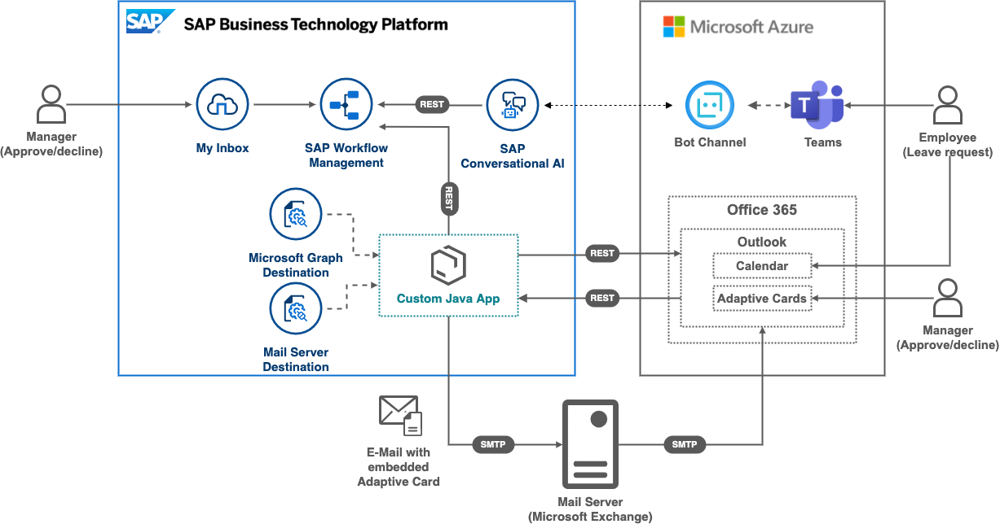

# OpenSAP - Building Applications on SAP BTP with Microsoft Services - Building Extension Scenarios

This repository contains code samples and step by step instructions 

## Description
Extend productivity beyond SAP ecosystem using MS Teams and Outlook as engagement channels for workflows.

The sample project where an employee can create a leave request via chatbot from Microsoft Teams integrated with SAP Conversational AI which triggers workflow. The manager of the employee can approve or reject the leave request via a My Inbox app in the SAP Fiori Launchpad or directly from the Microsoft Outlook inbox via Microsoft actionable messages. As soon as the request is approved, a calendar entry will automatically be created in the employee’s Microsoft Outlook triggered via Microsoft Graph APIs.

>NOTE: In case you skipped the previous weeks, please first setup your [SAP BTP Trial](https://github.com/SAP-samples/btp-azure-opensap/tree/main/Week1/Unit2#setting-up-sap-btp-trial) Account, [Azure Trail](https://github.com/SAP-samples/btp-azure-opensap/tree/main/Week1/Unit3#setup-free-microsoft-azure-account) and [Microsoft 365 Developer](https://github.com/SAP-samples/btp-azure-opensap/tree/main/Week2/Unit1#step-1---create-a-microsoft365-developer-account) Account before continuing with this week. Make sure that the User is [added to Microsoft Azure (Step 4)](https://github.com/SAP-samples/btp-azure-opensap/tree/main/Week2/Unit1#step-4---add-microsoft365-developer-account-as-co-administrator-in-your-azure-trial-subscription).

## Unit Overview

### [Unit 1: Setting up for Workflow Management on SAP Business Technology Platform](./Unit1/README.md)
### [Unit 2: SAP Workflow Management: create leave request workflow](./Unit2/README.md)
### [Unit 3: Triggering an SAP workflow from an SAP Conversational AI bot](./Unit3/README.md)
### [Unit 4: Sending adaptive cards from an SAP workflow](./Unit4/README.md) 
### [Unit 5: Create calendar entry using Microsoft Graph](./Unit5/README.md)

