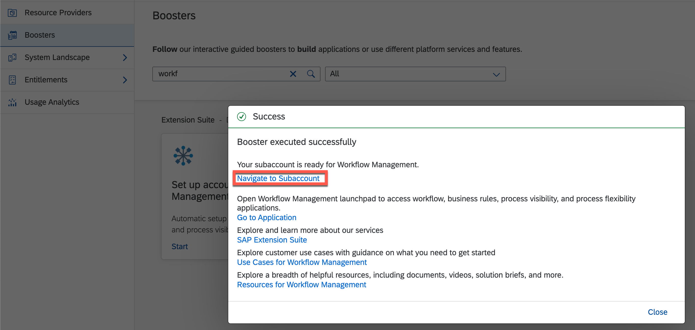

---

Even though the course is now closed, you can still access the videos and PDFs in self-paced mode via the openSAP course itself. The hands-on exercises will continue to be available for some time. However, certain steps and screenshots may be out of date as products continue to evolve. Therefore, we cannot guarantee that all exercises will work as expected after the end of the course.

---

This exercise is part of the openSAP course [Building applications on SAP Business Technology Platform with Microsoft services](https://open.sap.com/courses/btpma1) - there you will find more information and context. 

>NOTE: In case you skipped the previous weeks, please first setup your [SAP BTP Trial](https://github.com/SAP-samples/btp-azure-opensap/tree/main/Week1/Unit2#setting-up-sap-btp-trial) Account, [Azure Trail](https://github.com/SAP-samples/btp-azure-opensap/tree/main/Week1/Unit3#setup-free-microsoft-azure-account) and [Microsoft 365 Developer](https://github.com/SAP-samples/btp-azure-opensap/tree/main/Week2/Unit1#step-1---create-a-microsoft365-developer-account) Account before continuing with this week. Also make sure that the Microsoft365 user is [added to Microsoft Azure (Step 4)](https://github.com/SAP-samples/btp-azure-opensap/tree/main/Week2/Unit1#step-4---add-microsoft365-developer-account-as-co-administrator-in-your-azure-trial-subscription).

# Setup SAP Workflow Management in SAP BTP Trial

In this unit you'll set up and configure the basic aspects of the SAP Workflow Management that you'll need to complete Week 3 of this course.   

From a service perspective, you'll be using a number of services from the start:

* **Workflow Service**: Build, run, and manage simple and complex workflows spanning across various organizations and applications.
* **Workflow Management**: Configure the process flows, decisions and visibility scenarios in a low-code, no-code approach to improve process experience.
* **SAP Business Application Studio**: Develop, debug, test, and deploy SAP business applications.
* **Authorization & Trust Management**: to manage application authorizations and trust to identity providers

## Step 1 - Set up your trial account for SAP Workflow Management

To accelerate the setup process, BTP offers **Boosters** concept which will help you to automate the onboarding process and save several manual efforts for configuring and activating required services.

In a Booster Catalog you can find booster **"Set up account for Workflow Management"** which helps you to set up a development environment where you can work with SAP Workflow Management service in your SAP BTP account.

This guided set of automated steps will configure entitlements of workflow management services, subscribe to the workflow management application, create a service instance for: workflow management, workflow, create needed destinations, and assign all needed roles to your user. In the background, the booster will also automatically enable Cloud Foundry and create default space, if not done already. Business 

As the booster completes, your subaccount will be ready to start building using SAP Workflow Management. You'll have appropriate authorizations set up and assigned to your user, an Business Application Studio (IDE) setup and configured to work with Workflow artifacts, and an instance of the main Workflow service set up explicitly.

---
1.1 Go to the [SAP BTP Trial Cockpit](https://account.hanatrial.ondemand.com/) and **Go To Your Trial Account**. 

1.2.  Navigate to **Boosters** section. Find the **"Set up account for Workflow Management"** booster and open it.


1.2. You then get an overview which services and subscriptions are part of this booster. **Start** the booster.


1.3. The booster will start executing the following tasks:
   * Assigning Service Quotas
   * Subscribing to SaaS Applications
   * Creating Service Instances
   * Creating Destination
   * Assigning Role Collections
   
   After finishing all the tasks you will see a success message.


1.4 After the successful execution navigate to your subaccount. 



1.5. Now, the **Services > Instances and Subscriptions** area of your subaccount should list
   * Application Subscriptions to **SAP Business Application Studio** and **Workflow Management**
   * Service instances of **Destination** and **Workflow** Service

   

1.6. After the booster execution, you can also find all the required roles collections assigned to your user via **Security > Users**, so no manual assignment is necessary.
   
   

1.7. In the upcoming units we will use some APIs of SAP Worfklow Management and for that we need to add the required authorization scopes to the services instance. Using the **Instances and Subscriptions** menu item on the left, update the *wm_workflow* service instance by using the **Update** button and following the dialog flow, paying attention at each of the steps:


- Step "Basic info": make sure that you don't change the name. Go on with **Next**. 
- Step "Parameters": specify the following authorization scopes in the text area:

    ```
        {
        "authorities": [
            "TASK_COMPLETE",
            "WORKFLOW_DEFINITION_DEPLOY",
            "TASK_GET_CONTEXT",
            "TASK_UPDATE",
            "TASK_GET_FORM_MODEL",
            "TASK_GET_FORM",
            "TASK_GET",
            "TASK_GET_ATTRIBUTES",
            "PROCESS_TEMPLATE_DEPLOY",
            "PROCESS_VARIANT_DEPLOY",
            "TASK_GET_ATTACHMENTS",
            "WORKFLOW_INSTANCE_START"
            ]
    }
    ```
- Finish with **Update Instance**. 
  


> The authorities you specified in the "Parameters" step will be needed in a later unit, when you come to call the SAP Workflow Management APIs.
## Step 2 - Configure SAP Business Application Studio for development

The SAP Business Application Studio is a development environment available on SAP Business Technology Platform. You will use the development environment in the coming units to build and deploy workflow definitions for SAP Workflow Management. 

---

2.1. <a name="newdevspae">Navigate to **Instances and Subscriptions** inside your trial subaccount. Find **"SAP Business Application Studio"** within Application Subscriptions and launch it either from launch icon or "..." --> "Go to Application"</a>
   

   
2.2. **Create** a new development Space. 
   

    
2.3. Give the new dev space (e.g. _WFDEV_) and select the following extensions to enable them in the development space:
* Java Tools (to develop and run Java Apps)
* MTA Tools (to build and deploy Multitarget-Applications)
* Workflow Management (to create workflow definitions for SAP Workflow Management)
   
   

2.4 You can find the newly defined and preconfigured development space with all required tools in the overview of your development spaces. In the next unit we will use this space to build and deploy the workflow definition. 
   
   

## Summary

**Good work! You successfully finished the setup and configuration of all necessary services and tools for SAP BTP which are required for Week 3.**

