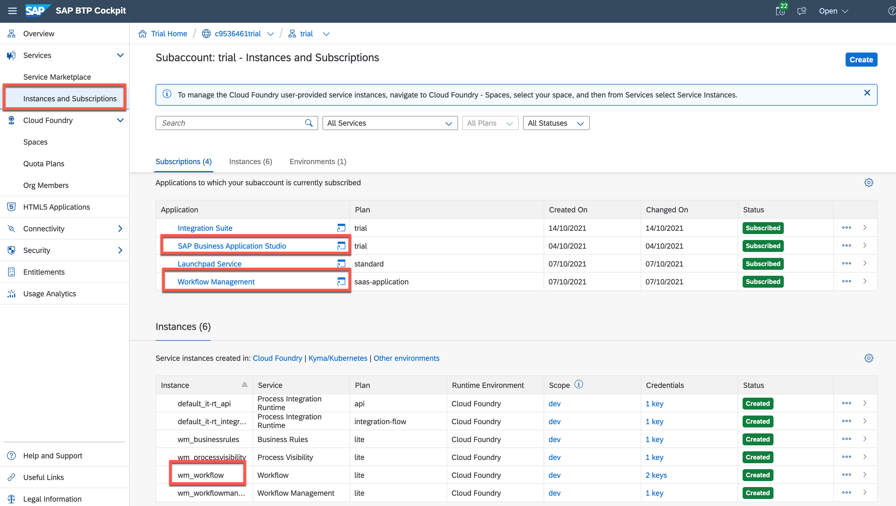

This exercise is part of the openSAP course [Building applications on SAP Business Technology Platform with Microsoft services](https://open.sap.com/courses/btpma1) - there you will find more information and context. 

>NOTE: In case you skipped the previous weeks, please first setup your [SAP BTP Trial](https://github.com/SAP-samples/btp-azure-opensap/tree/main/Week1/Unit2#setting-up-sap-btp-trial) Account, [Azure Trail](https://github.com/SAP-samples/btp-azure-opensap/tree/main/Week1/Unit3#setup-free-microsoft-azure-account) and [Microsoft 365 Developer](https://github.com/SAP-samples/btp-azure-opensap/tree/main/Week2/Unit1#step-1---create-a-microsoft365-developer-account) Account before continuing with this week. For Week 3 also very important to use the **Microsoft 365 User** * < youruser >@< yourdomain >.onmicrosoft.com* for all your accounts (BTP, Azure, CAI). Make sure that the User is [added to Microsoft Azure (Step 5)]([https://link](https://github.com/SAP-samples/btp-azure-opensap/tree/main/Week2/Unit1#step-4---add-microsoft365-developer-account-as-co-administrator-in-your-azure-trial-subscription)) and [to SAP BTP (Step 5)](https://github.com/SAP-samples/btp-azure-opensap/tree/main/Week2/Unit1#step-5---add-microsoft365-developer-account-as-administrator-in-sap-btp-trial-account).

# Setup SAP Workflow Management in SAP BTP Trial

In this unit you'll set up and configure the basic aspects of the SAP Workflow Management that you'll need to complete Week 3 of this course.   

From a service perspective, you'll be using a number of services from the start:

* **Workflow Service**: Build, run, and manage simple and complex workflows spanning across various organizations and applications.
* **Workflow Management**: Configure the process flows, decisions and visibility scenarios in a low-code, no-code approach to improve process experience.
* **SAP Business Application Studio**: Develop, debug, test, and deploy SAP business applications.
* **Authorization & Trust Management**: to manage application authorizations and trust to identity providers

## Problems
> If you have any issues with the exercises, don't hesitate to open a question in the openSAP Discussion forum for this course. Provide the exact step number: "Week3Unit1, Step 1.1: Command cannot be executed. My expected result was [...], my actual result was [...]". Logs, etc. are always highly appreciated. 
 


## Step 1 - Set up your trial account for SAP Workflow Management

To accelerate the setup process, BTP offers **Boosters** concept which will help you to automate the onboarding process and save several manual efforts for configuring and activating required services.

In a Booster Catalog you can find booster **"Set up account for Workflow Management"** which helps you to set up a development environment where you can work with SAP Workflow Management service in your SAP BTP account.

This guided set of automated steps will configure entitlements of workflow management services, subscribe to the workflow management application, create a service instance for: workflow management, workflow, create needed destinations, and assign all needed roles to your user. In the background, the booster will also automatically enable Cloud Foundry and create default space, if not done already. Business 

As the booster completes, your subaccount will be ready to start building using SAP Workflow Management. You'll have appropriate authorizations set up and assigned to your user, an Business Application Studio (IDE) setup and configured to work with Workflow artifacts, and an instance of the main Workflow service set up explicitly.
   
1.1.  Go to your SAP BTP trial account and go to **Boosters** section. Find the **"Set up account for Workflow Management"** booster and open it.


1.2. Get overview which Services and Subscriptions are part of this booster and start the booster


1.3. Booster will start executing following tasks:
   * Assigning Service Quotas
   * Subscribing to SaaS Applications
   * Creating Service Instances
   * Creating Destination
   * Assigning Role Collections
   
   After finishing all the tasks you will see a success message.


1.4. After successful execution you can navigate to **Instances and Subscriptions** of your subaccount and find
   * Application Subscriptions to **SAP Business Application Studio** and **Workflow Management**
   * Service instances of **Destination** and **Workflow** Service

   

1.5. After booster execution you can also find all the required roles assigned to your user, so no manual assignment is necessary.
   
   

1.6. In upcoming Units we will use workflow APIs and for that we need to add the required authorization scopes to the services instance. Using the "Instances and Subscriptions" menu item on the left, update the *wm_workflow* service instance by using the "Update" button and following the dialog flow, paying attention at each of the steps:


- Step "Basic info": make sure that you don't change the name
- Step "Parameters": specify the following authorization scopes in the text area:

    ```
        {
        "authorities": [
            "TASK_COMPLETE",
            "WORKFLOW_DEFINITION_DEPLOY",
            "TASK_GET_CONTEXT",
            "TASK_UPDATE",
            "TASK_GET_FORM_MODEL",
            "TASK_GET_FORM",
            "TASK_GET",
            "TASK_GET_ATTRIBUTES",
            "PROCESS_TEMPLATE_DEPLOY",
            "PROCESS_VARIANT_DEPLOY",
            "TASK_GET_ATTACHMENTS",
            "WORKFLOW_INSTANCE_START"
            ]
    }
    ```


> The authorities you specified in the "Parameters" step will be needed in a later unit, when you come to call the Workflow API.


## Step 2 - Configure Business Application Studio for development

2.1. Open BTP cockpit and navigated to **Instances and Subscriptions** inside your trial subaccount. Find **"SAP Business Application Studio"** within Application Subscriptions and launch it either from launch icon or "..." --> "Go to Application"
   

   
2.2. Create a new development Space 
   

    
2.3. Select Following Extensions to enable them in the development space:
    * Java Tools - For developing and running Java Apps
    * MTA Tools - For build/deploy/... Multitarget Applications
    * Workflow Management - For creating Workflow Applications
   
   

2.4. After creation you can find newly defined and preconfigured development space with all required tools. In the next Unit we will use this space for building and deploying the workflow application. 
   
   

## Summary

Good work!
You successfully finished the setup and configuration of all necessary services and tools which is required for the Week 3 and you will use them in later Unites.

