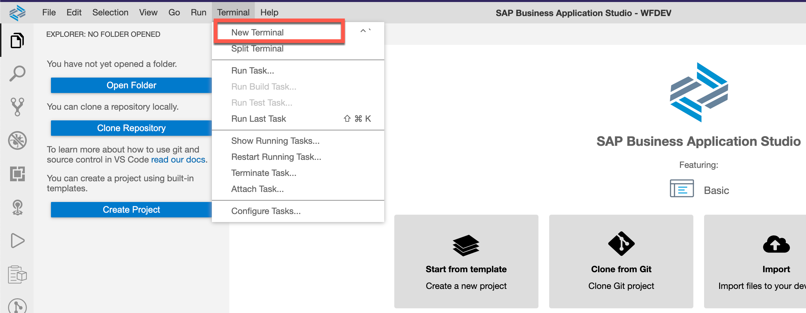
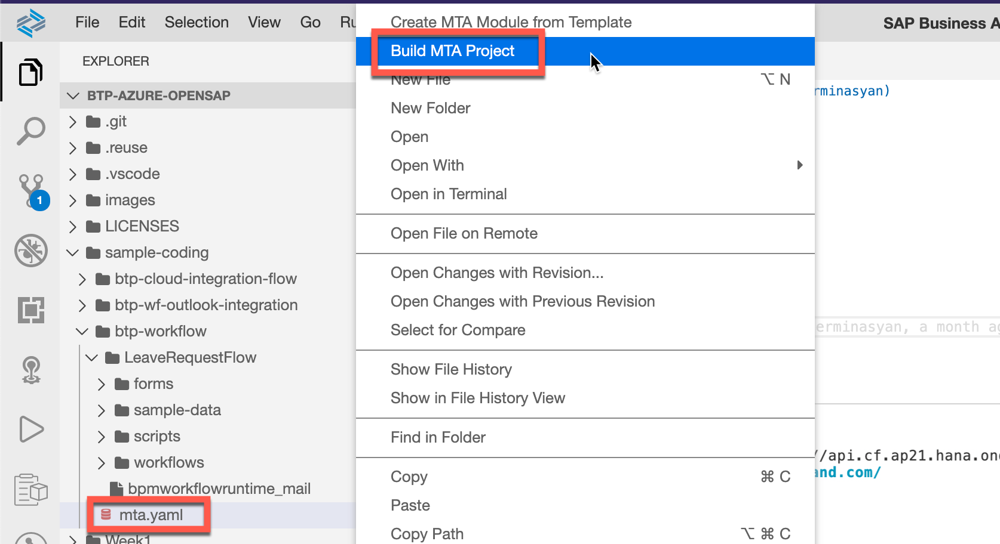
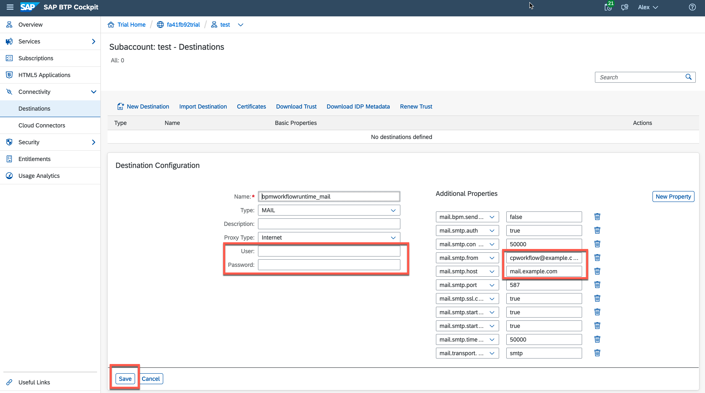

This exercise is part of the openSAP course [Building applications on SAP Business Technology Platform with Microsoft services](https://open.sap.com/courses/btpma1) - there you will find more information and context. 


# SAP Workflow Management: create leave request workflow

The objective of the exercise is to create leave request workflow, deploy and run it on BTP. Also understand the basic concepts how it works.

## Problems
> If you have any issues with the exercises, don't hesitate to open a question in the openSAP Discussion forum for this course. Provide the exact step number: "Week3Unit1, Step 1.1: Command cannot be executed. My expected result was [...], my actual result was [...]". Logs, etc. are always highly appreciated. 
 

## Step 1 - Business Application Studio getting started

1.1. Launch Business Application Studio from BTP cockpit
   
   

1.2. Run the Workflow Development space created in previous unit
   
   

1.3. Open the space. Business Application Studio will initiate all necessary tools
   
   

1.4. IDE is now ready for development
   
   


## Step 2 - Clone the Workflow project from GitHub and get familiar with it

2.1. Clone following project from GitHub into your BAS workspace. Clone the project using either the Terminal in BAS and *git* CLI or BAS Github tools.

Open the Termin via the BAS Menu. 
   

Change the directory and clone the git repo
   

   ```bash/Shell
   cd ~/projects/
   git clone https://github.com/maxstreifeneder/btp-azure-draft.git
   ```


2.2. Workflow project you can find in **btp-workflow** folder.
   Project has following structure:

   

2.3. Leave request workflow is defined in
   
   ```
   workflow
   └── EmployeeLeaveRequest.workflow
   ```

   

    Leave request workflow definition consist of following tasks:
   * **User Task:** A flow object that illustrates a task that a human performs. User tasks appear e.g. in My Inbox where the processor of the task can complete the task instance, and view its description.
   * **Mail Task:** A flow object that you configure to send e-mails to one or more recipients.
  
   >If you are interested in further task types, please refer to following  [documentation]([https://link](https://help.sap.com/viewer/e157c391253b4ecd93647bf232d18a83/Cloud/en-US/a855a4f8898547bd8a5aa04bf7ecaa40.html))

   As a **User Task** (ApproveOrRejectManager) we defined all the fields and forms necessary for manager to approve or reject the leave request.

   **Mail Task** (MailTaskAccept, MailTaskDecline) we use to send the leave requester the approval status.

2.4. Form definition for User Task is defined in
      
   ```
   forms
   └── EmployeeLeaveRequest
       └── ManagerApproval.form
   ```

   

   End users can interact with a workflow through user interface with forms and in this example Manager can see the request form in MyInbox and approve or reject the request.

2.5. To test the leave request workflow we defined sample data which can be used for testing purpose during workflow development
   
   ```
   sample-data
   └── EmployeeLeaveRequest
       └── sampleContext.json
   ```
   
   

   ```json
   {
    "requestorName": "Requestor Name",
    "reason": "Vacation",
    "requestor": "Requestor E-Mail (Use the address used in BTP)",
    "startdate": "2021-12-16",
    "enddate": "2021-12-19"
   }
   ```

   >Note, To keep the exercise simple, you will take the role of manager and approve or reject the leave request created by you. 
   
## Step 3 - Build and deploy the Workflow in your BTP trial account

Now after exploring the leave request workflow definition, you can build and deploy it in your BTP trial account.

3.1. Make sure that you are loged in your BTP account
   ```
      cf login -a <API Endpoint>
   ```
3.2. Right click on mta.yaml and **"Build MTA Project"**
   
   

   > mta.yaml is the Multitarget Application development descriptor

3.3. The deployable archive file you can find in  

   ```
   mta_archives
   └── LeaveRequest_0.0.1.mtar
   ```

   Right click on the archive file and **"Deploy MTA Archive"**
   
   

## Step 4 - Define the Mail Destination used in Mail task to send the approval status

To be able to send approval or rejection email from Mail Task, we need to configure mail destination with SMTP credentials.

4.1. Download the **"bpmworkflowruntime_mail"** destination from GitHub or from your BAS workspace
   
   

   ```
   sample-coding
   └── btp-wf-outlook-integration
       └── bpmworkflowruntime_mail
   ```

4.2. Go to BTP cockpit and navigate to destinations and import the downloaded mail destination
   
   

4.3. Add your SMTP Server host and credentials
   
   

   >Note, the destination name should be **bpmworkflowruntime_mail**, otherwise the Workflow Mail Task will not find it.

   ```
      Type=MAIL
      Name=bpmworkflowruntime_mail
      ProxyType=Internet

      mail.user=
      mail.password=
      
      mail.smtp.host=mail.example.com
      mail.smtp.port=587
      mail.transport.protocol=smtp
      mail.smtp.starttls.required=true
      mail.smtp.starttls.enable=true
      mail.smtp.connectiontimeout=50000
      mail.smtp.timeout=50000
      mail.smtp.auth=true
      
      mail.smtp.from=cpworkflow@example.com
      mail.smtp.ssl.checkserveridentity=true
      
      mail.bpm.send.disabled=false

   ```
    >Replace the SMTP host *mail.smtp.host* and *mail.smtp.from* also provide the credentials of SMTP Server.

## Step 5 - Test the workflow definition 

After successful deployment of leave request workflow we can see the deployment and test it with sample leave request

5.1. Go to BTP Cockpit and navigate to **"Instances and Subscriptions"** and run the **"Workflow Management"** using the highlighted icon
   
   
   
   It will open Workflow Management launchpad

5.2. In launchpad under Monitoring tools you can find the "Workflow Monitoring - Workflow Definition" tile. Open the application
   
   

5.3. Here you can find the Employee Leave Request Workflow deployed in previous steps
   
   

5.4. Now you can trigger new Leave Request Workflow by clicking on **"Start new instance"** and using the sample data we defined in earlier steps.

   

   >Note, later in upcoming Unit the leave request workflow will be triggered by API call from CAI chatbot

5.5. Go back to Workflow Management launchpad and open "Workflow Monitoring - Workflow Instances" tile

   

5.6. Here you can find the running instance of triggered workflow

   

   You can find detailed information about the triggered workflow, see the workflow context and also analyse execution log if necessary.
   
   In Execution log you can see that leave request task was created and the manager can find it in MyInbox application.

   To keep the exercise simple, you will take the role of manager and approve or reject the leave request created by you.

5.7. Go back to launchpad and launch **"My Inbox"** application
   
   

5.8. In My Inbox you will find the triggered leave request and you can "self" approve or reject it.

   

5.9. After approval or rejection you will receive confirmation/rejection E-Mail

   
    
5.10. In Workflow Monitoring under Execution Log you can see that all steps were successfully finished.
    
   
   

# Summary

Congrats! You successfully build and deployed the leave request workflow. You also simulated the workflow request process using the Monitoring tools provided by SAP Workflow Management.