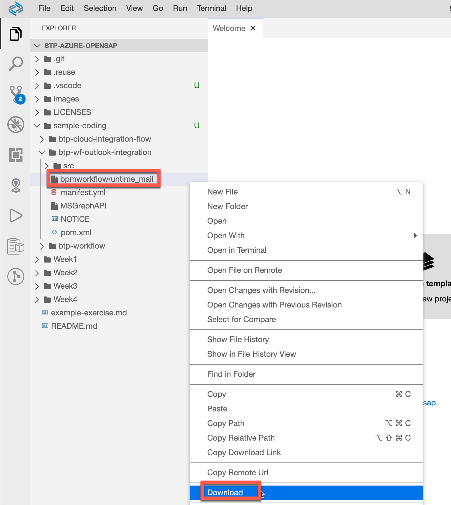
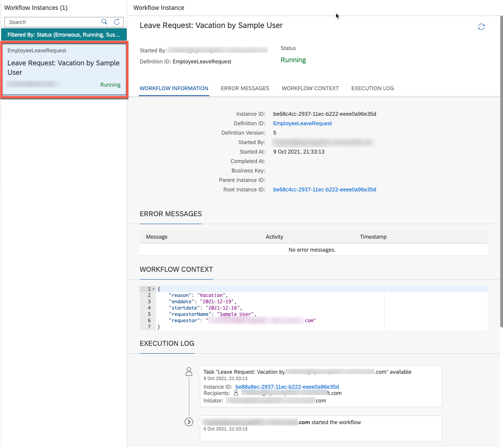

---

Even though the course is now closed, you can still access the videos and PDFs in self-paced mode via the openSAP course itself. The hands-on exercises will continue to be available for some time. However, certain steps and screenshots may be out of date as products continue to evolve. Therefore, we cannot guarantee that all exercises will work as expected after the end of the course.

---

This exercise is part of the openSAP course [Building applications on SAP Business Technology Platform with Microsoft services](https://open.sap.com/courses/btpma1) - there you will find more information and context. 


# SAP Workflow Management: Build Leave Request workflow

The objective of the exercise is to create a leave request workflow definition, deploy and run it on SAP BTP Trial. Also understand the basic concepts of how it all fits together.

## Step 1 - SAP Business Application Studio getting started

1.1. Launch SAP Business Application Studio from BTP cockpit
   
   

1.2. Start the development space that you have created in the previous unit. (e.g. _WFDEV_). 
   
   

1.3. Open the space through clicking on the name. The SAP Business Application Studio will initiate all necessary tools. 
   
   

1.4. You are now prompted with the _Welcome Page_ of your SAP Business Application Studio developement space. You are ready to go. 
   
   


## Step 2 - Clone the Workflow project from GitHub and get familiar with it

2.1. <a name="clonerepo">Clone the GitHub repository of this openSAP course using the terminal in SAP Business Application Studio.</a>

Open the Terminal via the SAP Business Application Studio Menu. 
   

Change the directory and clone the git repository using the following commands: 

   ```bash
   cd ~/projects/
   git clone https://github.com/SAP-samples/btp-azure-opensap
   ```

   

2.2 Open the cloned project in the File Explorer. 

   

2.3. The cloned repository not only contains the exercises like this one here but also sample coding. The relevant artifacts for this unit are part of the following structure:

   

2.4. The Leave Request workflow definition relevant for this unit can be found in **sample coding > btp-workflow > LeaveRequest > workflows**. Open the file and have a look at it. 
   
   ```
   workflows
   └── EmployeeLeaveRequest.workflow
   ```

   

   The Leave request workflow definition consist of following tasks:
    
   * **User Task:** A flow object that illustrates a task that a human performs. User tasks appear e.g. in My Inbox where the processor of the task can complete the task instance, and view its description.
   * **Mail Task:** A flow object that you configure to send e-mails to one or more recipients.
  
   >If you are interested in further task types, please refer to following  [documentation]([https://link](https://help.sap.com/viewer/e157c391253b4ecd93647bf232d18a83/Cloud/en-US/a855a4f8898547bd8a5aa04bf7ecaa40.html))

   As a **User Task** (ApproveOrRejectManager) we defined all the fields and forms necessary for manager to approve or reject the leave request.

   **Mail Task** (MailTaskAccept, MailTaskDecline) we use to send the leave requester the approval status.

2.4. The Form definition for the said User Task is defined in the following file. Open the file and have a look at it. 
      
   ```
   forms
   └── EmployeeLeaveRequest
       └── ManagerApproval.form
   ```

   

   End users can interact with a workflow through user interface with forms. In this example, the manager of an employee can see the request form in the MyInbox application and approve or reject the request.

2.5. <a name="sampledata" /> To test the leave request workflow, the project contains a sample data file that can be used for testing purpose during the workflow development. **Open** the file and **replace** the placeholder <mail address of your SAP BTP Trial account> with the actual mail address of your SAP BTP Trial account. 
   
   

   ```json
   {
    "requestorName": "Sample User",
    "reason": "Vacation",
    "requestor": "<mail address of your SAP BTP Trial account>",
    "startdate": "2021-12-16",
    "enddate": "2021-12-19"
   }
   ```

   >Note, To keep this scenario as simple as possible, you will take both the role of a potential manager and approve or reject the leave request created by you as well as the role of the leave request creator. 

2.6 **Save** the file. 
   
## Step 3 - Build and deploy the Workflow in your BTP trial account

After exploring the leave request workflow definition, you can build and deploy it to your SAP BTP trial account.

---

3.1. <a name="cfcli"> Make sure that you are loged in your SAP BTP Cloud Foundry environment. Therefore, you need an API Endpoint. **Open the SAP BTP Trial Cockpit in a new tab** (you still need the SAP Business Application) and navigate to your dev space.</a>

   

3.2 **Copy** the API Endpoint. 

   

3.3 Go back to the SAP Business Application Studio tab and use the following command. **Replace** the _<API Endpoint>_ placeholder with the actual value you have copied from the SAP BTP Trial Cockpit. 

   bash
   ```
      cf login -a <API Endpoint>
   ```

   

> Note: If you only have access to one Cloud Foundry space, then you are automatically target to this one. (If there are multiple spaces accessible for you, follow the progress in the terminal and provide the org/space numbers.)

3.4. Right click on the **sample-coding/btp-workflow/mta.yaml** file and select **Build MTA Project**.
   
   

   > mta.yaml is the [Multitarget Application development descriptor](https://help.sap.com/viewer/c2b99f19e9264c4d9ae9221b22f6f589/2021_3_QRC/en-US/4486ada1af824aadaf56baebc93d0256.html)

   The build step will produce the following file **sample-coding/btp-workflow/mta_archives/LeaveRequest_0.0.1.mtar**. 

   ```
   mta_archives
   └── LeaveRequest_0.0.1.mtar
   ```

3.5 <a name="wfdeploy">Right click on the LeaveRequest_0.0.1.mtar file and select **Deploy MTA Archive**. </a>
   
   

   The output in your terminal should be relatively similar to the one in the following screenshot. 

   

## Step 4 - Define the Mail Destination used in Mail task to send the approval status

To be able to send approval or rejection mails from a so called _Mail Task_, we need to configure a mail destination with SMTP credentials.

---

4.1. Download the **"bpmworkflowruntime_mail"** destination from your SAP Business Application Studio workspace.
   
   

   ```
   sample-coding
   └── btp-wf-outlook-integration
       └── bpmworkflowruntime_mail
   ```

4.2. Open a new tab and go to your **dev** space in the [SAP BTP Trial cockpit](https://hanatrial.ondemand.com). **Import** the downloaded mail destination.
   
   

4.3. Replace <your M365 mail address> with the mail adress of your Microsoft365 developer account.

**IMPORTANT**: Make sure that Multifactor Authentication (MFA) is not active in your Microsoft365 developer account, it'll cause issues while using SMTP Destination. In general we recommend using MFA but, not for this unit. You can find in [Troubleshooting](https://github.com/SAP-samples/btp-azure-opensap/tree/main/Week3/Unit2#troubleshooting) section how to deactivate it, in case you already activated it.   

   > How to setup a Microsoft365 user was covered in [Week2, Unit1](../../Week2/Unit1/README.md#microsoft365). 
   > You can also use other mail addresses. You only need to find out your SMTP Host and Port for your mail provider and adjust it in the destination properties. You need to provide these settings in Step 4.5
   
   **IMPORTANT**: Make sure that the mail setting **Authenticated SMTP** is activated in Microsoft 365 admin center (See [Troubleshooting](#troubleshooting)).   

   **IMPORTANT**: Do not change the Destination name! The destination name bpmworkflowruntime_mail is reference in other artifacts later on. 

   

4.4 Provide the password for the mail account you have provided in the previous step. 

   

4.5 **In case you haven't used the Microsoft365 Developer account in Step 4.3. and Step 4.4:** Change the property values _mail.smtp.host and mail.smtp.port_ with the respective values of your mail provider. 

   

4.6 **Save** the destination configuration.
   
## Step 5 - Test the workflow definition 

After the deployment of the workflow has succesfully finished, you can finally test it with a sample leave request. 

---

5.1. Go to BTP Cockpit and navigate to **Instances and Subscriptions** and open the **Workflow Management** application using the highlighted icon
   
   
   
   It will open Workflow Management launchpad.

5.2. The Workflow Management launchpad offers a variety of tools for development and monitoring purposes. Select the **Monitor Workflow (Workflow Definitions)** tile.
   
   

5.3. Here you can find the Employee Leave Request Workflow that you have deployed in [one of the previous steps of this unit](#wfdeploy). 
   
   

5.4. Now you can trigger new Leave Request Workflow by clicking on **Start new instance** and using the sample data we [defined in earlier steps](#sampledata).

   > if you are still seeting the <mail address of your SAP BTP Trial account> placeholder (_requestor_ property) instead of your actual SAP BTP Trial account mail, please replace it now. Otherwise you will not receive the Task assigned in the MyInbox tile that we'll cover in one of the subsequent steps.

   

   >Note, in one of the subsequent units the leave request workflow will be triggered by an API call from the SAP Conversational AI chatbot.

5.5. Go back to the SAP Workflow Management launchpad.

   

5.6 Open the **Workflow Monitoring (Workflow Instances)** tile.

   > This is an application for administrative/developement purposes and not meant for end users to approve/reject workflow tasks.

   

5.6. Here you can find the running instance of the recently triggered workflow.

   

   You can find detailed information about the triggered workflow, see the workflow context and also analyse the execution log if necessary. In Execution log tab you can see that leave request task was created and the manager can find it in MyInbox application. To keep the exercise simple, you will also take on the role of the manager and approve or reject the leave request created by you.

5.7. Go back to SAP Workflow Management launchpad and select the **My Inbox** application.

   > This is the application potential end users will use to approve/reject workflow tasks.
   
   

5.8. In the **MyInbox** you will find the recently triggered leave request and you can "self" approve or reject it.

   

5.9. After you have approved or rejected the workflow task, you will receive a confirmation/rejection mail. 

   
    
5.10. In the **Workflow Monitoring (Workflow Instances)** tile of SAP Workflow Management launchpad you can analyze the workflow instance in case something went wrong. The **Execution Log** you can see all steps.
    
   

## Troubleshooting   

>Note: Misconfiguration of the **"bpmworkflowruntime_mail"** destination may cause some issues while trying to send the emails. 

Using the **Monitor Workflow (Workflow Instances)** tools of the Workflow Management you can analyse and see the  cause of the issue.
   
   

For example in Execution Log you can see the details of the issue in detail.

Often SMTP servers are having additional security protections activated, which may cause the issue below, that the smtp credentials could not be validated. 

```Could not send email: The server 'smtp.office365.com' could be reached, but the login with the given credentials failed. Verify that the credentials are valid for the server.```

This issue occurs in case you have activated the Multifactor Authentication (MFA) in your Microsoft365 developer account.

 

 ### Deactivate Multifactor Authentication (MFA) in your Microsoft365 developer account.

With this we definitely don't want to tempt you to deactivate multi-factor authentication in general and always. MFA is good and should be used as far as possible! Nevertheless, there are always reasons why a global MFA cannot be used. In this case, here are the instructions.

Go to [Microsoft 365 admin center](https://portal.office.com/adminportal/home) and open Azure Active Directory.

We may have to log in again and we are logged in to the Azure AD Admin Portal. Here we can manage the security standards via Azure Active Directory -> Properties.

 

In this menu we can now switch off the standards defined by Microsoft.
You will be asked briefly why you are doing this, after which there will no longer be a request for a mandatory MFA.

 


### Activate the email apps where the user can access ‎Microsoft 365‎ email

In case of using Microsoft 365 email address in Destination Service (recommended approach for this course), we need to make sure that the **Authenticated SMTP** is activated in Microsoft 365 admin center.

* Go to [Microsoft 365 admin center](https://portal.office.com/adminportal/home) and open Users / Active Users

 

* Select the **User** you are using in Destination Service, open the Mail Tab and click on **Manage email apps**

 

 * Select all options and click on **Save changes**
  
 

After successfully activating the apps, you should be able to send the emails from SAP Workflow Management using the Destination Service and the Microsoft 365 email address.
 
## Summary

Congrats! You successfully build and deployed the leave request workflow. You also simulated the workflow request process using the Monitoring tools provided by SAP Workflow Management.
