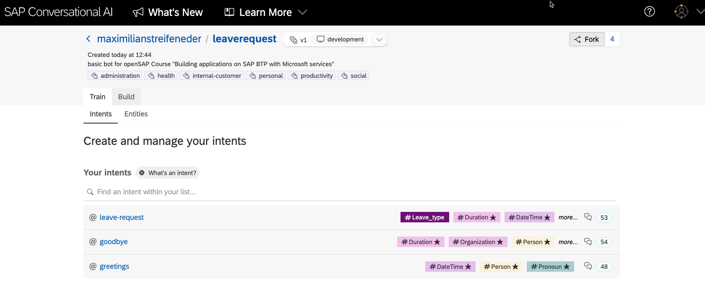
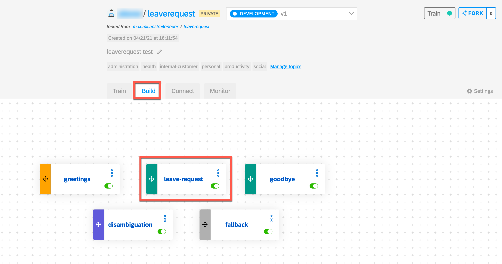
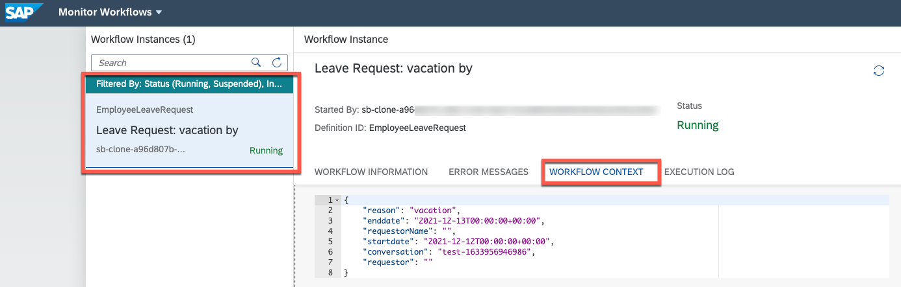

This exercise is part of the openSAP course [Building applications on SAP Business Technology Platform with Microsoft services](https://open.sap.com/courses/btpma1) - there you will find more information and context. 


# Build SAP Conversational AI bot 

In this exercise, learn how to create an SAP Conversational AI Bot and understand how to trigger an SAP workflow instance from a SAP Conversational AI bot. Lastly, integrate the built SAP Conversational AI with Azure Bot Channels and Microsoft Teams, so that end users can use it through Microsoft Teams.

## Problems
> If you have any issues with the exercises, don't hesitate to open a question in the openSAP Discussion forum for this course. Provide the exact step number: "Week3Unit1, Step 1.1: Command cannot be executed. My expected result was [...], my actual result was [...]". Logs, etc. are always highly appreciated. 
 

## Step 1 - Create Leave Request Chatbot with SAP Conversational AI

1.1. Create SAP Conversational AI account

   Go to  [SAP Conversational AI](https://cai.tools.sap/) and click Sign Up in the upper-right corner.
   
   > Use your BTP Account User/E-Mail to simplify the Identity authentication for later steps

   Follow the instructions for creating an account. 

   

   You will get an email with a link to validate your account.

1.2. Open up this URL [LeaveRequest](https://cai.tools.sap/maximilianstreifeneder/leaverequest/train/intents) and fork the bot into your account
   
   

   Now go back to your SAP Conversional AI environment, [SAP Conversational AI](https://cai.tools.sap/). You will get a predefined and trained bot with LeaveRequest intent (Intents are what the user intends to express when entering text in the chat).

   

1.3. Understand the 4 stages of a bot's life
   
   The 4 phases are represented in the bot project by the 4 tabs.
   
   
   
   There are 4 stages in your bot’s life:

   * **Train**: Teach your bot what it needs to understand.

     Here we defined the intents – ideas your bot will recognize – using expressions that the bot should recognize coming from the user. (e.g. Hi, I want to take leave request)

     

     For LeaveRequest bot we defined 3 intends: leave-request, greetings, goodbye

   * **Build**: Create your conversational flow with Bot Builder tool. Here you give your bot skills it can perform.

     Here we created skills – things the bot can do – and defined when they will be triggered. The skills are defined by triggers, requirements (information your bot must collect), and the actions.

     

     >Bot Builder helps you construct the conversation flow of your bot.

     In the next step we will configure the actions which will trigger the leave request workflow from *leave-request* skill 

     >Each skill represents one thing that your bot knows how to do.


   * **Connect**: Ship your bot to one or several messaging platforms.
     
     Here we integrate CAI bot with Microsoft Teams (See Step X or Unit 5)

   * **Monitor**: See how users are communicating with your bot, check if the bot is understanding users correctly, and make updates to the bots intents/entities. Monitoring also lets you see what your users want, and gives you ideas of what additional capabilities you could add to the bot.

## Step 2 - Configure the Action to trigger Leave Request workflow

2.1. Go to the Bot Builder tab of CAI and open **leave-request** skill
    
   

   The **leave-request** skill – like all skills – has 4 tabs:

   * *README*: A description of the purpose of  skill
   * *Triggers*: The conditions that must occur – generally the intents (leave request) that the user must express – for the skill to be executed
   * *Requirements*: Information that must be collected in order for the skill to be executed (start/end date, leave type, etc.)
   * *Actions*: The action to take (trigger workflow service)
   
   

2.2. Go to **Actions** to configure the workflow API request
   
   

2.3. Find the **API Service Configuration** and edit it
   
   
   
2.4. Update the request URL and Authentication credentials
   
   ```
    Request URL =  workflow_rest_url + "/v1/workflow-instances" 
        
    Client ID = uaa.clientid
    Client secret = uaa.clientsecret 

    Authorization URL = uaa.url + "/oauth/token"
   ```
   
   Follow the steps in 2.5 to get the parameters **workflow_rest_url, uaa.url, uaa.clientid and uaa.clientsecret** you can get from workflow service instance by BTP cockpit or CLI 

2.5. Get the parameters required for previous step
   
Go to BTP cockpit and navigate to **"Instances and Subscriptions"**. Find the Workflow service instance **"wm_workflow"** and click on credentials 


   Here you can find all necessary credentials *(workflow_rest_url, uaa.url, uaa.clientid, uaa.clientsecret)*

   
   
    
2.5. After updating API, save the API configuration
   
   

   Now the leave request bot is ready and we can test it in next Step

2.6. As a final step click on Train to train the bot once
   


## Step 3 - Test the Leave Request by chatting with bot

3.1. You can open Chat Preview and start conversation with the bot.
   
   

3.2. Sample conversation
   
   

3.3. Check the triggered workflow in My Inbox (Optional)

>Note, to be able to see the Workflow Items in My Inbox, you should be signed-in in BTP with the Microsoft 365 User. If you used another User for your BTP account skip this step.

Go to Workflow Management launchpad and open My Inbox application


3.4. You will find here the leave request triggered by Conversational AI
   


## Step 4 - Connect with Azure Bot and Microsoft Teams

4.1. Login into [Microsoft Azure](https://portal.azure.com/#home) and search for *"bot services"* and open it to create a new Azure Bot resource


4.2. Fill in the registration form and click on **Create**

> Make sure you select the F0 free Pricing tier, unless you want to use it in production.

| Field Name                    | Input Value                                                                                                   |
| ----------------------------- | ------------------------------------------------------------------------------------------------------------- |
| Bot Name                      | A unique display name for the bot (which will appear in channels and directories – this can be changed later) |
| Subscription                  | Your Azure subscription (in  trial, only one)                                                                 |
| Resource Group                | Select a resource group. If you don’t have one yet,  then create a new one                                    |
| Location                      | Choose a location near where your bot is deployed                                                             |
| Pricing Tier                  | F0 (10K Premium Messages)                                                                                     |
| Messaging endpoint            | This will be filled out later                                                                                 |
| Application Insights          | On                                                                                                            |
| Application Insights Location | Choose a location near where your bot is deployed                                                             |

Click on *"Review and Create"* and *"Create"* on the next screen. 


When the deployment is done, click on *"Go to Resource"*
   


4.3. After registration go to **Configuration**

   * Generate a **Client Secret** by clicking **Manage**, then **New Client Secret**, then **Add**
  

   * Copy the **Microsoft App ID** and **Client Secret**, for use later
  

4.4. Go back to [SAP Conversational AI](https://cai.tools.sap/) and open your bot.

4.5. Go to **Connect** tab and select Microsoft Teams via Microsoft Azure


4.6. Provide the generated **App ID** and **Client Secret** as Password generated in Azure portal from Step 4.3. and click on **Connect**


4.7. Set up your bot endpoint

 CAI will generate a **Messaging enpoint** which we need to register in Bot Channel in Azure Portal
  
   * Copy the **Messaging endpoint**
     

   * Go to the Settings section of your Azure Bot resource, and select Configuration. Fill the Messaging endpoint field with the one provided above
    

4.8. Connect your bot to channels

   * Go to **Channels** and select **Microsoft Teams** icon
   
   * Save the Connection
   

4.9. Test your bot in the Teams application

   * Navigate back to the Channels page
  
   * Click on Microsoft Teams to open the Teams application
   

   * Test the bot from Teams channel
   


# Summary

Congratulations! you successfully created leave request chatbot with SAP Conversational AI and integrated it with Workflow Management and Microsoft Teams.

If you want to learn more how to build chatbots wiht SAP Conversational AI, please check following OpenSAP course: [How to Build Chatbots with SAP Conversational AI](https://open.sap.com/courses/cai1)
