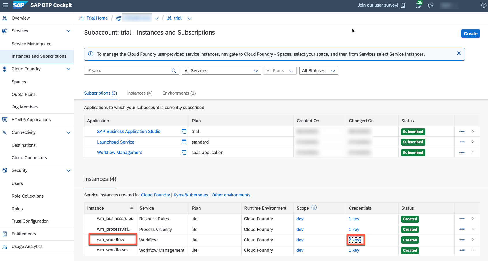
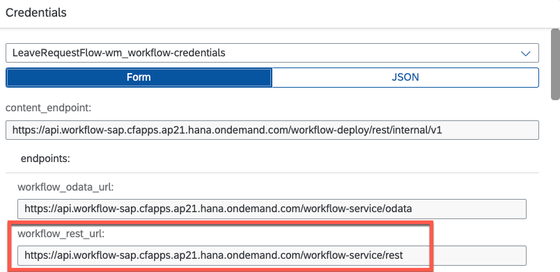
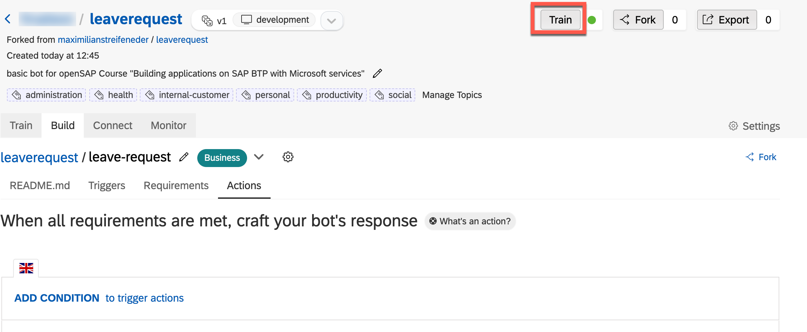
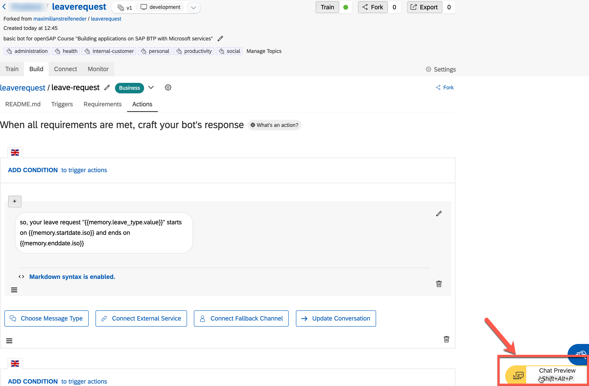
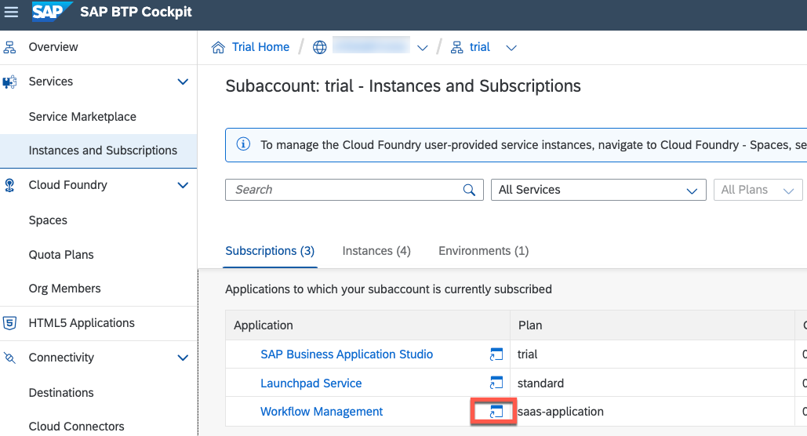
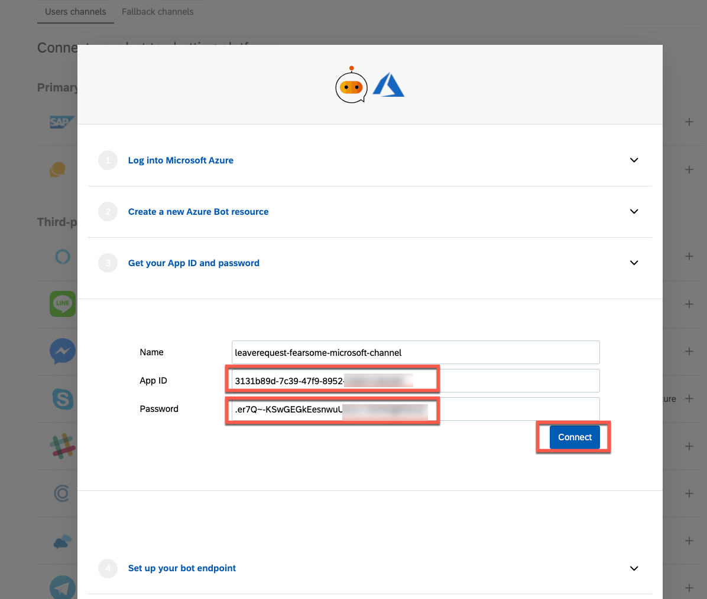

---

Even though the course is now closed, you can still access the videos and PDFs in self-paced mode via the openSAP course itself. The hands-on exercises will continue to be available for some time. However, certain steps and screenshots may be out of date as products continue to evolve. Therefore, we cannot guarantee that all exercises will work as expected after the end of the course.

---

This exercise is part of the openSAP course [Building applications on SAP Business Technology Platform with Microsoft services](https://open.sap.com/courses/btpma1) - there you will find more information and context. 

# Build SAP Conversational AI bot 

In this exercise, learn how to create an SAP Conversational AI Bot and understand how to trigger an SAP workflow instance from a SAP Conversational AI bot. Lastly, integrate the built SAP Conversational AI with Azure Bot Channels and Microsoft Teams, so that end users can use it through Microsoft Teams.

## Step 1 - Create an account for SAP Conversational AI and get started

In this step you'll register for the SAP Conversational AI Community Edition and get used to the basic wording of SAP Conversational AI. 

---

1.1 If you haven't signed up for SAP Conversational AI so far, go to <https://cai.tools.sap/> and click **Sign Up** in the upper-right corner.
   
   > Use the same mail/account that you have used to sign up for the SAP BTP Trial account to simplify the Identity authentication in other units of this week.

   Follow the instructions to create an account. 

   

   You will get an email with a link to validate your account.

1.2 In case you have already signed up for SAP Conversational AI or if you have already activated your account, use one of the login options on the start page. 

   

1.3 Open the following [URL](https://cai.tools.sap/maximilianstreifeneder/leaverequest/train/intents) in a new tab and **fork the bot** into your account.
   
   

1.4 Now go back to your own [SAP Conversional AI environment](https://cai.tools.sap/). You get a list of your bots. 

1.5 Click on the name of the bot to open the details. 

1.6 You have forked a predefined and trained bot with LeaveRequest intents (Intents are what the user intends to express when entering text in the chat) from another user (openSAP course content expert) that has made his bot public. 

   

1.7 Understand the 4 stages of a bot's life. The 4 phases are represented in the bot project by the 4 tabs.
   (Click on the corresponding tabs to see what the tab contains - no changes or concrete tasks from your side needed at this stage)
   
   
   
   There are 4 stages in your bot’s life:

   * **Train**: Teach your bot what it needs to understand.

     Here we defined the intents – ideas your bot will recognize – using expressions that the bot should recognize coming from the user. (e.g. Hi, I want to take leave request)

     

     For LeaveRequest bot we defined 3 intends: leave-request, greetings, goodbye

   * **Build**: Create your conversational flow with Bot Builder tool. Here you give your bot skills it can perform.

     Here we created skills – things the bot can do – and defined when they will be triggered. The skills are defined by triggers, requirements (information your bot must collect), and the actions.

     

     >Bot Builder helps you construct the conversation flow of your bot.

     In the next step we will configure the actions which will trigger the leave request workflow from *leave-request* skill 

     >Each skill represents one thing that your bot knows how to do.

   * **Connect**: Ship your bot to one or several messaging platforms.
     
     Here we integrate CAI bot with Microsoft Teams (See Step X or Unit 5)

   * **Monitor**: See how users are communicating with your bot, check if the bot is understanding users correctly, and make updates to the bots intents/entities. Monitoring also lets you see what your users want, and gives you ideas of what additional capabilities you could add to the bot.

## Step 2 - Configure the Action to trigger Leave Request workflow

Let's adjust the forked bot to your needs and connect it to your instance of SAP Workflow Management. 

---

2.1 Go to the **Build** tab of your bot and open the **leave-request** skill.
    
   

   The **leave-request** skill – like all skills – has 4 tabs:

   * *README*: A description of the purpose of  skill
   * *Triggers*: The conditions that must occur – generally the intents (leave request) that the user must express – for the skill to be executed
   * *Requirements*: Information that must be collected in order for the skill to be executed (start/end date, leave type, etc.)
   * *Actions*: The action to take (trigger workflow service)
   
   

2.2 Go to **Actions** to configure the how the bot should call SAP Workflow Management to trigger the leave request workflow.
   
   

2.3 Open the [SAP BTP Trial Cockpit](https://hanatrial.ondemand.com) in a new tab and navigate to **Instances and Subscriptions** in your dev space. 

2.4 Find the Workflow service instance **wm_workflow** and click on **keys** to get the credentials.  

   Here you can find all necessary credentials *(workflow_rest_url, uaa.url, uaa.clientid, uaa.clientsecret)* that are needed for the next step. Keep this tab open to make it easy to copy&paste the values. 

   
   

2.5 Go back to the SAP Conversational AI tab. Find the **API Service Configuration** and edit it.
   
   

2.6 Replace the actual target URL you want to call with the the **workflow_rest_url** value of the workflow service key that you have opened in a seperate tab recently.

   

2.7 Add **/v1/workflow-instances** to the end of the target URL in the API service configuration. 

2.8 Copy & paste the value of **clientid** (uaa) to **ClientID** in the API Service configuration. Do the same for **clientsecret** (uaa) to **Client secret** in the API Service configuration. 

   

2.9 Copy & paste the value of **url** (uaa) to the **Authorization URL** in the API Service configuration. 

   

2.10 Add **/oauth/token** to the end of the Authorization URL in the API service configuration.
   
2.11 After updating API, save the API configuration
   
   

2.12 As a final step click on **Train** to train the bot once
   

You have now configured the bot in a way that it triggers a workflow instance in your own SAP BTP Trial environment once the bot has fulfilled all requirements. 
## Step 3 - Test the Leave Request by chatting with the bot

3.1 Open the **Chat Preview** and start a conversation with the bot.
   
   

3.2 Chat with your bot and try to create a leave request. Here's a sample conversation:
   
   

3.3 Additionally, open the SAP Workflow Management launchpad. 

   

3.4 Open the **Monitor Workflows (Workflow Instances)** application. 

3.4. You will find here the leave request workflow instance triggered by the SAP Conversational AI Chat preview. 
   

The **Workflow Context** shows you, what data the SAP Conversational AI bot has gathered for you and is further on part of the workfow context. The data was given to the workflow instance as parameters by the API Service in SAP Conversational AI. 

As you can see, the variables **requestor** and **requestorName** are not yet filled. That's what we'll do in the next step. 
## Step 4 - Connect with Azure Bot and Microsoft Teams

It's time to use your SAP Conversational AI bot in an actual environment (other than the Chat Preview in SAP Conversational AI). Microsoft Teams will be the tool that we'll integrate the bot into. 

---

4.1 Login into [Microsoft Azure](https://portal.azure.com/#home) with your **Microsoft365 developer account**. 

4.2 Make sure that you are logged-in to the right Active Directory. 

You should have 2 Directories available
   * First one is the *directory* (Default Directory) created with your Microsoft Azure trial account and has access to the Azure subscription
   * Second one is coming from Microsoft 365 Developer account

For this exercise please switch to the **Default Directory** created with your Azure trial

Click on your profile and press the "Switch directory" button.

Switch to **Default Directory**

4.3 Search for *Azure bot* and select the corresponding offering from the Marketplace. 

4.4 Fill in the registration form as follows.

> Make sure you select the F0 free Pricing tier, unless you want to use it in production.

| Field Name       | Input Value                                                                                                                                                                          |
| ---------------- | ------------------------------------------------------------------------------------------------------------------------------------------------------------------------------------ |
| Bot handle       | A unique display name for the bot (which will appear in channels and directories – this can be changed later)                                                                        |
| Subscription     | Your Azure subscription (in  trial, only one)                                                                                                                                        |
| Resource Group   | Select a resource group. If you don’t have one yet,  then create a new one (A resource group is a collection of resources that share the same lifecycle, permissions, and policies.) |
| Location         | Choose a location near where your bot is deployed                                                                                                                                    |
| Pricing Tier     | F0 (10K Premium Messages)                                                                                                                                                            |
| Microsoft App ID | **Create new Microsoft App ID**                                                                                                                                                      |

4.5 Click on *Review and Create*. **Validation passed** should appear on the next screen.

4.6 Continue with *Create*. 

4.7 Wait until the deployment has finished. Click on *"Go to Resource"*
   
   

4.8 Open **Configuration in a new tab**.

   

4.9 <a name="appid">Note down the **Microsoft App ID**. You will need this later on in SAP Conversational AI to establish the connectivity.</a>

   

4.10 Select **Manage** to navigate to the secrets section of the application.
  

4.11 Select **New Client secret**, give the secret a name and finish the secret creation with **Add**.

  

4.12 <a name="secret">Note down the **Client Secret**. You will need this later on in SAP Conversational AI to establish the connectivity.</a>
  

4.13 Open a new tab and, go to [SAP Conversational AI](https://cai.tools.sap/) and open your bot.

4.14 Go to **Connect** tab and select Microsoft Teams via Microsoft Azure

4.15 Provide the **App ID** ([in Azure known as **Microsoft App Id**, Step 4.8](#appid)) and **Password** ([in Azure known as Secret, Step 4.10](#secret)). You have noted down these values in the previous steps. 

4.16 Click on **Connect**

4.17 Copy the Messaging endpoint. 

4.19 Go back to one of the tabs that should still be open, where you have previously jumped off to create the secret. There you should have the Azure Bot configuration. **Paste** the messaging endpoint from SAP Conversational AI into the corresponding Input field in the Configuration form.

4.19 **Apply** the changes.

4.20 Go to **Channels** and select the **Microsoft Teams** icon.
   

4.21 **Save** the Channel without any further adjustments.
   

4.22 Go to **Channels (Preview)** and open your bot in Microsoft Teams.

   

4.23 You'll most likely get asked if you want to use your Desktop or Web app. **Make sure you are using the webapp**. 

   > For the sake of simplicity we are using the web app of Microsoft Teams, where you can easily log in with your Microsoft365 user and don't get any overlaps with already logged in accounts in your Desktop app. 

   

4.24 **If you are asked to log in, use your Microsoft365 developer account!**

4.25 You can now have a conversation with the Chatbot again, similiar as in Step 3 of this unit. 

   

4.26 Additionally, open the SAP Workflow Management launchpad. 

   

4.27 Open the **Monitor Workflows (Workflow Instances)** application. 

4.28 You should see that the variables **requestor** and **requestorName** are now filled (compared to the leave request that was triggered via the Chat Preview in SAP Conversational AI). Microsoft Teams recognizes who is logged in, the SAP Conversational AI bot takes these values and sends them as parameters to the SAP Workflow Management API while triggering the worklow instance. 

   

# Summary

Congratulations! You have successfully created a leave request chatbot with SAP Conversational AI and integrated it with SAP Workflow Management and Microsoft Teams.

If you want to learn more how to build chatbots wiht SAP Conversational AI, please check the following OpenSAP course: [How to Build Chatbots with SAP Conversational AI](https://open.sap.com/courses/cai1)
