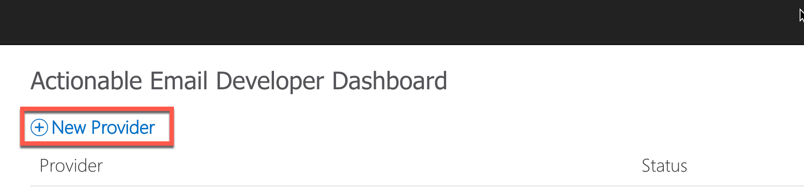
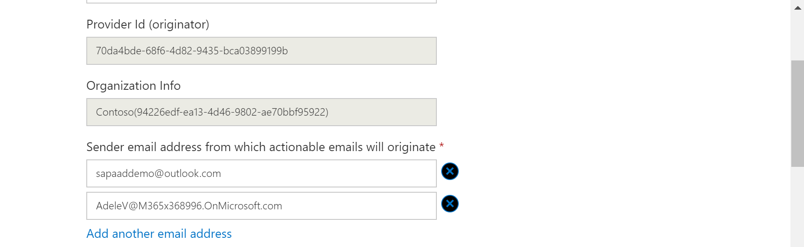
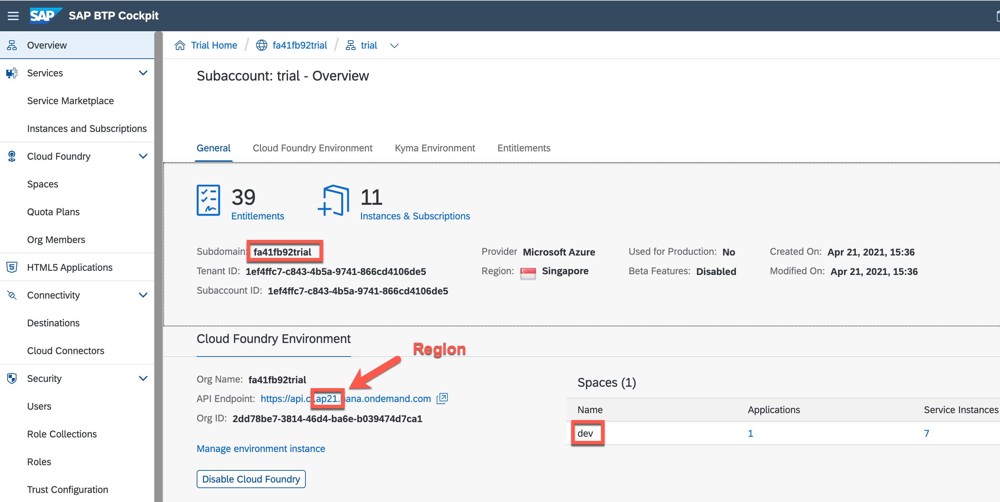
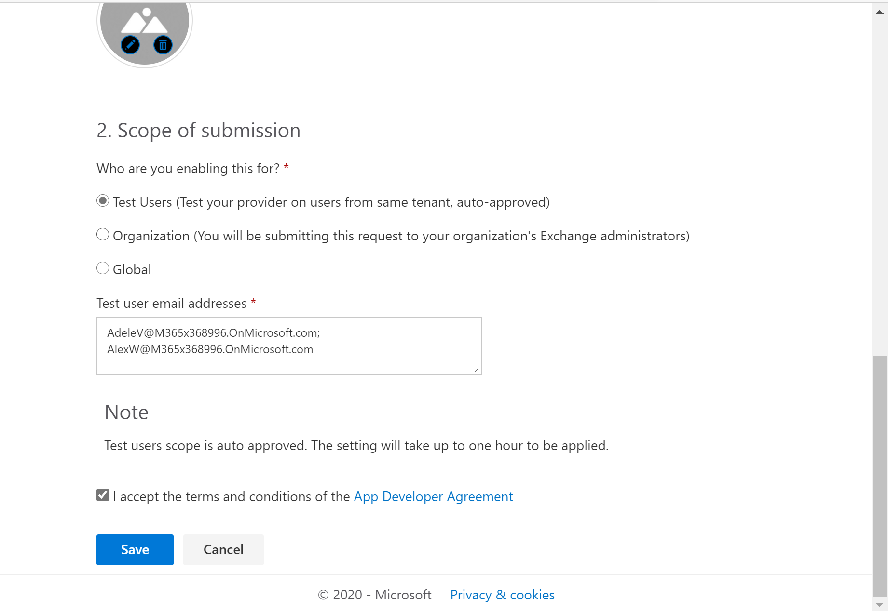
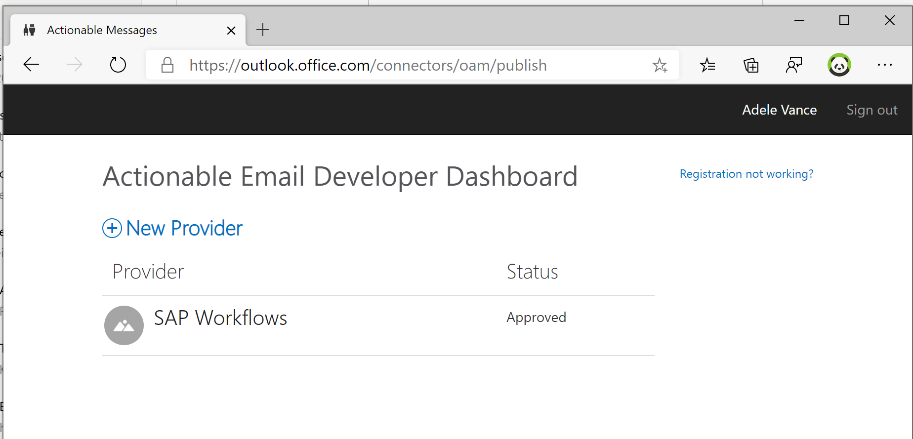

This exercise is part of the openSAP course [Building applications on SAP Business Technology Platform with Microsoft services](https://open.sap.com/courses/btpma1) - there you will find more information and context. 


# Sending adaptive cards from an SAP workflow

Now that we have configured the Workflow and can trigger it from a Chatbot in Teams we want to send the information of a new Workflow to Outlook and enable the user to Approve the workflow directly from there. In order to do this we use Actionable messages and Adaptive Cards. Adaptive Cards can render an incoming message and also allow the user to perform actions (like approving a workflow). In order to do this, we need to enable Adaptive Cards in Outlook. This can be done at an organizational level or -- like in our case -- on a case by case bases. This is especially good in a development scenario where you do not have (and need) global Exchange admin permissions.


## Problems
> If you have any issues with the exercises, don't hesitate to open a question in the openSAP Discussion forum for this course. Provide the exact step number: "Week3Unit1, Step 1.1: Command cannot be executed. My expected result was [...], my actual result was [...]". Logs, etc. are always highly appreciated. 
 


## Step 1 - Enable Actionable Messages

To enable and publish actionable messages, we need to register a new provider in **Actionable Email Developer Dashboard**

1.1. Go to [Actionable Email Developer Dashboard](https://outlook.office.com/connectors/oam/publish)

1.2. Create new Provider

>In our scenario use your **Office 365 User**



1.3. Enter a friendly name, e.g "SAP Workflows" and note down the Provider ID (e.g. 70da4bde-68f6-4d82-9435-bca03899199b) and Organization Info (e.g. 94226edf-ea13-4d46-9802-ae70bbf95922). Make sure that the Organization info is only the part in the brackets. It does not contain the organization name (e.g. Contoso)


1.4. In order for Outlook to trust the incoming actionable message you have to specify the sender. Enter here the Office 365 and your SAP BTP username (e.g. your @outlook.com or @gmail.com address). We will add both users here in in case one of the users is not working. Click on "Add another email address" to enter the second email) 




1.5. The Target URL is the URL of a Java application that we will deploy only in the next step. In order to "guess" the correct URL we are trying to follow a certain naming convention (we might need to adjust it later if required).

```
https://<your-trial-account>-<your-cf-space-name>-wfs-forms-adaptive-cards.cfapps.<region>.hana.ondemand.com
```

* *< your-trial-account >* - should match your subdomain as shown below and can be found in SAP BTP Cockpit
* *< your-cf-space-name >* name will be ‘dev’ by default on SAP BTP Cloud Foundry Trial
* *< region >.hana.ondemand.com* is depending on the region and provider you have selected (e.g. ap21 for Microsoft Azure - Singapore)



A resulting URL could look like this: e.g. 

https://fa41fb92trial-dev-wfs-forms-adaptive-cards.cfapps.ap21.hana.ondemand.com/


1.6. Scroll further down (you do not need to specify a Public Key) and select Test Users (Test your provider on users from same tenant, auto-approved)


1.7. Finally enter a list of all the Email Recipients (this can be the same as the sender). Enter one of more of your Office 365 users, select the Terms and Conditions and click on Save. 


1.8. As a result you should see your new registered Provider with the status Approved. 



## Step 2 - 

# Summary

Congratulations! you successfully created leave request chatbot with SAP Conversational AI and integrated it with Workflow Management and Microsoft Teams.

If you want to learn more how to build chatbot with SAP Conversational AI, please check following OpenSAP course: [How to Build Chatbots with SAP Conversational AI](https://open.sap.com/courses/cai1)
