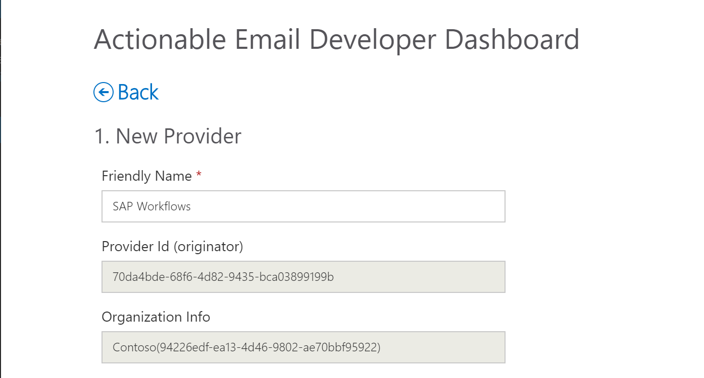
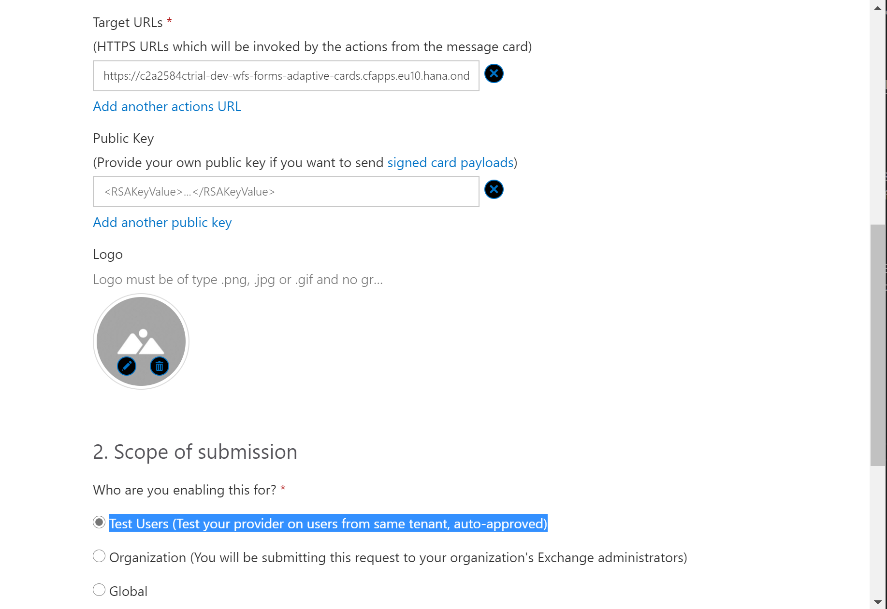
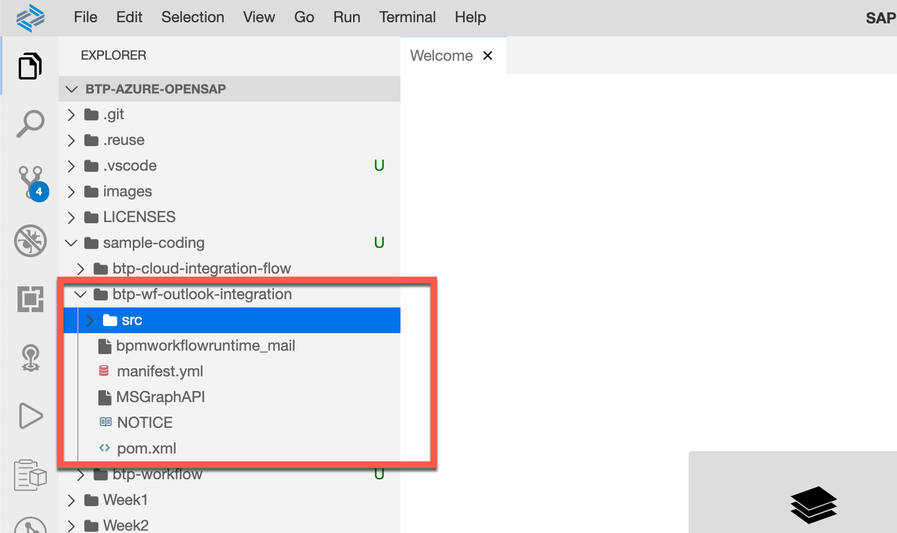
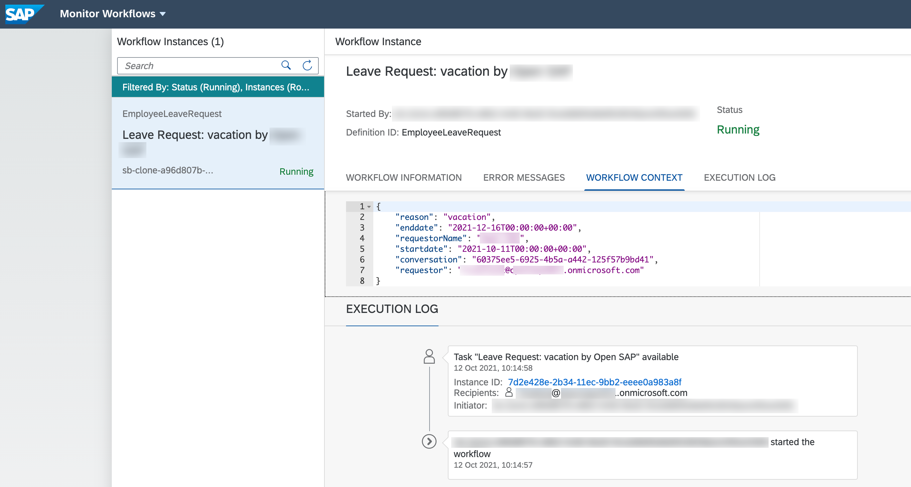
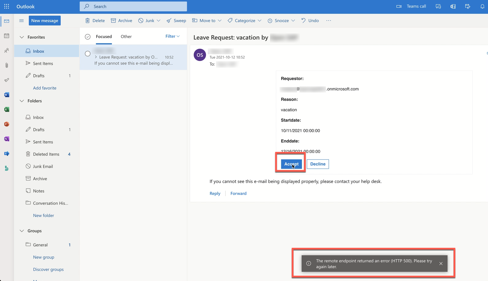

This exercise is part of the openSAP course [Building applications on SAP Business Technology Platform with Microsoft services](https://open.sap.com/courses/btpma1) - there you will find more information and context. 


# Sending adaptive cards from an SAP workflow

Now that we have configured the Workflow and can trigger it from a Chatbot in Teams we want to send the information of a new Workflow to Outlook and enable the user to Approve the workflow directly from there. In order to do this we use Actionable messages and Adaptive Cards. Adaptive Cards can render an incoming message and also allow the user to perform actions (like approving a workflow). In order to do this, we need to enable Adaptive Cards in Outlook. This can be done at an organizational level or -- like in our case -- on a case by case bases. This is especially good in a development scenario where you do not have (and need) global Exchange admin permissions.


## Problems
> If you have any issues with the exercises, don't hesitate to open a question in the openSAP Discussion forum for this course. Provide the exact step number: "Week3Unit1, Step 1.1: Command cannot be executed. My expected result was [...], my actual result was [...]". Logs, etc. are always highly appreciated. 
 


## Step 1 - Enable Actionable Messages

To enable and publish actionable messages, we need to register a new provider in **Actionable Email Developer Dashboard**

1.1. Go to [Actionable Email Developer Dashboard](https://outlook.office.com/connectors/oam/publish)

1.2. Create new Provider

>In our scenario use your **Office 365 User**


1.3. Enter a friendly name, e.g "SAP Workflows" and note down the Provider ID (e.g. 70da4bde-68f6-4d82-9435-bca03899199b) and Organization Info (e.g. 94226edf-ea13-4d46-9802-ae70bbf95922). Make sure that the Organization info is only the part in the brackets. It does not contain the organization name (e.g. Contoso)



1.4. In order for Outlook to trust the incoming actionable message you have to specify the sender. Enter here the Office 365 and your SAP BTP username (e.g. your @outlook.com or @gmail.com address). We will add both users here in in case one of the users is not working. Click on "Add another email address" to enter the second email) 


1.5. The Target URL is the URL of a Java application that we will deploy only in the next step. In order to "guess" the correct URL we are trying to follow a certain naming convention (we might need to adjust it later if required).

```
https://<your-trial-account>-<your-cf-space-name>-wfs-forms-adaptive-cards.cfapps.<region>.hana.ondemand.com
```

* *< your-trial-account >* - should match your subdomain as shown below and can be found in SAP BTP Cockpit
* *< your-cf-space-name >* name will be ‘dev’ by default on SAP BTP Cloud Foundry Trial
* *< region >.hana.ondemand.com* is depending on the region and provider you have selected (e.g. ap21 for Microsoft Azure - Singapore)


A resulting URL could look like this: e.g. 

https://fa41fb92trial-dev-wfs-forms-adaptive-cards.cfapps.ap21.hana.ondemand.com/


1.6. Scroll further down (you do not need to specify a Public Key) and select Test Users (Test your provider on users from same tenant, auto-approved)


1.7. Finally enter a list of all the Email Recipients (this can be the same as the sender). Enter one of more of your Office 365 users, select the Terms and Conditions and click on Save. 


1.8. As a result you should see your new registered Provider with the status Approved. 


## Step 2 - Update and deploy the Adaptive Card Sender App

2.1. Open Business Application Studio

2.2. In Unit 2 you already cloned the repository in your Business Application Studio Workspace. 

In case you didn't clone the repo, or removed your workspace, you can clone it once again

```bash/Shell
git clone https://github.com/maxstreifeneder/btp-azure-draft.git
```

2.3. Adaptive Card Sender Java App is located in folder **btp-wf-outlook-integration**

 

Get familiar with the project

2.4. Open manifest.yaml file from

 ```
   sample-coding
    └── btp-wf-outlook-integration
        └── manifest.yaml
```

 Replace the **applications: name** with the first part of the URL that you configured in the previous step for the Target URL
 ```
 <your-trial-account>-<your-cf-space-name>-wfs-forms-adaptive-cards
```
 e.g. *fa41fb92trial-dev-wfs-forms-adaptive-cards*

 

 2.5. Open application.properties file from

  ```
   sample-coding
    └── btp-wf-outlook-integration
        └── src
            └── main
                └── resources
                     └── application.properties
                
```

Update following properties:

* **card.submission.url** - *https://< trial org name >-< space name >-wfs-forms-adaptive-cards.cfapps.< region >.hana.ondemand.com*  like the target URL from **Step 1.5.** ( e.g. http://fa41fb92trial-dev-wfs-forms-adaptive-cards.cfapps.ap21.hana.ondemand.com )
  
* **mail.smtp.host**  - If you are going to use the SMTP server for Office 365, use smtp.office365.com if you are using your private @outlook.com or @gmail.com address use either smtp-mail.outlook.com or smtp.gmail.com 
  
* **organization.id**  - The Organization Info from Step 1.3 or copy from [Actionable Email Developer Dashboard](https://outlook.office.com/connectors/oam/publish) (e.g. 94226edf-ea13-4d46-9802-ae70bbf95922) 
  
* **originator.id** - The Provider ID from Step 1.3 or copy from [Actionable Email Developer Dashboard](https://outlook.office.com/connectors/oam/publish) (e.g. 70da4bde-68f6-4d82-9435-bca03899199b) 
  

 

 2.6. Before deploying the application, create destination service instance

* Open a new **Terminal** and login in your BTP CF account using your credentials
  
    ```bash/Shell
    cf login
    ```
    

* Create Destination service instance
  
    ```bash/Shell
    cf create-service destination lite wm_destination
    ```
    

 2.7. Build Java App

```bash/Shell
cd sample-coding/btp-wf-outlook-integration

mvn clean install
```


 2.8. Deploy Java App on SAP BTP

 ```bash/Shell
cf push
```


 2.9. Download the Destination file **bpmworkflowruntime_mail** and import in BTP Cockpit to setup mail server information used from workflow service

* Download the destination file
    ```
    sample-coding
    └── btp-wf-outlook-integration
        └── bpmworkflowruntime_mail
    ```

* Go to SAP BTP Cockpit into Connectivity/Destinations and *Import Destination*
  

* Update the Destination properties based on your mail server and credentials
  
  In this example I'm using mail server for Office 365 ( smtp.office365.com )

  | Field Name | Input Value |
  | ---------- | ------------|
  | User | Email for logging in to the mail server |
  | Password | Password for logging in to the mail server |
  | mail.smtp.from | Mail address to use as the "From" address of mails sent by the workflow capability |
  | mail.smtp.host | Host name of your mail server |
  | mail.smtp.port | Port on which your mail server listens for connections (typically 587, in rare cases 465) |

  

## Step 3 - Test the scenario

3.1. Open Microsoft teams and request a leave


3.2. We can go to SAP Workflow Management and open Workflow Instance Monitor, to validate that the task was successfully created. 
    


You can see that the task is created and is running.



3.3. After confirmation that the workflow task was successfully triggered, open your Outlook

>Note, in this demo example the requestor and approver are the same person

In your Outlook Inbox you will find an email from your employee requesting leave with the necessary information including **"Accept"** and **"Reject"** buttons to directly approve or reject the request from outlook. The Email is rendered as an Adaptive Cards and allows you to perform actions.


3.4. Now when you Accept or Decline the request, the workflow task will be completed accordingly

* Click on **Accept**, you should get a confirmation that task has completed
  

* Go again to SAP Workflow Management, where you will find as well that lately created task has been completed
  

## Step 4 - Troubleshooting

There are two approaches, to troubleshoot the application and adaptive cards, in case you are facing issues.

* In case of issues with Java Application, go to SAP BTP Cockpit and open the Application where you can find the Logs (see below). The logs will give you overview of the issue, in case there are some.
  

* In case of rendering issues with Actionable Message, you could find the add-in to Microsoft Outlook called “Actionable Messages Debugger”. It will help you to identify issues with your message
 


# Summary

Congratulations! you successfully ... TBD

