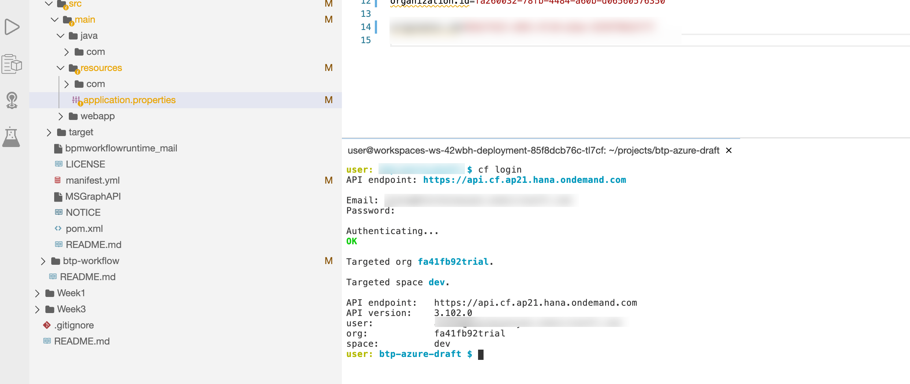
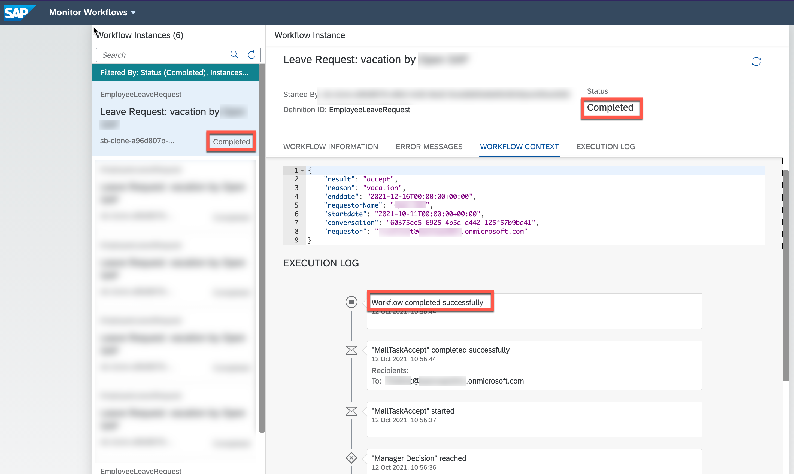

This exercise is part of the openSAP course [Building applications on SAP Business Technology Platform with Microsoft services](https://open.sap.com/courses/btpma1) - there you will find more information and context. 


# Sending adaptive cards from an SAP workflow

We have already configured SAP Workflow Management and can trigger a leave request workflow instance from a Chatbot in Microsoft Teams. It's time to send the information of a new Workflow to Microsoft Outlook and enable the user to approve/reject the workflow directly from there. In order to do this, we use so called Actionable messages and Adaptive Cards. Adaptive Cards can render an incoming message and also allow the user to perform actions (like approving a workflow). In order to do this, we need to enable Adaptive Cards in Outlook. This can be done at an organizational level or -- like in our case -- on a case by case basis. This is especially good in a development scenario where you do not have (and need) global Exchange admin permissions.

## Problems
> If you have any issues with the exercises, don't hesitate to open a question in the openSAP Discussion forum for this course. Provide the exact step number: "Week3Unit1, Step 1.1: Command cannot be executed. My expected result was [...], my actual result was [...]". Logs, etc. are always highly appreciated. 
 


## Step 1 - Enable Actionable Messages

To enable and publish actionable messages, we need to register a new provider in **Actionable Email Developer Dashboard**

---

1.1 Go to the [Actionable Email Developer Dashboard](https://outlook.office.com/connectors/oam/publish) and logon with your **Microsoft365 Developer account**. 

1.2 Create a new Provider. 


1.3 Enter a friendly name, e.g "SAP Workflows" and note down the Provider ID (e.g. 70da4bde-68f6-4d82-9435-bca03899199b) and Organization Info (e.g. 94226edf-ea13-4d46-9802-ae70bbf95922). Make sure that the Organization info is only the part in the brackets. It does not contain the organization name (e.g. Contoso)


1.4 Outlook needs to know the sender beforehand in order to trust the incoming actionable message. Enter here the **Microsoft 365 Developer Account** and the mail address of your **SAP BTP Trial account** (e.g. your @outlook.com or @gmail.com address). We will add both users here in in case one of the users is not working. Click on **Add another email address** to enter the second mail address.


1.5 <a name="targeturl"></a>The Target URL is the URL of a Java application that we will deploy only in the next step. In order to "guess" the correct URL we are trying to follow a certain naming convention (we might need to adjust it later if required).

```
https://<your-trial-account>-<your-cf-space-name>-wfs-forms-adaptive-cards.cfapps.<region>.hana.ondemand.com
```

* *< your-trial-account >* - should match your subdomain as shown below and can be found in SAP BTP Cockpit
* *< your-cf-space-name >* name will be ‘dev’ by default on SAP BTP Cloud Foundry Trial
* *< region >.hana.ondemand.com* is depending on the region and provider you have selected (e.g. ap21 for Microsoft Azure - Singapore)


A resulting URL could look like this: e.g. 

https://fa41fb92trial-dev-wfs-forms-adaptive-cards.cfapps.ap21.hana.ondemand.com/


1.6 Scroll further down (you do not need to specify a Public Key) and **select Test Users (Test your provider on users from same tenant, auto-approved)**


1.7 Finally enter a list of all the Email Recipients (this can be the same as the sender). Enter one of more of your Office 365 users, select the Terms and Conditions and click on Save. 

> **IMPORTANT:** In this scenario, the sender and receiver of the actionable messages is your Microsoft365 Developer account. Make sure that at least this mail address is part of the Test Users list. 


1.8. As a result you should see your new registered Provider with the status Approved. 


## Step 2 - Update and deploy the Adaptive Card Sender App

In order to send out adaptive cards, you'll use a custom Java application that transforms _User Tasks_ of a workflow into the right adaptive card format and also uses the SMTP Destination that you have defined in Week 3, Unit 1. 

---

2.1 Go to the SAP BTP Trial Cockpit (<https://hanatrial.ondemand.com>) and navigate to your SAP BTP Trial subaccount. 

2.2. Open the SAP Business Application Studio. 


2.3 In case the dev space that you have created earlier is in status **stopped**, click on the _play_ icon. 


2.4 As soon as the dev space is in status **started**, click on the name of the dev space to open the dev space. 

> in case your workspace is not available anymore, please go back and visit [Week 3, Unit 1 and create a new devspace](../Unit1/README.md#newdevspace). 


2.6 The main component of this is unit is a custom Java application that is used to send out Adaptive Cards. The application is located in the folder **btp-wf-outlook-integration**. **Have a look at the project structure and make your familiar with what you are roughly dealing with. 

 

2.7. Open the **manifest.yaml** file from **sample-coding/btp-wf-outlook-integration**.

 ```
   sample-coding
    └── btp-wf-outlook-integration
        └── manifest.yaml
```

 2.8 Replace the placeholders in the **application** property with the first part of the URL that you configured in the [Actionable Message Provider configuration in Step 1.5](#targeturl). 
 ```
 <your-trial-account>-<your-cf-space-name>-wfs-forms-adaptive-cards
```
 e.g. *fa41fb92trial-dev-wfs-forms-adaptive-cards*

 

 2.9 Open the application.properties file in **sample-coding/btp-wf-outlook-integration/src/main/resources/**

  ```
   sample-coding
    └── btp-wf-outlook-integration
        └── src
            └── main
                └── resources
                     └── application.properties
                
```

2.10 Update the **card.submission.url**. Take the value that you have defined during the Actionable Message Provider configuration in [**Step 1.5**](#targeturl). (e.g. http://fa41fb92trial-dev-wfs-forms-adaptive-cards.cfapps.ap21.hana.ondemand.com )

 
  
2.11 Update the **organization.id** property. Take the value that you have noted down in Step 1.3 or copy from [Actionable Email Developer Dashboard](https://outlook.office.com/connectors/oam/publish) (e.g. 94226edf-ea13-4d46-9802-ae70bbf95922) 

 
  
2.12 Update the **originator.id** property. Take the Provider ID that you have noted rom Step 1.3 or copy from [Actionable Email Developer Dashboard](https://outlook.office.com/connectors/oam/publish) (e.g. 70da4bde-68f6-4d82-9435-bca03899199b) 

 

2.13 **Save** the file. 

2.14 Before deploying the application, create a destination service instance.

2.15 Open a new **Terminal**. 

 

2.16 Login in your SAP BTP Trial Cloud Foundry environment using the Cloud Foundry CLI. 

> If you can't remember how to use the Cloud Foundry CLI, please go back and visit [Week 3, Unit 1](../Unit2/README.md#cfcli) where you have used the Cloud Foundry CLI to deploy the workflow definition for this week. 
  
  ```bash/Shell
  cf login
  ```
  

2.17 Once you are logged in, **create an instance** of the Destination service using the **following command in the Terminal**: 
  
  ```bash/Shell
  cf create-service destination lite wm_destination
  ```
  

 2.18 **Build the Java application using the following maven command in the terminal**:

```bash/Shell
cd ~/projects/btp-azure-opensap/sample-coding/btp-wf-outlook-integration && mvn clean install
```


With the following result: 


 2.19 Finally, deploy the Java application to SAP BTP Cloud Foundry. 

 ```bash/Shell
cf push
```


With the following result: 


## Step 3 - Test the scenario

Let's finally test the scenario from Microsoft Teams with an SAP Conversational AI chatbot that triggers a workflow in SAP Workflow Management. As a result, you should get a mail in the Outlook inbox of your Microsoft365 Developer account with an adaptive card. Using the adaptive card, you can directly accept/reject the workflow without the need to open the **MyInbox** application in the SAP Fiori Launchpad. 

---

3.1. Open Microsoft teams (<https://teams.microsoft.com>) and log in with your **Microsoft365 Developer account**. 

> We recommend using the web application of Microsoft Teams - for this development & testing scenario. 

3.2 Try to create a leave request using the chat bot that you have created over the course of the last units. 


3.3 Go to the **SAP Workflow Management launchpad** once again and open the **Monitor Workflows (Workflow Instances)**, to validate that the workflow instance was successfully created. 
    


You can see that the workflow was created and is running.


3.3. Now, that you have seen that the workflow task was successfully triggered, open <https://outlook.com> and log in with your **Microsoft365 Developer account**.

>Note, in this demo example the requestor and approver are the same person

You will find an email in your Outlook Inbox from your employee (actually you) requesting some time off with the necessary information including **Accept** and **Reject** buttons to directly approve or reject the request from Outlook. The Email is rendered as an Adaptive Card and allows you to perform actions.


3.4. Click on **Accept**. 

   **There will be an error message popping up. Don't worry this will be fixed in the next unit - approving/rejecting the workflow works nevertheless!** There should already be another mail in your inbox showing that your workflow was approved/rejected. 
  


3.5 Go again to SAP Workflow Management, where you will find as well that lately created task has been completed.
  

## Step 4 - Troubleshooting

There are two approaches, to troubleshoot the application and adaptive cards, in case you are facing issues.

* In case of issues with the Java Application on SAP BTP Trial, go to the SAP BTP Trial Cockpit and open the application where you can find the Logs (see below). The logs will give you an overview of the app behavior. 
  

* In case of rendering issues with Actionable Message, you could find the add-in to Microsoft Outlook called “Actionable Messages Debugger”. It will help you to identify issues with your message
 


# Summary

Congratulations! you successfully completed the Unit 4. You learned how to transform workflow tasks into adaptive cards using the custom Java application and sent it to Microsoft Outlook.

