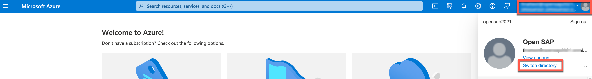
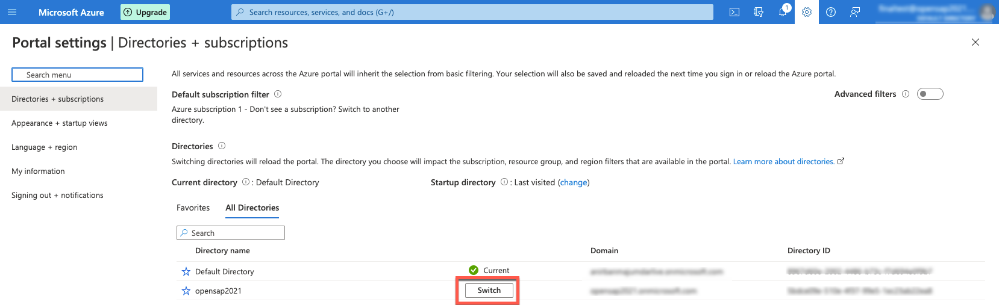
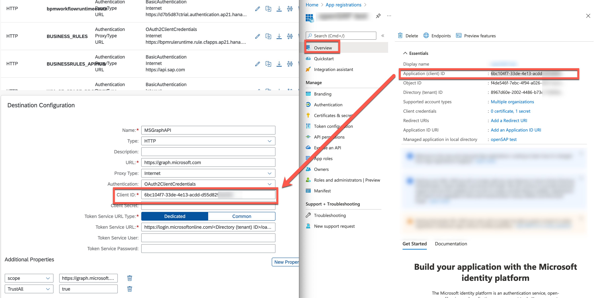
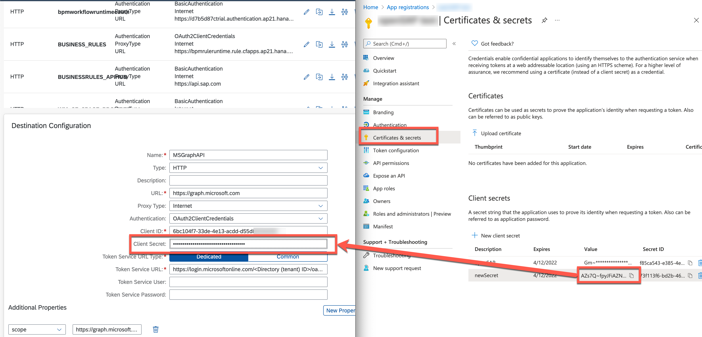
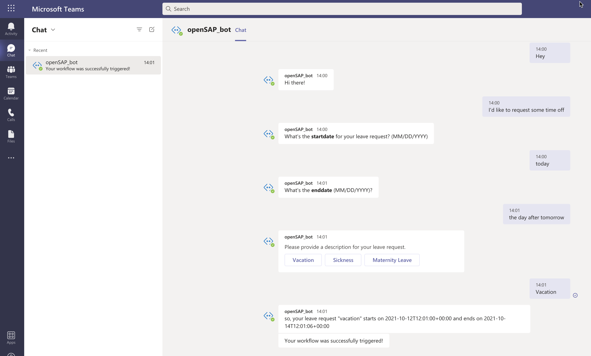
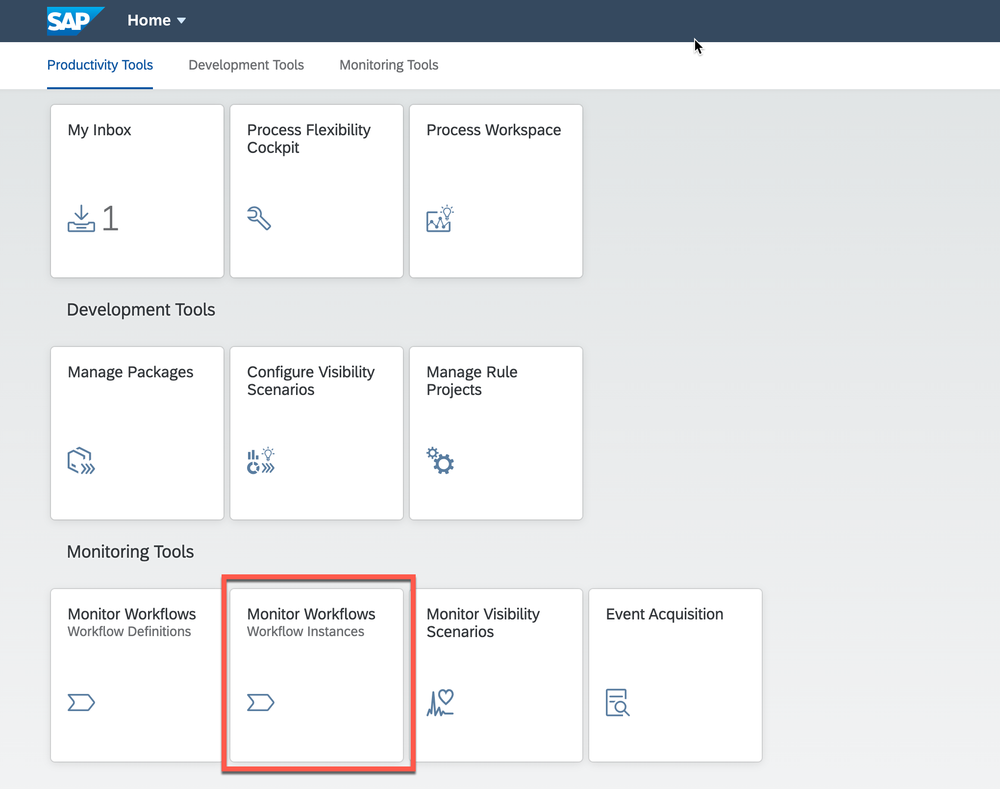
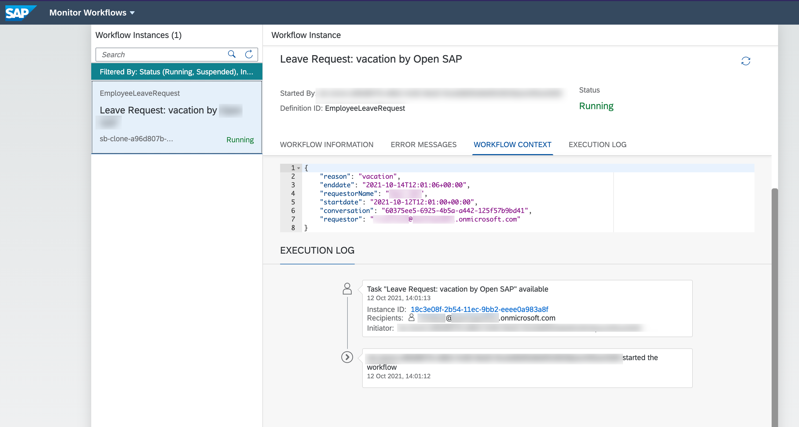
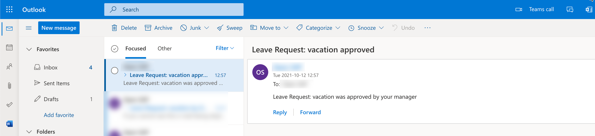
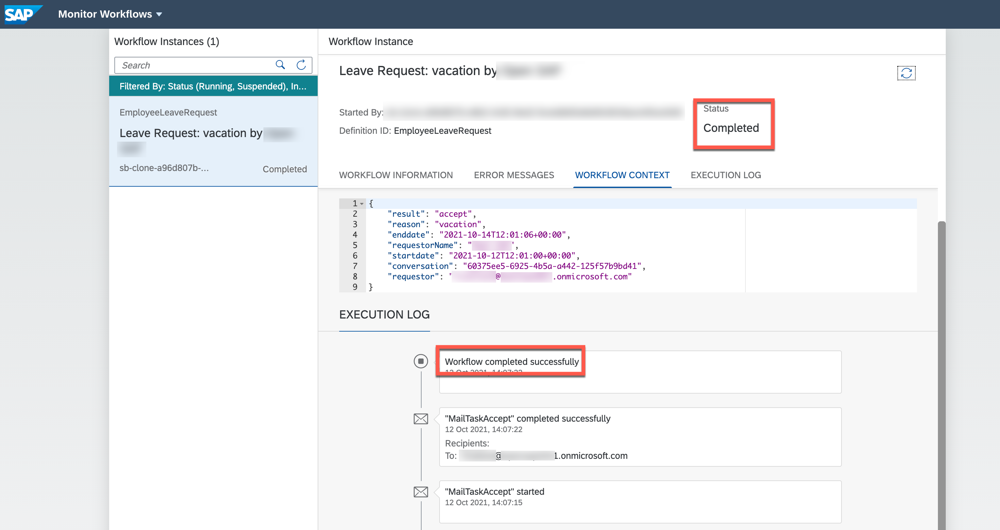

This exercise is part of the openSAP course [Building applications on SAP Business Technology Platform with Microsoft services](https://open.sap.com/courses/btpma1) - there you will find more information and context. 

# Create calendar entry using Microsoft Graph

As a final step, after sending adaptive cards, we continue and create a calendar entry in the requestors Outlook calendar triggered via an Microsoft Graph API call from SAP BTP using Microsoft Graph APIs. 

Microsoft Graph provides a central endpoint with access to data and services of Microsoft 365. To test the available APIs you can use [Microsoft Graph Explorer](https://graph.microsoft.com) as a playground to test.

## Problems
> If you have any issues with the exercises, don't hesitate to open a question in the openSAP Discussion forum for this course. Provide the exact step number: "Week3Unit1, Step 1.1: Command cannot be executed. My expected result was [...], my actual result was [...]". Logs, etc. are always highly appreciated. 

 

## Step 1 - Register an App in Azure Active Directory

In this step we need to create an application in Azure Active Directory to grant the Microsoft Graph API permissions.

---

1.1. Sign-in in to [Azure Portal](https://portal.azure.com/) with your **Microsoft 365 User**.

1.2. Make sure that you are logged-in in the right Active Directory. 

You should have 2 Directories available
   * First one is the *directory* (Default Directory) created with your Microsoft Azure trial account and has the Azure subscription
   * Second one is coming from Microsoft 365 Developer account

For this exercise please switch to the **second (not default) directory**, which is coming from Microsoft 365 Developer account

Click on your profile and press the "Switch directory" button.

Switch to second **NOT Default Directory**

1.3. Search and open **App registrations**

1.4. Select **New Registration**.

1.5. Provide an **Application Name**,  e.g. "OpenSAP-GraphAPI".

1.6. Select the account type **Accounts in any organizational directory (Any Azure AD directory - Multitenant)**.

1.7. Finish the registration with **Register**.

1.8.  Note down the **Application (client) ID** and **Directory (tenant) ID** values. These are required for the next step.

1.9. Go to **certificates & secrets** and create **New client secret**. Also, provide a name for that secret. (only a display name, not used anywhere else)

> The application will use this secret to prove its identity when requesting a token.

1.10.  Note down the secret value for the next step - this value cannot be copied later on.

1.11. Add the API Permissions for Microsoft Outlook Calendar. Therefore, Go to **API permissions** and **Add a permission**.
  

1.12. Select **Microsoft Graph**, followed by **Application permissions** (where the application runs as a background service or daemon without a signed-in user)
  
  
1.13. Add the permission **Calendars.ReadWrite** which is required for creating Calendar entry in Outlook.
 

1.14. **Grant admin consent for Default Directory**.

 

## Step 2 - Configure SAP BTP destination for Microsoft Graph

The custom Java app uses the SAP BTP destination service to interact with Microsoft Graph.
For authentication, OAuth2ClientCredentials needs to be selected and the Client ID & Secret from the previous app registration is set.

>NOTE: Please make sure that the JAVA application on BTP is running before continuing the unit, since BTP Trial environment overnight is stopping all running applications. In appendix of Unit 4 you can find [how to start the Java Application](https://github.com/SAP-samples/btp-azure-opensap/tree/main/Week3/Unit4#appendix) .

---

2.1. Download the Destination Configuration for the Microsoft Graph API. Right click on the **MSGraphAPI** file in the **sample-coding/btp-wf-outlook-integration** directory in your SAP Business Application Studio dev space. 
  

2.2 Open SAP BTP Cockpit and navigate to **Connectivity > Destinations** and **Import Destination**. Select the file that you have downloaded in the previous step. 

 

2.3 Update the **Client ID** with the **Application (client) ID** value from the Azure app registration. Either you have noted down that value in [Step 1.8](#clientcredentials) or you can also go back to the Azure App registration and go the **overview** section of the App registration. 

   

2.4 Update the **Client Secret** with the actual **secret value** from the Azure app registration that you have noted down in [Step 1.9](#clientsecret). If you don't have the secret value anymore, just create a new secret and copy the new value. 

   

2.5 Replace the placeholder **<Directory (tenant) ID>** in the **Token Service URL** with the actual **Directory (tenant) ID** from the Azure app registration. You have noted down the _Directory (tenant) ID_ in  [Step 1.8](#clientcredentials). Alternatively, you can go to the **overview** menu of the App registration to copy the value again. 

2.6 **Save** the Destination in SAP BTP. 

## 3 - Test the scenario End to End

The application itself now has all the necessary configurations to create a calendar entry in the requestors Outlook for the requested timeframe. Let's go through the whole leave request process once again and see if everything works. 

---

3.1 Open Microsoft teams (<https://teams.microsoft.com>) and request a leave

3.2 We can go to SAP Workflow Management and open Workflow Instance Monitor, to validate that the task was successfully created. 
    

You can see that the task is created and is running.

3.3 After confirmation that the workflow task was successfully triggered, open your Outlook

>Note, in this demo example the requestor and approver are the same person

In your Outlook Inbox you will find an email from your employee requesting leave with the necessary information including **"Accept"** and **"Reject"** buttons to directly approve or reject the request from outlook. The Email is rendered as an Adaptive Cards and allows you to perform actions.

3.4 Now when you Accept or Decline the request, the workflow task will be completed accordingly and  calendar item has been sent to the requestor

Click on **Accept**, you should get a confirmation that task has completed

3.4 Open Microsoft Calendar, where you will find a calendar entry for the approved days of leave

3.1. Open Microsoft teams (<https://teams.microsoft.com>) and log in with your **Microsoft365 Developer account**. 

> We recommend using the web application of Microsoft Teams - for this development & testing scenario. 

3.2 Try to create a leave request using the chat bot that you have created over the course of the last units. 

3.3 Go to the **SAP Workflow Management launchpad** once again and open the **Monitor Workflows (Workflow Instances)**, to validate that the workflow instance was successfully created. 
    

You can see that the workflow was created and is running.

3.3. Now, that you have seen that the workflow task was successfully triggered, open <https://outlook.com> and log in with your **Microsoft365 Developer account**.

>Note, in this demo example the requestor and approver are the same person

You will find an email in your Outlook Inbox from your employee (actually you) requesting some time off with the necessary information including **Accept** and **Reject** buttons to directly approve or reject the request from Outlook. The Email is rendered as an Adaptive Card and allows you to perform actions.

3.4. Click on **Accept**. 

You should get a popup saying, that the workflow was approved. Additionally, there should be...

* a new mail in your inbox saying that your workflow was approved (your the requestor and approver in this case, for the sake of simplicity)

  

* a new event in your outlook calendar for the timeframe that you have requested using the chatbot in Microsoft Teams. 
* 
3.5 Go again to SAP Workflow Management, where you will find as well that lately created task has been completed.
  

# Summary

Congratulations! you successfully completed the last unit of this week. You have learned how to create a calendar entry using Microsoft Graph and SAP BTP. Moreover you should now know how to explore the APIs using Microsoft Graph Explorer, register an app in Azure Active Directory and also use destinations in SAP BTP to point to different addresses in the SAP and non-SAP world.

This is the end of Week 3. You learned how to extend your business workflow with Microsoft Teams and Microsoft Outlook using SAP Business Technology Platform together with Microsoft Azure. Now you know how to trigger an SAP workflow from an SAP Conversational AI bot, integrate SAP Conversational AI with Azure Bot and Microsoft Teams. Additionally, you learned how to transform SAP Workflow Forms into Microsoft Adaptive Card format and send adaptive cards from an SAP workflow. Finally, we have covvered how to use actionable messages to quicly trigger actions right within the Microsoft Outlook email client using Outlook. 

