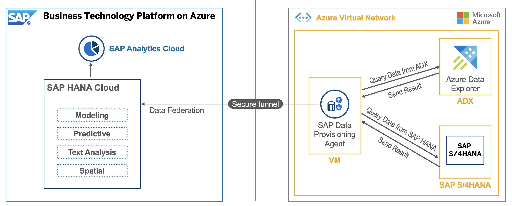

---

Even though the course is now closed, you can still access the videos and PDFs in self-paced mode via the openSAP course itself. The hands-on exercises will continue to be available for some time. However, certain steps and screenshots may be out of date as products continue to evolve. Therefore, we cannot guarantee that all exercises will work as expected after the end of the course.

---

This exercise is part of the openSAP course [Building applications on SAP Business Technology Platform with Microsoft services](https://open.sap.com/courses/btpma1) - there you will find more information and context. 

# Week 4: Building Data-to-Value Scenarios 

In this Week 4 exercise we will setup end to end flow from Micosoft Azure Explorer to SAP HANA CLoud to SAP Analytics Cloud (SAC) via Federation.The Data will be visualized in SAP Analytics Cloud Story.

 
## Architecture

## Unit Overview

### [Unit 1: SAP HANA Cloud and SAP Analytics Cloud Overview](./Unit1/README.md)
### [Unit 2: Setup Azure Data Explorer instance and load data](./Unit2/README.md)
### [Unit 3: Connecting SAP HANA Cloud with Microsoft Azure Data Services](./Unit3/README.md)
### [Unit 4: Connecting SAP Analytics Cloud with SAP HANA Cloud](./Unit4/README.md) 
### [Unit 5: Implementation of End to End flow via Federation](./Unit5/README.md)
