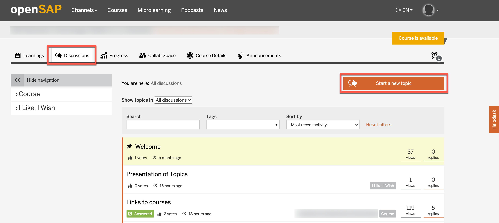
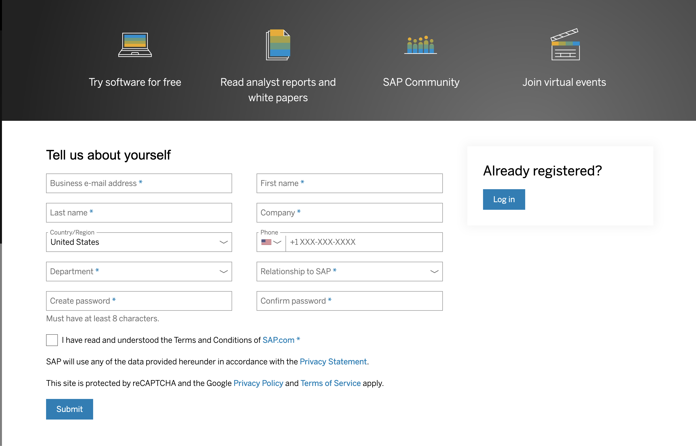
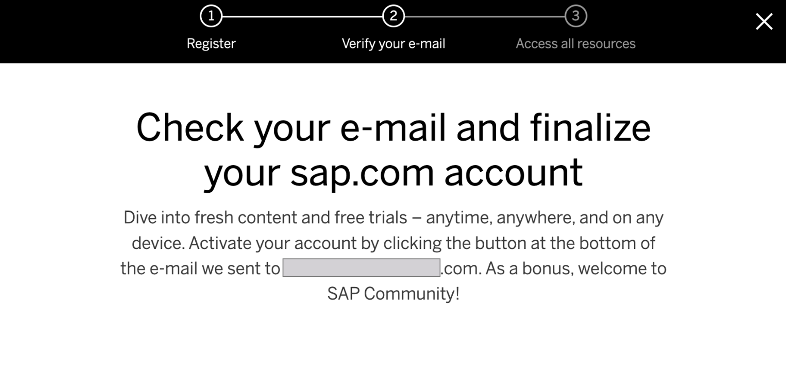

This exercise is part of the openSAP course [Building applications on SAP Business Technology Platform with Microsoft services](https://open.sap.com/courses/btpma1) - there you will find more information and context. 

# SAP HANA Cloud and SAP Analytics Cloud Overview

In this exercise we will setup SAP Analytics Cloud (SAC) and SAP HANA Cloud. SAC will be later connected to SAP HANA Cloud and the data surfaced in SAP Analytics Cloud story. 

## Problems
> If you have any issues with the exercises, don't hesitate to open a question in the openSAP Discussion forum for this course. Provide the exact step number: "Week4Unit2, Step 1.1: Command cannot be executed. My expected result was [...], my actual result was [...]". Logs, etc. are always highly appreciated. 
 
 
## Step 1 - Setup SAP Analytics Cloud Trial Account

Open [https://www.sap.com/products/cloud-analytics/trial.html] (https://www.sap.com/products/cloud-analytics/trial.html) to request SAP Analytics Cloud trial account.

** If you have not yet created a user in the Azure Portal, please follow the steps outlined in Week 1 Unit 3 and continue with Step 1.1 afterwards.

---

1.1. Register for SAP Trial Account.
Open the SAC trial account link and click the button start your free trial. 

 

1.2. Verify Email Address
Email will be sent to verify the email address. Click the link to verify.

 
 
 1.2. Confirmation
Once the email address is verified successfully, confirmation page will be displayed.

 
