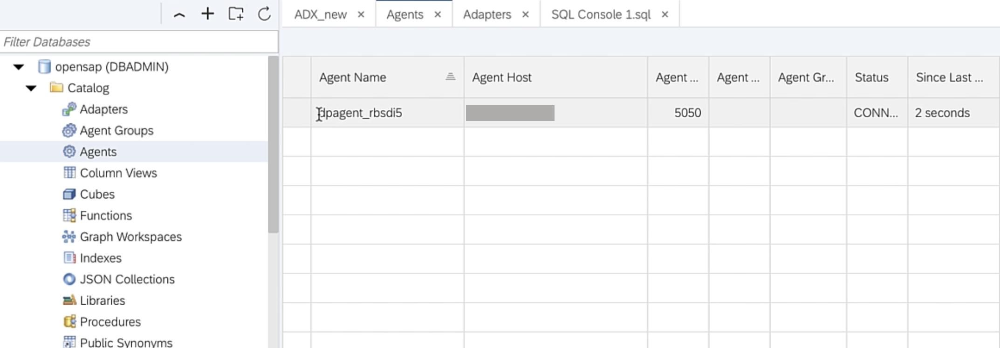
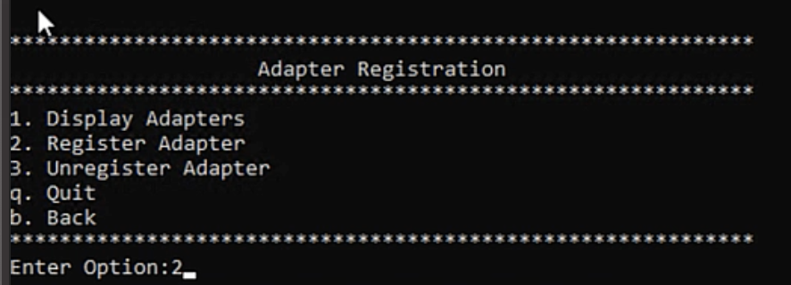

This exercise is part of the openSAP course [Building applications on SAP Business Technology Platform with Microsoft services](https://open.sap.com/courses/btpma1) - there you will find more information and context. 

# Connecting SAP HANA Cloud with Microsoft Azure Data Services 

In this exercise we will setup connection between SAP HANA Cloud and Microsoft Azure Data Explorer. 

## Problems
> If you have any issues with the exercises, don't hesitate to open a question in the openSAP Discussion forum for this course. Provide the exact step number: "Week4Unit3, Step 1.1: Command cannot be executed. My expected result was [...], my actual result was [...]". Logs, etc. are always highly appreciated. 
 
 
## Step 1 - Install Data Provisioning Agent
 
## Step 2 - Configuring Data Provisioning Agent (DPAgent)

This section will walk you through the steps to be followed to Data provisioning agent 

---

2.1. Open the Data Provisioning Agent Configuration tool by running config.bat. Enter option 6 to establish connection with HANA Cloud.

2.2 To estabilish the connection with SAP HANA Cloud enter option 1.

2.3 Enter HANA Connection details like JDBC Connection(default true) hostname , port (default 443) , Agent Admin HANA User & password , Proxy server (false) , HANA User for Agent messaging and password.

HANA Cloud usernames should be different for Agent Admin user and Agent Messaging. If you are using default DBAdmin for Agent Admin  User (which is not recommended) create a new HANA Cloud user for agent messaging.

2.4 To Register agent with your HANA Cloud go back to the main menu and enter option 7.

2.5 Enter option 1 to start the registration process.

2.6 Enter name of the Agent and enter the IP address of the instance where DPAgent is installed. Make sure that this IP Address is reachable from internet/HANA Cloud. 

2.7 Verify Agent Registration by opening HANA Cloud -> Catalog -> Agents. DPAgent registered in previous step should be visitble.

## Step 3 - Register Adapter

3.1 Download & Copy the MSSQL JDBC driver to the lib folder of the DPAgent installation directory. Version 7.2.2 is used for this excercise. 

3.2 Open DPAgent Configuration tool and enter option 8 to start the Adapter registration process.

3.3 To list all the available adapters enter option 1.

3.3 Locate MSSQLLogReaderAdapter. Note that unlike the image below your list will show that the MSSQLLogReaderAdapter will have 'NO' in the Registered column

3.4 Now enter the name of the adapter as MSSQLLogReaderAdapter and fisnish the registration process.

3.5. To verify the registration process open HANA Cloud -> Catalog->Adapters. Now MSSQLLogReaderAdapter will be listed for your DPAgent.

