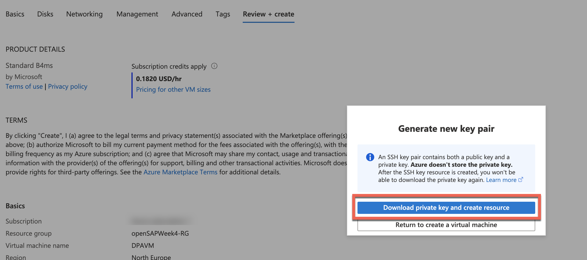
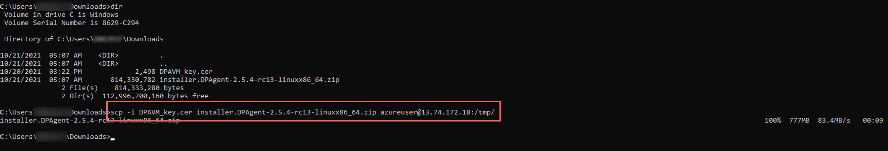
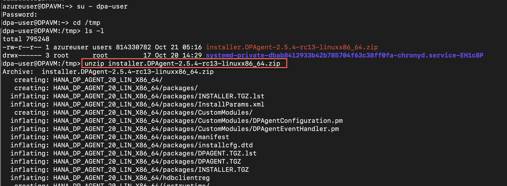
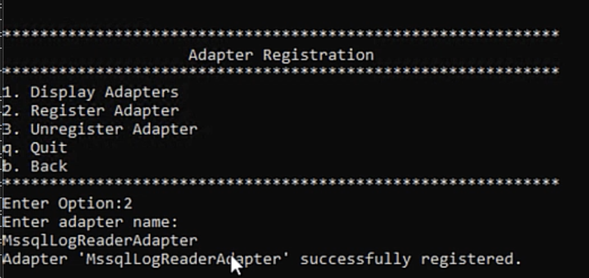

This exercise is part of the openSAP course [Building applications on SAP Business Technology Platform with Microsoft services](https://open.sap.com/courses/btpma1) - there you will find more information and context. 

# Connecting SAP HANA Cloud with Microsoft Azure Data Services 


In this exercise we will setup connection between SAP HANA Cloud and Microsoft Azure Data Explorer. 

## Problems
> If you have any issues with the exercises, don't hesitate to open a question in the openSAP Discussion forum for this course. Provide the exact step number: "Week4Unit3, Step 1.1: Command cannot be executed. My expected result was [...], my actual result was [...]". Logs, etc. are always highly appreciated. 
 
 
## Step 1 - Create Azure Virtual Machine

As we want to federate data that resides at Azure Data Explorer (ADX), we want to deploy the Data Provisioning Agent (DPAgent) as close as possible to the source data. Therefore we will be using Azure´s Virtual Machine service to deploy a Suse Linux Enterprise virtual machine (VM), where the DPAgent will run.

---

1.1 Navigate to <https://portal.azure.com> and log in with your Azure Account. 

1.2 Search for **Virtual Machines** and select the corresponding entry from the result list. 


1.3 Create a new Azure VM via **Create > ** a new Azure VM. 


1.4 In the basic configuration screen set the following configuration:
* **Subscription:** Azure Trial subscription that you have setup in [Week 1, Unit3](../../Week1/Unit3/README.md)
* **Resource Group:** penSAPWeek4-RG (created in the previous unit)
* **Virtual machine name:** DPAVM
* **Region**: Same region as your Azure Data Explorer (previous unit) is located in
* **Availability Options**: No infrastructure redundancy required (*not recommended for production*)
* **Image**: SUSE Enterprise Linux image (e.g. SUSE Enterprise Linux 15 SP2 +Patching - Gen2)
* **Size**: Standard_B4ms - 4 vcpus, 16 GiB memory (**IMPORTANT:** You need to click on **See all sizes to be able to select this machine)
* **Authentication Type**: SSH public key
* **Username**: azureuser (*keep the default value for this purpose, not recommended for production*)
* **SSH public key source**: Generate new key pair
* **Key pair name**: DPAVM_key


1.5 Proceed by selecting **Next: Disks**

1.6 Select **Standard SSD** for OS disk type. 


1.7 Proceed with **Next: Networking**.

https://itsupportportal.services.sap/itsupport?id=kb_article_view&sysparm_article=KB0011226&sys_kb_id=5a0f359b1bc92010325eeced7b4bcbcc&spa=1

1.8 For the **security group** we are creating a custom one and add the public IP from the machine we are working from. Click on **create new**.

> **Note:** For the virtual network, the subnet and the public IP we are sticking to the defaults.


1.9 Keep everything as it is and continue with **OK**. 


1.10 Proceed to **Review + create**. 


1.11 Go on and **Create** the Azure VM. 


1.12 A prompt comes up. Make sure to **download the key pair** that will be required to log on to the VM via SSH.


You should then see a conformation that the virtual machine was succesfully created. 


## Step 2 - Prepare Azure Virtual Machine

Before we can actually install the Data Provisioning Agent on the Virtual Machine, a few things like directories and users need to be created. 

---

2.1 **WINDOWS USER ONLY: If you are using Windows, please make sure that you SSH & SCP installed. Therefore open a command prompt and execute the following commands:**

```shell
ssh
```

```shell
scp
```


In case you are getting errors like *'not recognized as an internal or external command'*, please install the tools. Verify the installation again using the commands above after you have installed the mentioned tools. Installation links: 

* SCP: <https://winscp.net/eng/docs/installation>
* SSH: <https://docs.microsoft.com/en-us/windows-server/administration/openssh/openssh_install_firstuse>

> macOS users have these tools installed by default. 

2.2 In case you don't have a terminal (macOS)/command prompt (Windows) open, please open one now. 

2.3 Navigate to the location of your key file that you have downloaded in step 1.12 using the **cd** command. 

Windows: 


> **dir** lists the directory content on Windows, **ls** lists the directory content on macOS. 

macOS: 


2.4 Go to the Azure Portal (<https://portal.azure.com>) and search for your VM and select it from the result list. 


2.5 Copy the **public IP address**.


2.6 Execute the following command to connect to your Azure VM: 

Windows: 
```shell
ssh -i <.cer file name> azureuser@<public ip address>
```


macOS: 
```shell
chmod 400 <.cer file name> && ssh -i <.cer file name> azureuser@<public ip address>
```


> **Note:** Answer 'Are you sure you want to continue connecting (yes/no/[fingerprint])? with **yes**.

One you see **Have a lot of fun** in the output, you are succesfully connected to your Virtual Machine. 

2.7 Next up, as we do not want to use the **azureuser**, who has root rights, to install and run the DP Agent we will create a user specific for the DPAgent activities. Therefore, execute the following command to create a new user: 

```shell
sudo useradd -m dpa-user
```

> This command doesn't depend on your actual operation system anymore since you are connected to the VM that runs SUSE Enterprise Linux. 


2.8 The new user requires a password, to set one run: 

```shell
sudo passwd dpa-user
```


2.9 Now we need to create the installation folder and provide our new user with the respective rights to install software in that directory. First, change into the **/usr** directory:

```shell
cd /usr
```

2.10 Create a directory called **sap**: 

```shell 
sudo mkdir sap
```

2.11 Change into the new directory: 

```shell
cd sap 
```


2.12 Create another folder inside /usr/sap called **dataprovagent** running:

```shell
sudo mkdir dataprovagent
```

2.13 Change the ownership of this new folder to our dpa-user using: 

```shell
sudo chown dpa-user:users dataprovagent
```


## Step 3 - Install Data Provisioning Agent (DPAgent)

Since the Virtual Machine is succesfully created and prepared, you can now start to install the Data Provisiong Agent on the Virtual Machine. 

--- 


3.1 As a first step download **SDI Data Provisioning Agent for Linux** from <https://tools.hana.ondemand.com/#cloudintegration> to your local machine. (You need to scroll down on this page)

> **IMPORTANT:** Please make sure you are downloading the SDI Data Provisioning Agent for Linux, since the Virtual Machine runs on Linux!


3.2 After the download is completed we send it from our local machine to the VM on Azure using the secure copy command. Therefore, open a **new terminal/command prompt** (to keep the existing ssh session alive) and execute the following command. 

```shell
scp -i <.cer file name> <downloaded DPAgent file> azureuser@<public ip address>:/tmp/
```

> The <.cer file name> and  <public ip address> were already used in Step 2.6. The same values should be used here. 
> The <downloaded DPAgent file> is the file that you have downloaded in Step 3.1. Make sure that you are using the right path to the file in this command. 

Windows: 


macOS: 


3.3 After successfully copying the installer, switch back to the terminal/command prompt, where you are logged in to the VM and switch the user to the **dpa-user** by running: 

```shell
su - dpa-user
```


3.4 Navigate into the **tmp** directory, where you have copied the installer (Step 3.2) into by running: 

```shell
cd /tmp
```


3.5 As the installer is a ZIP file, **unzip** it by running:

```shell
unzip <DPAgent ZIP File>
```

> Note: double check if the DPAgent installer file was succesfully copied using the **ls** command to lis the directories content. 



3.6 Navigate into the extracted folder: 

```shell
cd <unzipped directory name>
```

> Again, you can use **ls** to find out the exact directory name and use your **tab** key while using **cd** to autocomplete the directory name. 


3.7 Finally, run the installer: 

```shell
./hdbinst --silent --batch --path="/usr/sap/dataprovagent/"
```


The Data Provsioning Agent has now been succesfully installed!

## Step 4 - Configure DPAgent

Now that the installation has been finished, the DPAgent is ready to be configured and to be connected. 

--- 

4.1 In order to connect to Azure Data Explorer, the DPAgent is using the *MssqlLogReaderAdapter* - therfore, you need the Microsoft JDBC driver. Download the driver **version 8.4** [here](https://docs.microsoft.com/de-de/sql/connect/jdbc/release-notes-for-the-jdbc-driver?view=sql-server-ver15#84) to your local machine. 


4.2 Again, you need to send this JDBC Driver from your local machine to the VM running the following command in the terminal/command prompt **where you are NOT logged on with the dpa-user**:

```shell
scp -i <.cer file name> <jdbc file name> azureuser@<public ip address>:/tmp/
``` 

Windows:


macOS:


4.3 Go back to the **terminal/command prompt where you are logged on with the dpa-user** and navigate to the **/tmp** directory: 

```shell
cd /tmp
```


4.4 Copy the JDBC Driver into the **lib** directory of the DPAgent: 

```shell
cp <JDBC Driver filename> /usr/sap/dataprovagent/lib/
```


1.1. Download SAP Data Provisioning Agent from SAP Software Download Center. Click [here](https://help.sap.com/viewer/7952ef28a6914997abc01745fef1b607/2.0_SPS04/en-US/665d8ea78f0c4f0dbb530a1193737f11.html) for details

1.2. Follow the the steps outlined [here](https://help.sap.com/viewer/7952ef28a6914997abc01745fef1b607/2.0_SPS02/en-US/dd8aaa71a6d4490485b8eb5123f46149.html) to install DP Agent

DPAgent can be installed in your local machine or in a VM close to the source system. If you dont have access to VM install in local machine. Make sure that there are no firewall or other restrictions for HANA Cloud to communicate with your local machine's IP address.

Note : SQL Queries will run slower with DPAgent installed in local machine compared to virtual machine in same region as ADX.
 
## Step 2 - Configuring Data Provisioning Agent (DPAgent)

This section will walk you through the steps to be followed to configure data provisioning agent.

---

2.1. Open the Data Provisioning Agent Configuration tool by running config.bat. Enter option 6 to establish connection with HANA Cloud.


2.2 To estabilish the connection with SAP HANA Cloud enter option 1.


2.3 Enter HANA Connection details like JDBC Connection(default true) hostname , port (default 443) , Agent Admin HANA User & password , Proxy server (false) , HANA User for Agent messaging and password.

HANA Cloud usernames should be different for Agent Admin user and Agent Messaging. If you are using default DBAdmin for Agent Admin  User (which is not recommended) create a new HANA Cloud user for agent messaging.


2.4 To Register agent with your HANA Cloud go back to the main menu and enter option 7.


2.5 Enter option 1 to start the registration process.


2.6 Enter name of the Agent and enter the IP address of the instance where DPAgent is installed. Make sure that this IP Address is reachable from internet/HANA Cloud. 


2.7 Verify Agent Registration by opening HANA Cloud -> Catalog -> Agents. DPAgent registered in previous step should be visitble.


## Step 3 - Register Adapter

3.1 Download & Copy the MSSQL JDBC driver to the lib folder of the DPAgent installation directory. Version 7.2.2 is used for this excercise. 


3.2 Open DPAgent Configuration tool and enter option 8 to start the Adapter registration process.


3.3 To list all the available adapters enter option 1.


3.3 Locate MSSQLLogReaderAdapter. Note that unlike the image below your list will show that the MSSQLLogReaderAdapter will have 'NO' in the Registered column


3.4 Now enter the name of the adapter as MSSQLLogReaderAdapter and fisnish the registration process.



3.5. To verify the registration process open HANA Cloud -> Catalog->Adapters. Now MSSQLLogReaderAdapter will be listed for your DPAgent.


## Step 4 - Create connection to Azure Data Explorer

4.1 In HANA Cloud, right click on Remote Source and select Add Remote Source


4.2 Select Adapter MSSQLLogReaderAdapter registered in step 3.4. Enter your ADX host name from Unit 2 , port (default 1433) , database name from Unit 2 and additional parameter "authentication=ActiveDirectoryPassword".


4.3 Scroll to Security section. Set SSL to true and Host name in certificate to "*.kusto.windows.net"


4.4 Scroll to Credentials section. Set Credential mode to Technical User and user name and password. Now click create. Active Directory Authentication method is one of many methods of authenticating ADX.


4.5 Verify the connection by opening the connection. Expand Remote Objects to locate the table created in Unit 2.


