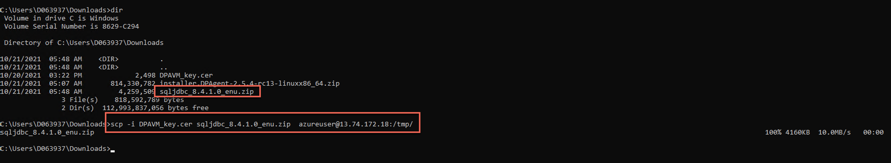
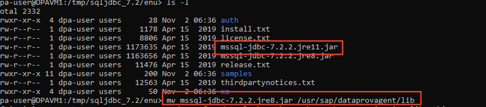
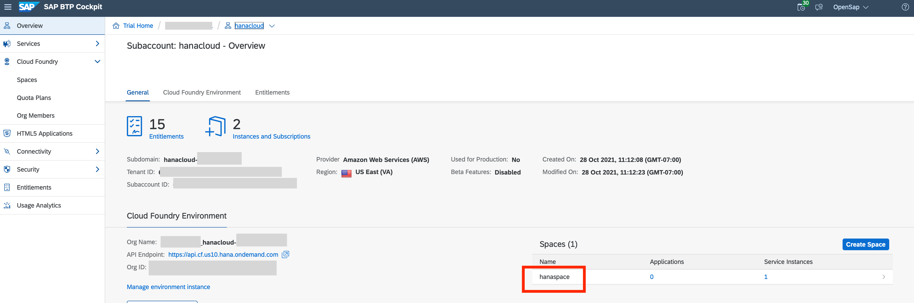
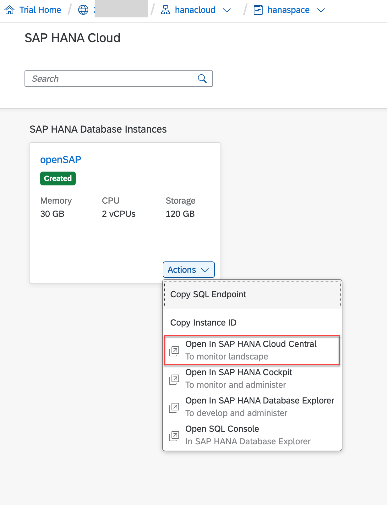
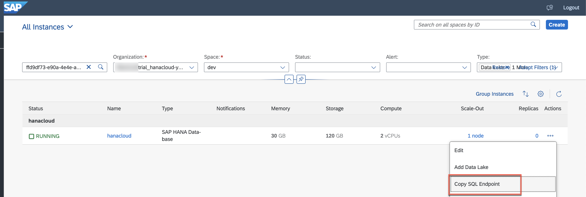
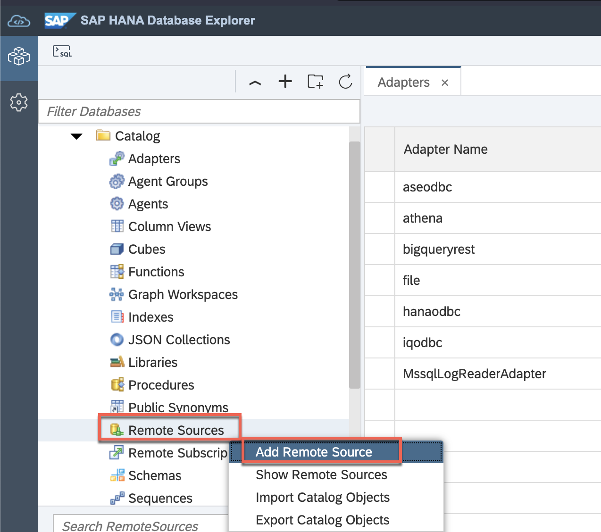

This exercise is part of the openSAP course [Building applications on SAP Business Technology Platform with Microsoft services](https://open.sap.com/courses/btpma1) - there you will find more information and context. 

# Connecting SAP HANA Cloud with Microsoft Azure Data Services 

In this exercise we will setup connection between SAP HANA Cloud and Microsoft Azure Data Explorer. There's quite some stuff that can go wrong, so watch out for the [troubleshooting section](#troubleshooting).

## Problems
> If you have any issues with the exercises, don't hesitate to open a question in the openSAP Discussion forum for this course. Provide the exact step number: "Week4Unit3, Step 1.1: Command cannot be executed. My expected result was [...], my actual result was [...]". Logs, etc. are always highly appreciated. 
 
 
## Step 1 - Create Azure Virtual Machine

As we want to federate data that resides at Azure Data Explorer (ADX), we want to deploy the Data Provisioning Agent (DPAgent) as close as possible to the source data. Therefore we will be using Azure´s Virtual Machine service to deploy a Suse Linux Enterprise virtual machine (VM), where the DPAgent will run.

---

1.1 Navigate to <https://portal.azure.com> and log in with your Azure Account. 

1.2 Search for **Virtual Machines** and select the corresponding entry from the result list. 


1.3 Create a new Azure VM via **Create** a new Azure VM. 


1.4 In the basic configuration screen set the following configuration:
* **Subscription:** Azure Trial subscription that you have setup in [Week 1, Unit3](../../Week1/Unit3/README.md)
* **Resource Group:** penSAPWeek4-RG (created in the previous unit)
* **Virtual machine name:** DPAVM
* **Region**: Same region as your Azure Data Explorer (previous unit) is located in
* **Availability Options**: No infrastructure redundancy required (*not recommended for production*)
* **Image**: SUSE Enterprise Linux image (e.g. SUSE Enterprise Linux 15 SP2 +Patching - Gen2)
* **Size**: Standard_B4ms - 4 vcpus, 16 GiB memory (**IMPORTANT:** You need to click on **See all sizes to be able to select this machine)
* **Authentication Type**: SSH public key
* **Username**: azureuser (*keep the default value for this purpose, not recommended for production*)
* **SSH public key source**: Generate new key pair
* **Key pair name**: DPAVM_key


1.5 Proceed by selecting **Next: Disks**

1.6 Select **Standard SSD** for OS disk type. 


1.7 Proceed with **Next: Networking**.

https://itsupportportal.services.sap/itsupport?id=kb_article_view&sysparm_article=KB0011226&sys_kb_id=5a0f359b1bc92010325eeced7b4bcbcc&spa=1

1.8 For the **security group** we are creating a custom one and add the public IP from the machine we are working from. Click on **create new**.

> **Note:** For the virtual network, the subnet and the public IP we are sticking to the defaults.


1.9 Keep everything as it is and continue with **OK**. 


1.10 Proceed to **Review + create**. 


1.11 Go on and **Create** the Azure VM. 


1.12 A prompt comes up. Make sure to **download the key pair** that will be required to log on to the VM via SSH.


You should then see a conformation that the virtual machine was succesfully created. 


---

**IMPORTANT:** <a name="restartvm">Stop & Start your Virtual Machine when you don't need it. The Virtual Machine is otherwise unnecessarily consuming some of your free credits (in case you are using the Azure Free Trial subscription). </a>

Search for your Virtual Machine in the Azure Portal: 


**Start** or **Stop** the VM depending on your needs. 


Step 2.6 will show you how to log on to your VM again. **Every time the Virtual Machine is started again, it will have a new public IP address!**

---

## Step 2 - Prepare Azure Virtual Machine

Before we can actually install the Data Provisioning Agent on the Virtual Machine, a few things like directories and users need to be created. 

---

2.1 **WINDOWS USER ONLY: If you are using Windows, please make sure that you SSH & SCP installed. Therefore open a command prompt and execute the following commands:**

```shell
ssh
```

```shell
scp
```


In case you are getting errors like *'not recognized as an internal or external command'*, please install the tools. Verify the installation again using the commands above after you have installed the mentioned tools. Installation links: 

* SCP: <https://winscp.net/eng/docs/installation>
* SSH: <https://docs.microsoft.com/en-us/windows-server/administration/openssh/openssh_install_firstuse>

> macOS users have these tools installed by default. 

2.2 In case you don't have a terminal (macOS)/command prompt (Windows) open, please open one now. 

2.3 Navigate to the location of your key file that you have downloaded in step 1.12 using the **cd** command. 

Windows: 


> **dir** lists the directory content on Windows, **ls** lists the directory content on macOS. 

macOS: 


2.4 Go to the Azure Portal (<https://portal.azure.com>) and search for your VM and select it from the result list. 


2.5 Copy the **public IP address**.


2.6 Execute the following command to connect to your Azure VM: 

Windows: 
```shell
ssh -i <.cer file name> azureuser@<public ip address>
```


macOS: 
```shell
chmod 400 <.cer file name> && ssh -i <.cer file name> azureuser@<public ip address>
```


> **Note:** Answer 'Are you sure you want to continue connecting (yes/no/[fingerprint])? with **yes**.

One you see **Have a lot of fun** in the output, you are succesfully connected to your Virtual Machine. 

2.7 Next up, as we do not want to use the **azureuser**, who has root rights, to install and run the DP Agent we will create a user specific for the DPAgent activities. Therefore, execute the following command to create a new user: 

```shell
sudo useradd -m dpa-user
```

> This command doesn't depend on your actual operation system anymore since you are connected to the VM that runs SUSE Enterprise Linux. 


2.8 The new user requires a password, to set one run: 

```shell
sudo passwd dpa-user
```


2.9 Now we need to create the installation folder and provide our new user with the respective rights to install software in that directory. First, change into the **/usr** directory:

```shell
cd /usr
```

2.10 Create a directory called **sap**: 

```shell 
sudo mkdir sap
```

2.11 Change into the new directory: 

```shell
cd sap 
```


2.12 Create another folder inside /usr/sap called **dataprovagent** running:

```shell
sudo mkdir dataprovagent
```

2.13 Change the ownership of this new folder to our dpa-user using: 

```shell
sudo chown dpa-user:users dataprovagent
```


## Step 3 - Install Data Provisioning Agent (DPAgent)

Since the Virtual Machine is succesfully created and prepared, you can now start to install the Data Provisiong Agent on the Virtual Machine. 

--- 


3.1 As a first step download **SDI Data Provisioning Agent for Linux** from <https://tools.hana.ondemand.com/#cloudintegration> to your local machine. (You need to scroll down on this page)

> **IMPORTANT:** Please make sure you are downloading the SDI Data Provisioning Agent for Linux, since the Virtual Machine runs on Linux!


3.2 After the download is completed we send it from our local machine to the VM on Azure using the secure copy command. Therefore, open a **new terminal/command prompt** (to keep the existing ssh session alive) and execute the following command. 

```shell
scp -i <.cer file name> <downloaded DPAgent file> azureuser@<public ip address>:/tmp/
```

> The <.cer file name> and  <public ip address> were already used in Step 2.6. The same values should be used here. 
> The <downloaded DPAgent file> is the file that you have downloaded in Step 3.1. Make sure that you are using the right path to the file in this command. 

Windows: 


macOS: 


3.3 After successfully copying the installer, switch back to the terminal/command prompt, where you are logged in to the VM and switch the user to the **dpa-user** by running: 

```shell
su - dpa-user
```


3.4 Navigate into the **tmp** directory, where you have copied the installer (Step 3.2) into by running: 

```shell
cd /tmp
```


3.5 As the installer is a ZIP file, **unzip** it by running:

```shell
unzip <DPAgent ZIP File>
```

> Note: double check if the DPAgent installer file was succesfully copied using the **ls** command to lis the directories content. 


3.6 Navigate into the extracted folder: 

```shell
cd <unzipped directory name>
```

> Again, you can use **ls** to find out the exact directory name and use your **tab** key while using **cd** to autocomplete the directory name. 


3.7 Finally, run the installer: 

```shell
./hdbinst --silent --batch --path="/usr/sap/dataprovagent/"
```


The Data Provsioning Agent has now been succesfully installed!

## Step 4 - Configure DPAgent - JDBC Driver 

Now that the installation has been finished, the DPAgent is ready to be configured and to be connected. In order to connect to Azure Data Explorer, the DPAgent is using the *MssqlLogReaderAdapter* - therfore, you need the Microsoft JDBC driver.

--- 

4.1 Download the driver **version 8.4** [here](https://docs.microsoft.com/de-de/sql/connect/jdbc/release-notes-for-the-jdbc-driver?view=sql-server-ver15#84) to your local machine. 


4.2 Again, you need to send this JDBC Driver from your local machine to the VM running the following command in the terminal/command prompt **where you are NOT logged on with the dpa-user**:

```shell
scp -i <.cer file name> <jdbc file name> azureuser@<public ip address>:/tmp/
``` 

Windows:


macOS:


4.3 Go back to the **terminal/command prompt where you are logged on with the dpa-user** and navigate to the **/tmp** directory: 

```shell
cd /tmp
```


4.4 Unzip the JDBC Driver ZIP file into the the **lib** directory of the DPAgent:

```bash
unzip sqljdbc_8.4.1.0_enu.zip -d /usr/sap/dataprovagent/lib
```




## Step 5 - Double-Check SAP HANA Cloud Status

<a name="hanacloudstatus">Since the SAP HANA Cloud instance in SAP BTP Trial is automatically stopped after a certain time, make sure that your SAP HANA Cloud instance is running. This is needed since you are going to establish a connection between the SAP HANA Cloud instance and the Data Provisioning Agent in the next step. </a>

---

5.1 Go to the SAP BTP Trial Cockpit <https://hanatrial.ondemand.com> and navigate to your **hanacloud** subaccount where you have set up the SAP HANA Cloud instance in [Week 4, Unit1](../Unit1/README.md).


5.2 Open the **dev** space. 



5.3 Navigate to the **SAP HANA Cloud** menu item. 


5.4 Open the context menu of your SAP HANA Cloud instance using the **actions** button and select **Open in SAP HANA Cloud Central**. Sign in with your SAP BTP Trial account. 



5.5 In case your SAP HANA Cloud instance is **Stopped**, select **...** to open the available actions for this SAP HANA Cloud instance. **Start** the instance.

> Starting the instance can take a few minutes. 


5.6 Refresh the page every now and then to get the current status of the SAP HANA Cloud instance. 


> Wait until SAP HANA Cloud instance is in status **Running**

## Step 6 - Start DPAgent

6.1 In the terminal/command prompt, where you are logged in with the **dpa-user**, navigate into the **bin** directory of the DPAgent: 

```shell
cd /usr/sap/dataprovagent/bin
```

> In case you are not logged in anymore, please revisit Step 2.6 to log in. Make sure that you have the right public IP address (Step 2.4 & Step 2.5). 
> **IMPORTANT:** Use the **dpa-user** for this operations. ```su - dpa-user``` is the right command to switch to the **dpa-user**. 


6.2 Start the DPAgent Configuration tool: 

```shell
./agentcli.sh --configAgent
```


6.3 Enter **2** and hit the **Enter** key to choose **Start or Stop Agent**: 


6.4 Enter **1** to start the DPAgent. After the Agent has started, press **Enter** so you can go on with other configurations in the next steps.


## Step 7 - Establish Connection between SAP HANA Cloud and Data Provisioning Agent

<a name="hanaconnectioninit">This section will walk you through the steps to be register the DPAgent with SAP HANA Cloud. </a>

---


> In case you are not connected with the Azure VM anymore, please revisit Steps 2.4-2.6
> In case your DPAgent config tool isn't running anymore, please revisit Step 6

7.1 Enter **b** to navigate back to the main menu. And navigate to the SAP HANA Connection menu using **Option 6**.


7.2 Enter **1** to choose Option 1 **Connect to SAP HANA Cloud via JDBC**. 

7.3 Hit enter to Keep the default value for **Use encrypted JDBC connection**. 

7.4 <a name="hostname">You are asked to enter the host name of your SAP HANA Cloud instance. Go back to the SAP HANA Cloud Central (Steps 5.1 - 5.3) to copy the host name of your SAP HANA Cloud instance and paste the value into the DPAgent configuration **without the port number** and **without the protocol in the beginning**.  </a>

> host name example: ffd9df73-e90a-4e4e-a216-687d306ed47c.hana.trial-us10.hanacloud.ondemand.com




7.5 *Enter Port Number:* **443**

7.6 *Enter Agent Admin HANA User:* **DBADMIN**

7.7 *Enter Agent Admin HANA User Password:* **DBADMIN Password** that you have provided in [**Week 4, Unit 1**](../Unit1/README.md) during the SAP HANA Cloud instance creation. 

7.8 *Repeat the password for* **DBADMIN**.

7.9 *Enter Use Proxy Server[false]:* false

7.10 *Enter HANA User Name for Agent Messaging:* SDI_DP_AGENT

7.11 *Enter HANA User Password for Agent Messaging:* Set an initial password for the **SDI_DP_AGENT** user.

7.12 *Repeat the password from the previous step.*

7.13 *Do you want to create a new SAP HANA user with the specified Agent XS HANA User credentials?:* **true**


7.14 Press **Enter** to continue. 

7.15 Select **Option b** to navigate pack to the main menu. 

7.16 Select **Option 1** to show the Agent status. You should see that Agent is **running** and connected to your SAP HANA Cloud instance. 


## Step 8 - Register DPAgent in SAP HANA Cloud 

Now, that the connection between SAP HANA Cloud and the DPAgent is established, you can register the DPAgent itself in SAP HANA Cloud. 

--- 


> In case you are not connected with the Azure VM anymore, please revisit Steps 2.4-2.6
> In case your DPAgent config tool isn't running anymore, please revisit Step 6

8.1 In the DPAgent configuration tool, select **Option 7** (Agent Registration) followed by **Option 1** (Register Agent).


8.2 Enter the following details during the interactive configuration:
* **Agent Name**: Agent on Azure
* **Agent Host**: <Public IP Adress from Azure Portal>

> if you are wondering why the public IP of the Azure VM in the screenshots of this exercise have changed: The VM was stopped and started to save costs and therefore received a new IP. How to Stop and Star the VM can be found [earlier in this exercise](#restartvm).
  


8.2 Open your SAP HANA Cloud instance in the **SAP HANA Database Explorer**, launched from SAP HANA Cloud Central.

> Step 5  of this exercise describes how to navigate to the SAP HANA Cloud Central. 


8.3 You should then see in the **catalog** of your SAP HANA Cloud database that you are DPAgent is registered. 


8.4 Restart your DPAgent. Therefore go to the main menu of the DPAgent configuration tool, choose **option 2** and hit the **Enter** key to choose **Start or Stop Agent**: 


8.5 Choose **Option 2** to stop the Agent. 


8.6 Hit **Enter** to continue and start the Agent again with **Option 1**. 


8.7 Go back to the main menu, navigate to **SAP HANA Connection (Option 6)** to establish the JDBC Connection to SAP HANA Cloud once gain. Therefore, choose **Connect to SAP HANA Cloud via JDBC (Option 1)** and go through the interactive configuration once again as described in Step 7. 


## Step 9 - Register Adapter

In order to be able to connect to Azure Data Explorer, a specific Smart Data Integration (SDI) Adapter is necessary. In this step, you'll register the needed MssqlLogReaderAdapter. 

---

9.1 Go back to your DPAgent configuration tool on the Azure Virtual Machine that you are connected with via ssh and navigate to **Option 8** (Adapter registration) from the main menu. 

> In case you are not connected with the Azure VM anymore, please revisit Steps 2.4-2.6
> In case your DPAgent config tool isn't running anymore, please revisit Step 6


9.2 Choose **Option 2** (Register Adapter) and type in **MssqlLogReaderAdapter** as the adapter name. 


9.3 Open your SAP HANA Cloud instance in the **SAP HANA Database Explorer**, launched from SAP HANA Cloud Central.

> Step 5  of this exercise describes how to navigate to the SAP HANA Cloud Central. 


9.4 Open the **context menu** of the Adapters with a right-click and **Show Adapters**. You should now see that the MssqlLogReaderAdapter is registred on your DPAgent on the Azure VM. 


## Step 10 - Create Remote Source for Azure Data Explorer 

10.1 In the **SAP HANA Database Explorer**, right-click on **Remote Sources** and **Add Remote Source**. 



10.2 Provide the following settings in the **Database section** of this form: 

* **Source Name:** Azure Data Explorer
* **Adapter Name:** MssqlLogReaderAdapter
* **Source Location:** AGENT: Agent on Azure
* **Data Server**: URI of Azure Data Explorer cluster that you have created in [Week 4, Unit2](../Unit2/README.md)
    (e.g. https://opensapclusterhbr1.northeurope.kusto.windows.net)
* **Port Number:** 1433
* **Database Name:** Database name that you have created in [Week 4, Unit2](../Unit2/README.md)
* **Additional JDBC connection paramter:** authentication=ActiveDirectoryPassword


10.3 Scroll further to the **Security** section of the Remote Source creation form and provide the following settings: 

* **Use SSL:** true
* **Host Name in Certificate**: *.kusto.windows.net


10.4 Scroll further to the **Credentials** section of the Remote Source creation form and provide the following settings: 

* **Credentials Mode:** Technical User
* **User Name:** Your Azure Portal User (that you have used to create the Azure Data Explorer cluster)
* **Password**: Password of your Azure Portal User

Click on **Create**.


10.5 To check the remote source status, open the context menu of Remote Sources and select **Show Remote Sources**. 


## Summary

Well done! You have succesfully set up an Azure Virtual Machine, installed the Data Provisioning Agent on it, connected the DPAgent with your SAP HANA Cloud instance and registered the MssqlLogReaderAdapter (to read from Azure Data Explorer). 
## Troubleshooting

### Failed to connect to server SAP DBTech..

In case you are facing the error shown on the screenshot below, your SAP HANA Cloud instance is most likely not running. 

**Solution**: Step 5 describes how to check the status of your SAP HANA Cloud instance and how to start it.


### Error while starting DPAgent configuration tool using ./agentcli.sh --configAgent

In case you are facing the error shown on the screenshot below, make sure you are logged in to the Azure VM with the right user. Only the **dpa-user** has the appropriate rights on the VM itself. 

**Solution:** First switch the user to *dpa-user* (Step 3.3) and try to start the DPAgent configuration tool again. 

```shell
su - dpa-user
```


### Unable to make JDBC connection to server

In case your Agent Status shows *Unable to make JDBC connection to server*, most likely either the SAP HANA Cloud instance was stopped or the DPAgent was stopped/interrupted. 

**Solution**: Try to go through the **SAP HANA connection** setup described in Step 7 once again.


### Failed to register adapter. Context: Connection has not been initialized yet.

**Solution**: Try to go through the **SAP HANA connection** setup described in Step 7 once again.


