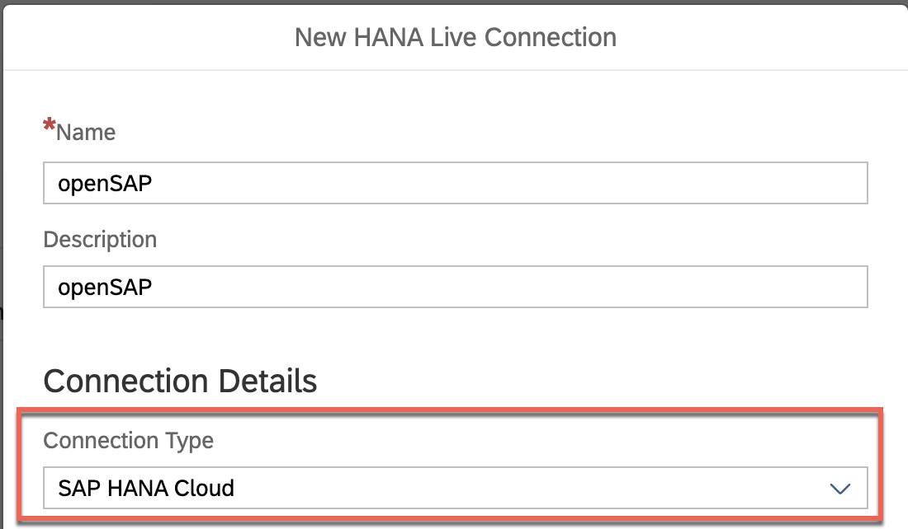

---

Even though the course is now closed, you can still access the videos and PDFs in self-paced mode via the openSAP course itself. The hands-on exercises will continue to be available for some time. However, certain steps and screenshots may be out of date as products continue to evolve. Therefore, we cannot guarantee that all exercises will work as expected after the end of the course.

---

This exercise is part of the openSAP course [Building applications on SAP Business Technology Platform with Microsoft services](https://open.sap.com/courses/btpma1) - there you will find more information and context. 

# Connecting SAP Analytics Cloud with SAP HANA Cloud

In this exercise we will setup a connection between SAP Analytics Cloud (SAC) and SAP HANA Cloud. In Unit 5 we will finally visualize ADX data in a SAP Analytics Cloud story.
 
## Step 1 - Setup new SAP HANA Connection

This section will walk you through the steps to be followed to setup up live connection between SAP Analytics Cloud and SAP HANA Cloud.

**IMPORTANT:** If you have not yet created a SAP Analytics Cloud trial account, please follow the steps outlined in [Week 4, Unit1](../Unit1/README.md) and continue with Step 1.1 afterwards.**

---

1.1 Logon to SAP Analytics Cloud using the credentials from [Week 4, Unit1](../Unit1/README.md). **Expand the side menu** and click on **Connections**. Then hit the **plus sign** on the top right side.

1.2 Select **SAP HANA** (in the **Connect to Live Data** section which is easy to oversee!). 

1.3 Switch the **Connection Type** from **SAP Cloud Platform** to **SAP HANA Cloud**. 

1.4 Enter the credentials for **SAP HANA Cloud** and click **OK**.

* Connection Type : **SAP HANA Cloud** 
* Host : **\<your HANA Cloud instance host name without port\>** (how to get the host name: [Week 4, Unit 3 - Step 7.4](../Unit3/README.md#hostname)) 
* Authentication Method : **User Name and Password** 
* User Name : **DBADMIN** 
* Password : **\<Password of DBADMIN\>**
  
  

## Summary
  
Good Job! Now you have successfully set up a live connection from SAP Analytics Cloud to SAP HANA Cloud. This is just a connectivity test, in the next unit you will leverage this connection with another user to consume the data through a Virtual Table on SAP HANA Cloud. 