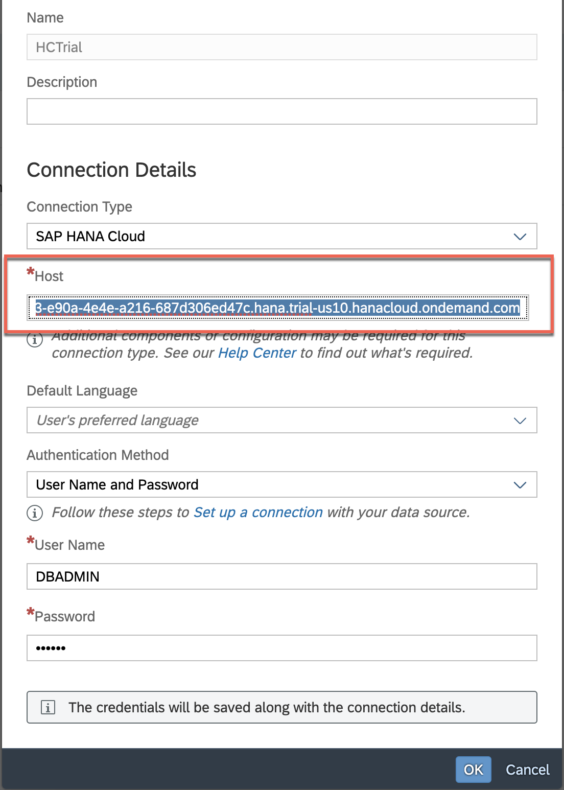

This exercise is part of the openSAP course [Building applications on SAP Business Technology Platform with Microsoft services](https://open.sap.com/courses/btpma1) - there you will find more information and context. 

# Connecting SAP Analytics Cloud with SAP HANA Cloud

In this exercise we will setup connection between SAP Analytics Cloud (SAC) and SAP HANA Cloudn.In Unit 5 we will visualize ADX data in a SAP Analytics Cloud story. 

## Problems
> If you have any issues with the exercises, don't hesitate to open a question in the openSAP Discussion forum for this course. Provide the exact step number: "Week4Unit4, Step 1.1: Command cannot be executed. My expected result was [...], my actual result was [...]". Logs, etc. are always highly appreciated. 
 
 
## Step 1 - Setup new SAP HANA Connection

This section will walk you through the steps to be followed to setup up live connection between SAP Analytics Cloud and SAP HANA Cloud.

** If you have not yet created a SAP Analytics Cloud trial account, please follow the steps outlined in Week 4 Unit 1 and continue with Step 1.1 afterwards.

---

1.1. Create new connection
Logon to SAC application and click Connections in the menu on the rightside. Then click plus on the top left side.

1.2. Select SAP HANA
Select SAP HANA under live connections list.

1.3. Enter HANA CLoud credentials.
Enter the credentials for SAP HANA Cloud and click OK.

  Connection Type : SAP HANA Cloud
  Host : <your HANA Cloud instance>
  Authentication Method : User Name and Password
  User Name : <username in SAP HANA Cloud>
  Password : <Password for the HANA Cloud User>
  
  
  
  Now you have successfully setup Live Connection from SAP Analytics Cloud to SAP HANA Cloud
