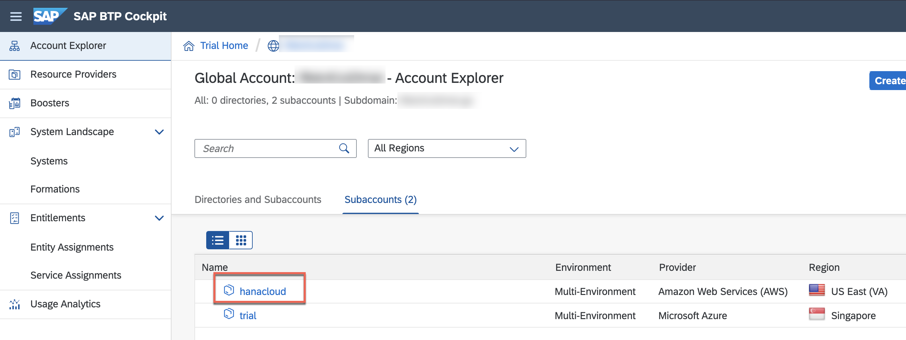
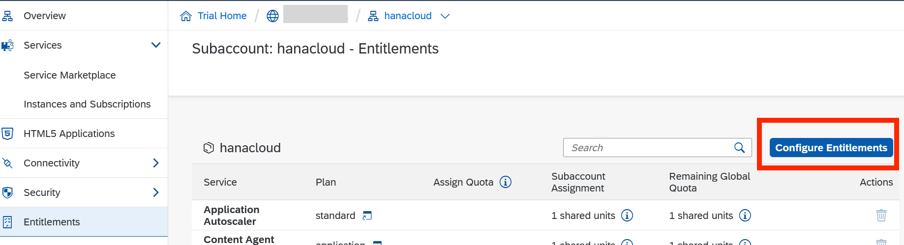
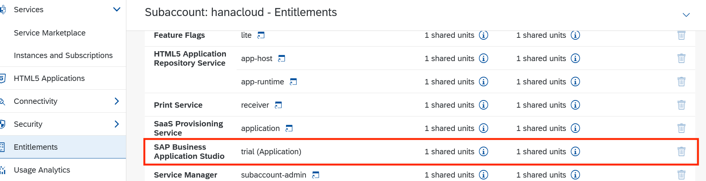
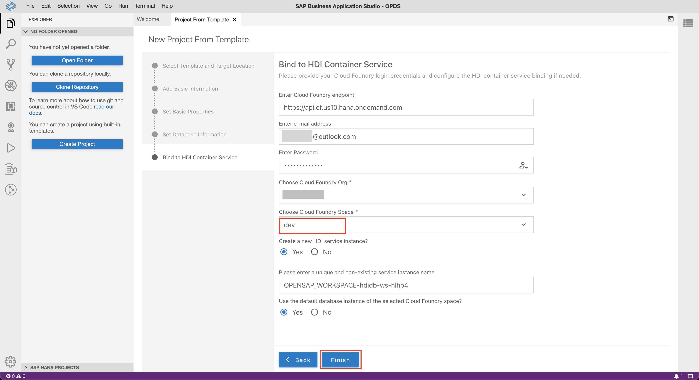

## Setup a User-Provided Service and SAP Business Application Studio

1.1. Go to SAP BTP cockpit. Open the subaccount 'hanacloud'.



1.2 Click on **Entitlements** in left panel, select **Configure Entitlements** and then click on **Add Service Plans** button as shown.



1.3 In the resulting screen find SAP Business Application Studio, select the **trial** plan click on **Add 1 Service Plan** as shown.


The SAP Business Application Studio entitlement will show up in available entitlements list as shown below.



1.4 Repeat the above process, find **SAP HANA Schema and HDI Containers** and select all available options. Then click on **Add 4 Service Plans**.


1.4.1 Click on **Save** in the entitlements overview, next to the **Add Service Plans** button to save your changes.

1.4.2 Navigate to your Cloud Foundry **Space** and select **Instances** from the left menu. Now click on the small arrow next to **Create** and select **User-Provided Service Instance** as shown below.


1.4.3 Enter the name **ups_opensap** and enter the HANA Cloud details in the below format. Then click the **Create** button. The other fields remain empty.

 ```shell
{
    "driver": "com.sap.db.jdbc.Driver",
    "endpoint": "https://api.cf.us10.hana.ondemand.com",
    "host": "<Host Name of HANA Cloud Instance>",
    "password": "<Password for DBADMIN>",
    "port": "443",
    "schema": "DBADMIN",
    "tags": [
        "hana"
    ],
    "user": "DBADMIN"
}
 ```


1.5 Navigate back to your **Subaccount**, select the **Service Marketplace** section on the left, search for **SAP Business Application Studio** and click on **Create**.


1.6 Accept the default values and click **Create**.


1.7 Clicking on **Instances and Subscriptions** tab on left should show the **SAP Business Application Studio** as **Subscribed**. Click on it to bring up the **Go to Application** button. Select it to open SAP Business Application Studio.


1.8 This should take you to the **SAP Business Application Studio** in a new tab.


1.9 Click on **Create Dev Space** button.


1.9.1 As name for your workspace enter **OPENSAP_DS**.


1.9.2 Select **SAP HANA Native Application** and click the **Create Dev Space** button.


1.9.3 Once the space has switched from state **Starting** to **Running** click the dev space name **OPENSAP_DS**.


1.10 Now the dev space is created. To create a new project click the **Create Project** button. Select **SAP HANA Database Project** and click the **Start** button.


1.11 Enter name for the project as **OPENSAP_WORKSPACE** and click next.


1.12 Enter module name as **db** and click the **Next** button.


1.13 Select **HANA Cloud** as HANA Database version and click **Next**. The other settings can remain blank.


1.14 Enter your **SAP BTP Trial account username** and **password**. Then click on the highlighted icon next to the password field.


**NOTE** If you get error 'Login failed' in spite of giving correct username and password, go to [Troubleshooting section](#troubleshooting) below.

1.15 The SAP BTP subacount and your space should be automatically populated. In case you have created a different subaccount or further spaces, select the right one from the dropdown.


1.16 Keep the other values as default values and click the **Finish** button.


1.17 Once the project is created, it will automatically open in the left section of your **SAP Business Application Studio**. This may take a minute and your browser might reload automatically. Once your project is visible, open the **mta.yaml** file and enter the highlighed values.


>**Hint**: The **mta.yaml** file requires you to use the **space key** of your keyboard instead of the **tab key** to generate **intents**. Please make sure, you're creating the intents exactly as depicted in the screenshot by adding spaces manually!

1.18 Click the **bind** button next to the **ups_opensap** connection.


1.19 Select **Bind to a user provided service**.


1.20 Select **ups_opensap** from the dropdown.


1.21 Select the **db/src** folder within your project. Then click **File menu** and select **New File**.


1.22 Enter the file name **DBA.hdbgrants**.


1.23 Paste the below code in **DBA.hdbgrants**.

```shell
{
  "ups_opensap": {
   "object_owner": { 
      "schema_privileges": [
        {
          "reference" : "DBADMIN",
          "privileges_with_grant_option": ["SELECT"]
        }
      ]
    },
    "application_user": { 
      "schema_privileges": [
        {
          "reference" : "DBADMIN",
           "privileges_with_grant_option": ["SELECT"]
        }
      ]
    }
  }
}
 ```


1.24 Now its time to **deploy** the project. Click the **rocket icon** next to the root level of the project.


## Troubleshooting

1. If you get the below 'Login Failed' error screen while logging in at the  1.14 step above, do the following:

 

**Solution:**

a. Try resetting your SAP ID by going to sap.com, Log Out


b. Click on 'Forgot Password' while trying to login again. This will generate the below reset email .  If you get two emails one from SAP ID service and one from SAP Universal ID,  use reset link in each of them to set it to your new password.  Close all tabs. Delete cache in browser. Go to BTP Cockpit again and try logging in with new password. Now reopen BAS Application and retry from steps 1.10 and continue, you should be able in successfully. 

