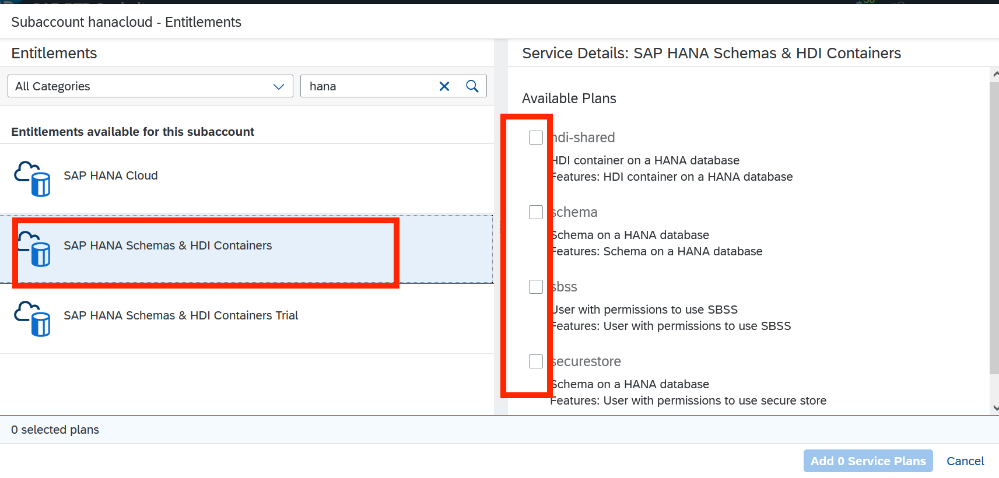
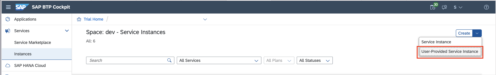
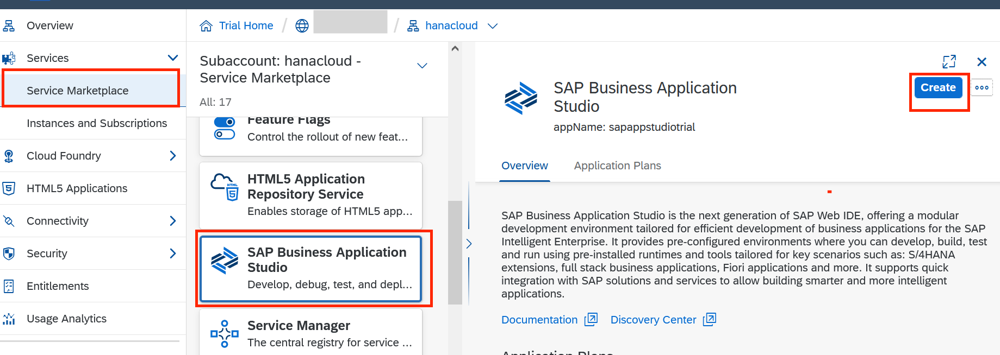
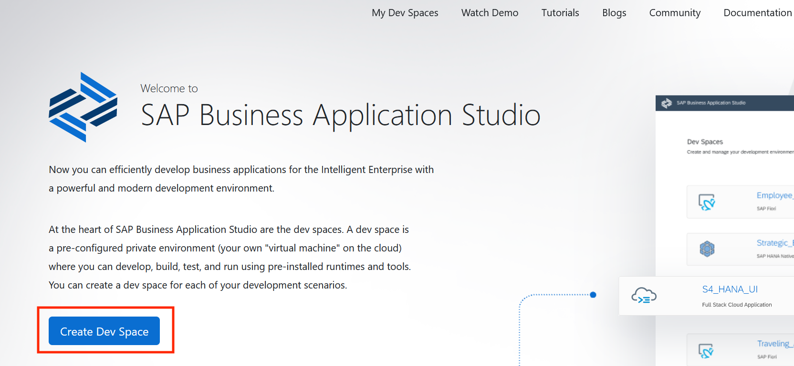
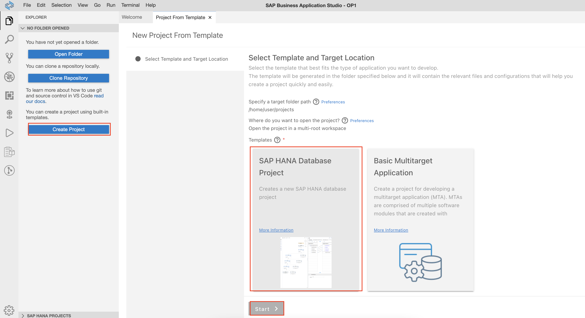
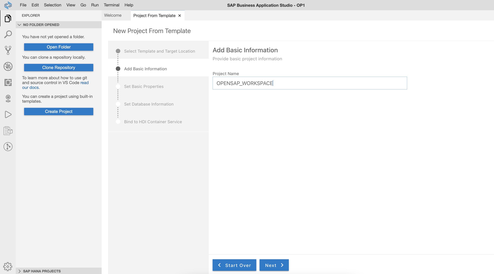
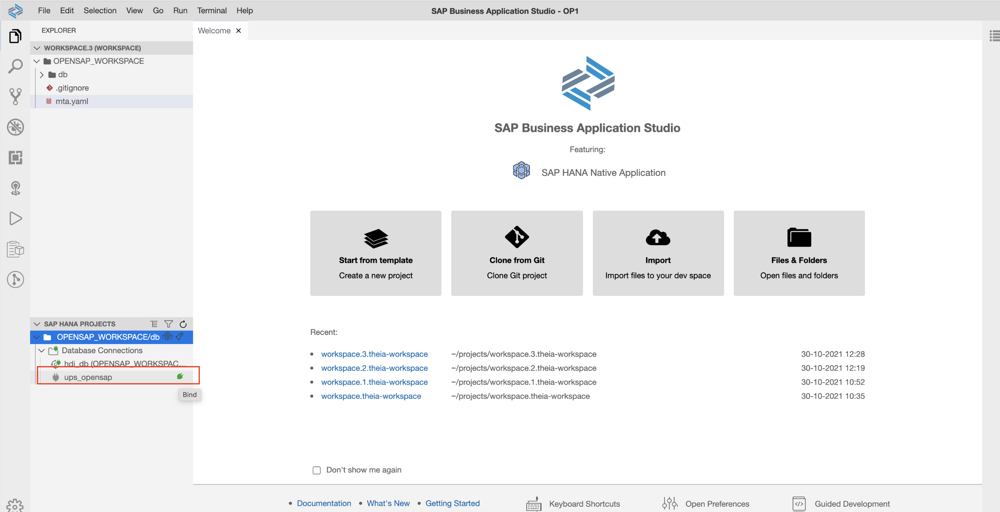
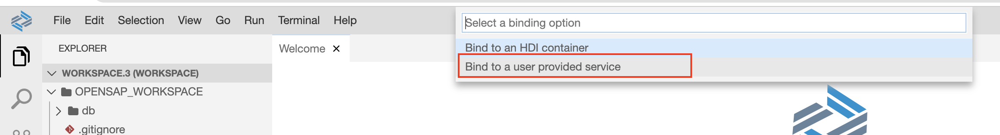
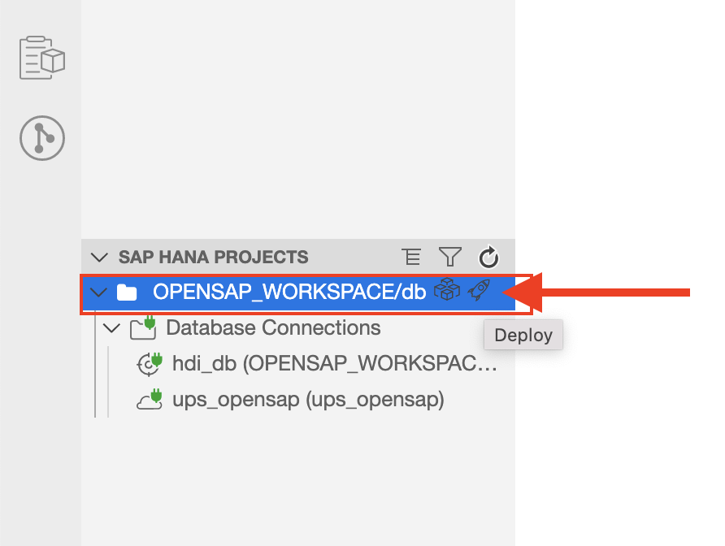

## Setup User Provided Instance and Business Application Studio

1.1. Go to SAP BTP cockpit. Open the subaccount 'hanacloud'.


1.2. Click on Entitlements on left panel and Click on Configure Entitlements and then on Add Service Plan buttons as shown:


1.3 In the resulting screen find Business Application Studio , check the 'trial' plan click on 'Add 1 Service Plan' as shown:


The SAP Business Application Studio entitlement would show up in available entitlements list as shown below:


1.4 Now repeat the above process and find SAP HANA Schema and HDI Containers and select all the options as shown and click pn 'Add Service Plans' :




1.4.1 Now navigate to SubAccount -> Space and click Instances from the left menu. Now click Create and select User-Provided Service Instance.



1.4.2 Enter the name ups_opensap and enter the HANA Cloud details in the below format and click Create button.

 ```shell
{
    "driver": "com.sap.db.jdbc.Driver",
    "endpoint": "https://api.cf.us10.hana.ondemand.com",
    "host": "<Host Name of HANA Cloud Instance>",
    "password": "<Password for DBADMIN>",
    "port": "443",
    "schema": "DBADMIN",
    "tags": [
        "hana"
    ],
    "user": "DBADMIN"
}
 ```


1.5 Go to Service Marketplace on left and find SAP Business Application Studio and click on "Create" 



1.4  Accept the default values and click 'Create' :


1.5 Clicking on Instances and Subscriptions tab on left should show the SAP Business Application Studio as 'Subscribed' as shown. Click on it to bring up the 'Go to Application' button. Click it.


1.6 This should take you to the SAP Business Application Studio application in a new tab.


1.8  Click on 'Create Dev Space' button.



1.11 Once the dev space is created proceed to create Project and select SAP HANA Database project.


1.12 Enter name for the project as OPENSAP_WORKSPACE and click next.


1.13 Keep the other values as default values and click next button until finish.


1.14 Open mta.yaml file and enter the highlighed values.


1.15 Click the bind buton next to ups_opensap connection service.


1.16 Select Bind to a user provided service


1.17 Select ups_opensap from the dropdown


1.18 Now its time to deploy the project. Click the rocket icon next to the projecct

