 
 ## Create Calculation View and deploy it in SAP HANA Cloud
 
  1. In your business application studio, select menu View -> Find Command
  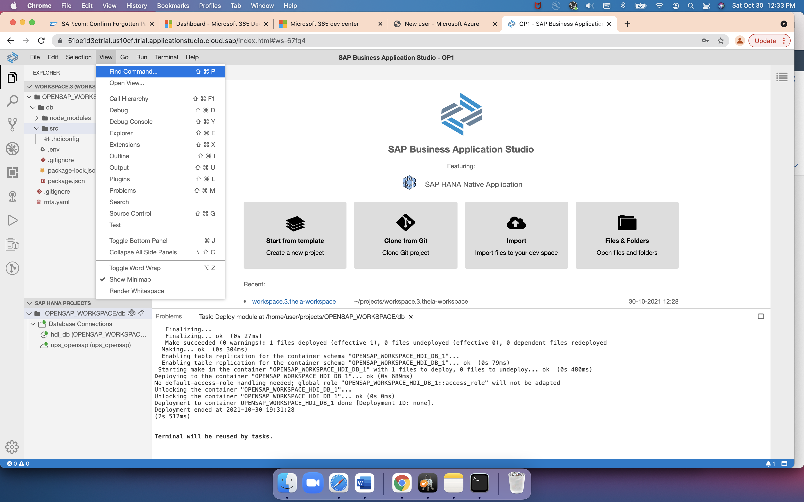
 
  2. Type "HANA Database Artifact" and select Create SAP HANA Database Artifact.
  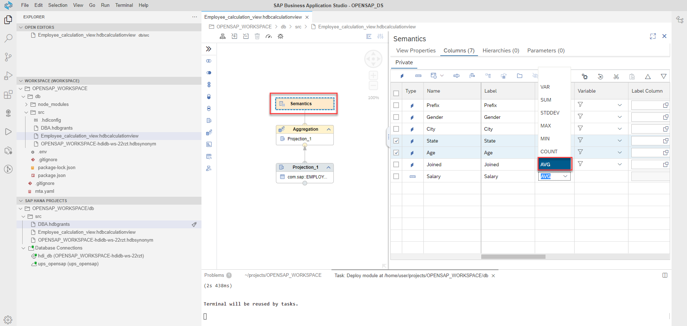
  
  3. Select artifact type as "Calculation View" and enter artifact name "Employee_calculation_view".
   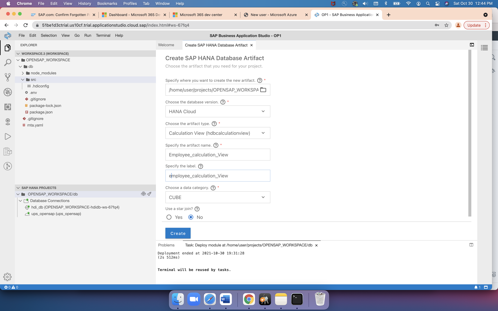
   
  4. Once the calculation view is created, select the calculation view and add "Projection" to the calculation view.
   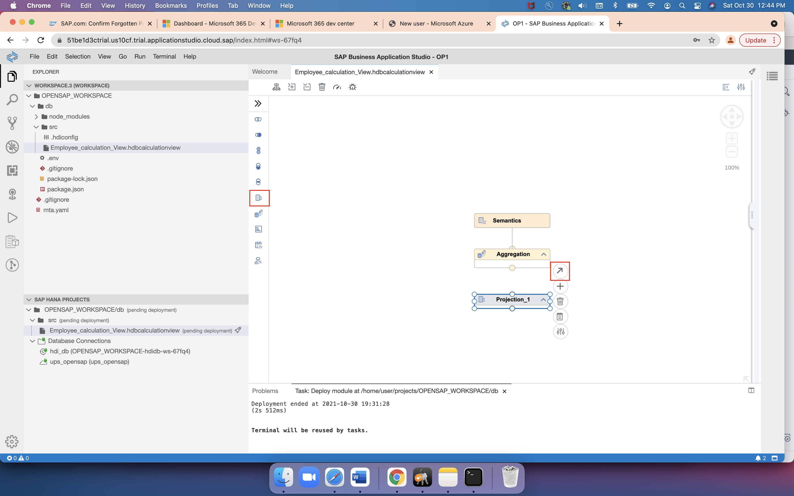
   
  5. Select the projection and connect the projection to the Aggregation
   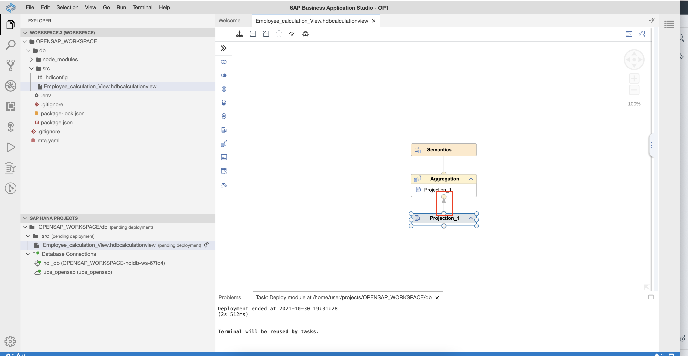

  6. Select the Projection and click the Plus button to add data source
   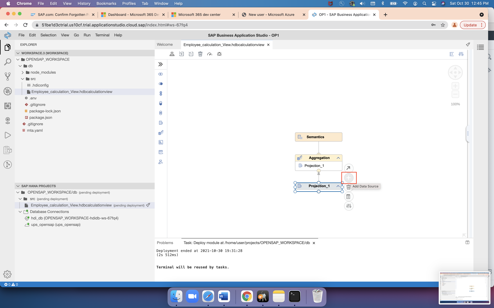
   
  7. Click the Services drop down and select "ups_opensap"
   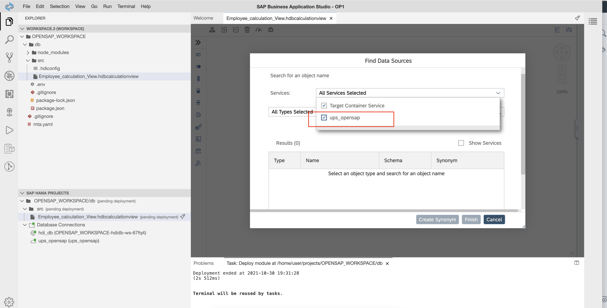

  8. Type employee_view and click search. Once the Employee_view is listed, select it and click "Create Synonym". 
  Note: If you have not created view in the SAP HANA Cloud for your remote table, you can search and select your remote table "virtual-employee-sample-data" directly.

   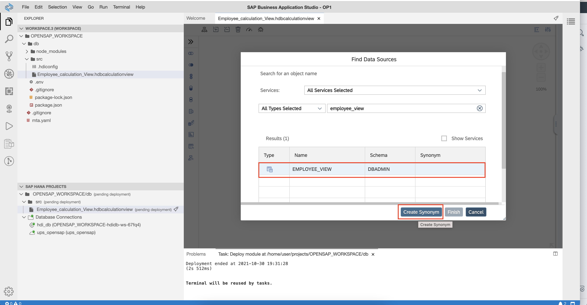
   
  9. Now click Finish button.
   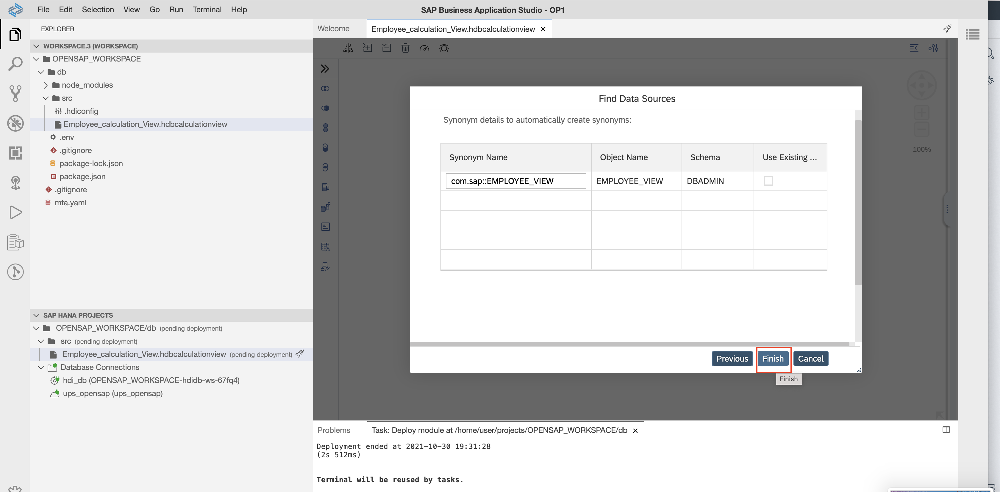
   
  10. Select projection and drag and drop "Salary" column to the output section. 
   Note : If you have selected remote table directly in step 8, you will see more columns.
   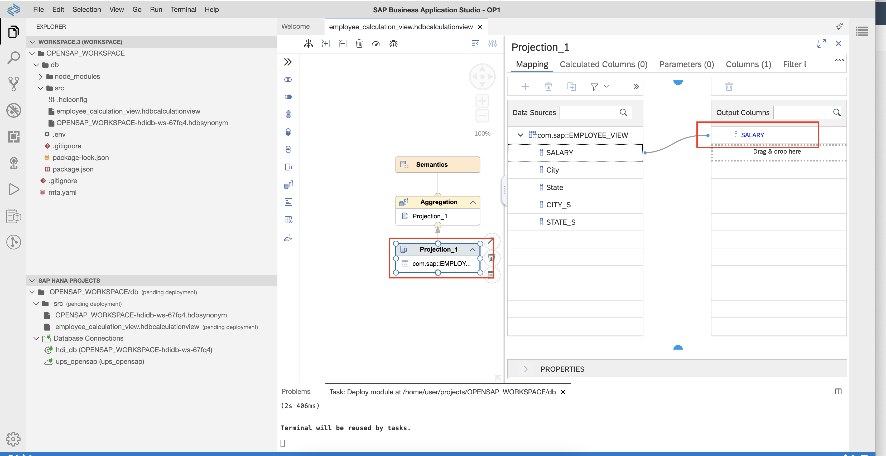
   
  11. Now select Aggregation and drag and drop "Salary" column to the output section.
   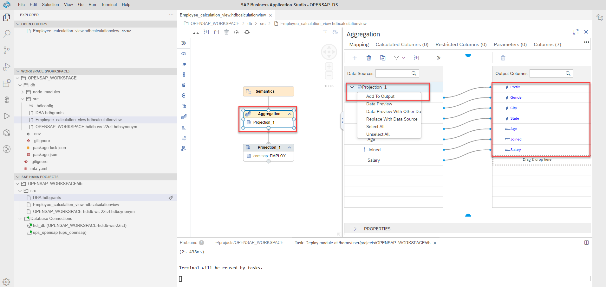
   
  12. Click deploy button (Rocket icon) next to the project workspace and deploy the calculation view.
   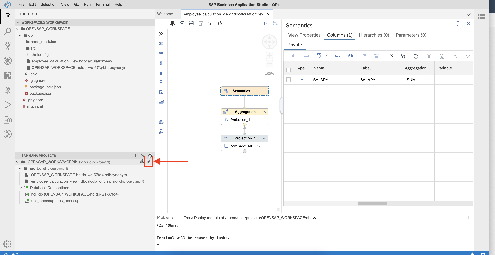
   
   Now your calculcation view is successfully deployed to SAP HANA Cloud
  
