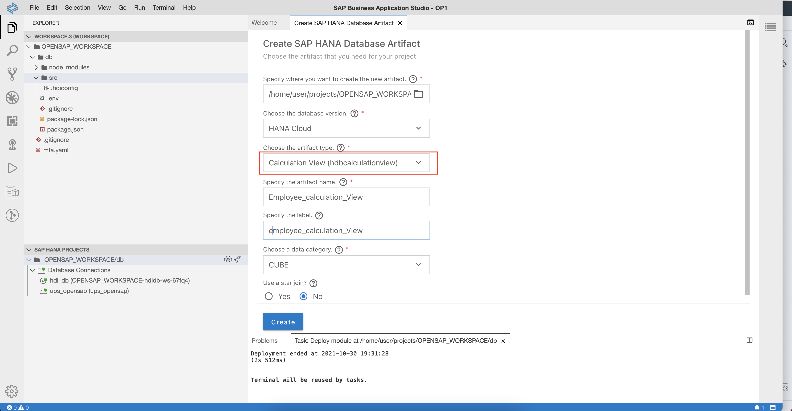
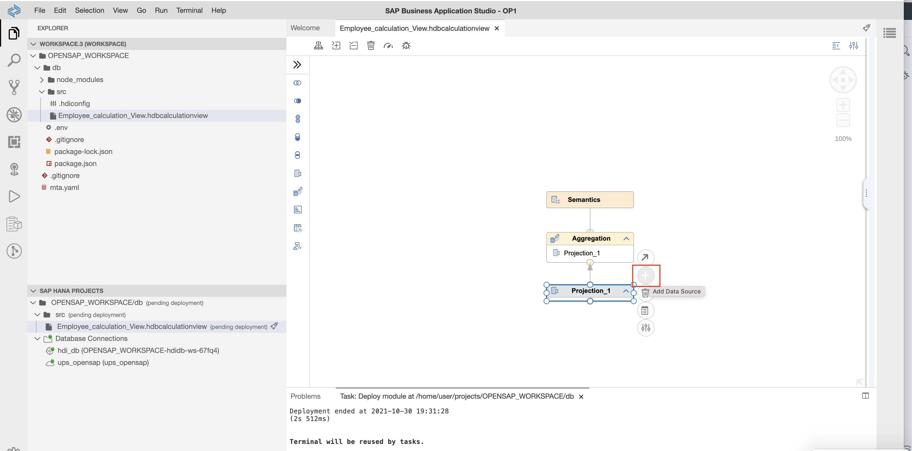

 ## Create a Calculation View and deploy it to SAP HANA Cloud
 
1.1 In your SAP Business Application Studio, select **View** -> **Find Command**.
    
 
1.2 Type **HANA Database Artifact** and select **Create SAP HANA Database Artifact**.
    
  
1.3 Select artifact type as **Calculation View** and enter the artifact name **Employee_calculation_view**. Leave the other settings as is. Make sure the Calculation View is created in the **db/src** folder of your project.
    
   
1.4 Once the **Calculation View** is created, double-click it. Add a new **Projection** node in the canvas.
    
   
1.5 Select the **Projection** node and connect it to the **Aggregation** node.
    

1.6 Select the **Projection** node and click the **+ button** to add data source.
    
   
1.7 Click the **Services** dropdown and select **ups_opensap**.
    

1.8 Type **employee_view** and click **Search**. Once the **Employee_view** is listed, select it and click **Create Synonym**.   
**Note:** If you have not created an SQL view in the SAP HANA Cloud for your remote table, you can still search and select your remote table **virtual-employee-sample-data** directly.
    
   
1.9 Now click the **Finish** button.
    
   
1.10 Select the **Projection**, do a right-click on the top node of your **Data Source** section and select **Add to Output**. Your input columns will appear in the Output Columns section.  
   **Note**: If you have selected the remote table directly in step 8, you will probably see more available columns.
    
   
1.11 Now select the **Aggregation** node and repeat the same process once again, to add all available Data Source columns of **Projection_1** to the Output Columns of the **Aggregation** Node.
    

1.12 Switch to the **Semantics Node**. Select the **Columns** tab on the right side of your screen. Change the **Aggregation Type** of **Age** and **Joined** to **Blank** by selecting the blank field in the respective dropdowns. 
       

1.13 Change the **Aggregation Type** of the **Salary** measure to **AVG** by selecting **AVG** in the respective dropdown. 
       

1.14 Click the **deploy button** (Rocket icon) next to the project workspace once again and deploy the **Calculation View**.
    
   
Now your **Calculcation View** is successfully deployed to SAP HANA Cloud.
  
