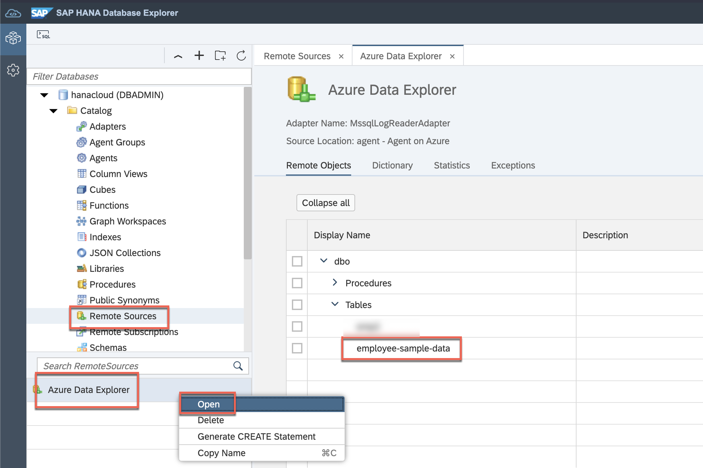
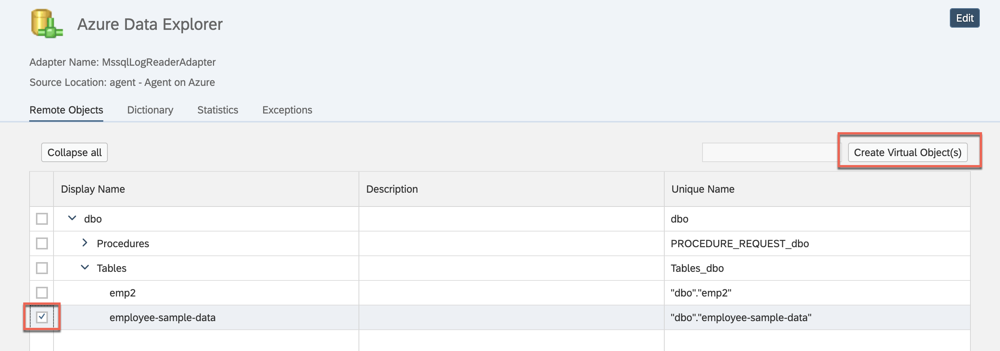
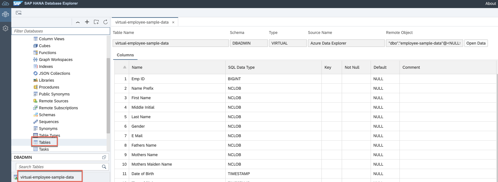
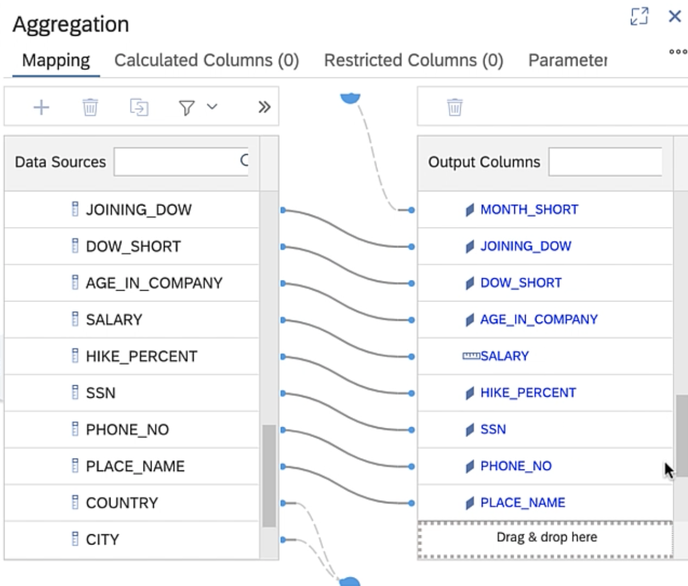

This exercise is part of the openSAP course [Building applications on SAP Business Technology Platform with Microsoft services](https://open.sap.com/courses/btpma1) - there you will find more information and context. 

# Implementation of End to End flow via Federation

In this exercise we will implement the end to end flow. We will create a virtual table for the ADX table in HANA Cloud and consume the virtual table via Calculation view in SAP Analytics Cloud. 

## Problems
> If you have any issues with the exercises, don't hesitate to open a question in the openSAP Discussion forum for this course. Provide the exact step number: "Week4Unit5, Step 1.1: Command cannot be executed. My expected result was [...], my actual result was [...]". Logs, etc. are always highly appreciated. 
 
 
## Step 1 - Create Virtual Table (aka Remote Table) for ADX table in SAP HANA Cloud

1.1. Open remote connection
Open the remote connection we created in Unit 3 and locate the table in ADX created in Unit 2.

1.2. Create Virtual Table
Select the table and Click the button Create Remote Table

1.3. Save Virtual Table
Enter a name and click Create

1.4. Open Virtual Table
Click Tables in the left menu and locate the table created in the previous step. Search the table by name.

## Step 2 - Create Calculation View

2.1 Create Calculation view in Business Application Studio

2.2 Add addtrbutes and measures

2.3 Deploy Calculation View
 

2.4 Verify Deployment
 

