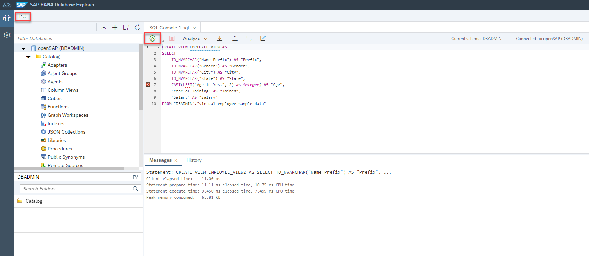

This exercise is part of the openSAP course [Building applications on SAP Business Technology Platform with Microsoft services](https://open.sap.com/courses/btpma1) - there you will find more information and context. 

# Implementation of End to End flow via Federation


In this exercise we will implement the end to end flow. We will create a virtual table for the ADX table in HANA Cloud and consume the virtual table via Calculation view in SAP Analytics Cloud. 

## Problems
> If you have any issues with the exercises, don't hesitate to open a question in the openSAP Discussion forum for this course. Provide the exact step number: "Week4Unit5, Step 1.1: Command cannot be executed. My expected result was [...], my actual result was [...]". Logs, etc. are always highly appreciated. 
 
 
## Step 1 - Create Virtual Table (aka Remote Table) for ADX table in SAP HANA Cloud

1.1. Make sure you that all your involved artefacts are running. 

- SAP HANA Cloud is running [Week 4, Unit 3](../Unit3/README.md#hanacloudstatus)
- Azure VM is running - [Week 4, Unit 3](../Unit3/README.md#restartvm)
- Data Provisioning Agent is started 
    
- SAP HANA Cloud connection is healthy. When your SAP HANA Cloud instance was stopped/restarted, you need to go back to the DPAgent configuration and re-initiate the connection to SAP HANA Cloud. [Week 4, Unit 3](../Unit3/README.md#hanaconnectioninit) shows you how to initiate the connection. 
    
  
  
1.2 Open your SAP HANA Cloud instance in the SAP HANA Database Explorer. 
    

1.2 Open the remote connection you created in the previous unit and locate the table of Azure Data Explorer created in [Week 4, Unit2](../Unit2/README.md).


1.2. Select the table and click **Create Virtual Object(s)**.


1.3. Enter **virtual-employee-sample-data** as table name, select **DBADMIN** as the scheman and click **Create**.


1.4. Double-Click **Tables** in the catalog and open the virtual table that you have created previously.


1.5. Open SQL Editor. To create view, paste the below SQL in the SQL Editor and click run button. If you have created the table with a different name or have renamed your columns adjust the SQL before running it.
```SQL
create view employee_view as 
select "Salary" as "SALARY" , "City" , "State" , CAST("City" as nvarchar(50)) as "CITY_S" , CAST("State" as nvarchar(50) as "STATE_S" from DBADMIN."virtual-employee-sample-data"
```



## Step 2 - Create Calculation View

2.1 [Follow steps outlined here to setup Business Application Studio and create user provided service](./BusinessApplicationStudioSetup.md)

2.2 [Follow steps to configure HANA Cloud authorization](./HANAAuthorization.md)
 
2.3 [Follow steps outlined here to create calculation view](./CalculationViewCreation.md)


## Step 3 - Create Model in SAP Analytics Cloud

3.1 Create Live Data Model
 

3.2 Select Data Source
 

3.3 Save Model
 


## Step 4 - Create Story in SAP Analytics Cloud

4.1 Create Canvas
 

4.2 Add Chart
 

4.3 Select Model
 

4.4 New Canvas with empty chart
 

4.5 Select Measure
 

4.5 Chart is rendered
 

4.8 Save Canvas
 


