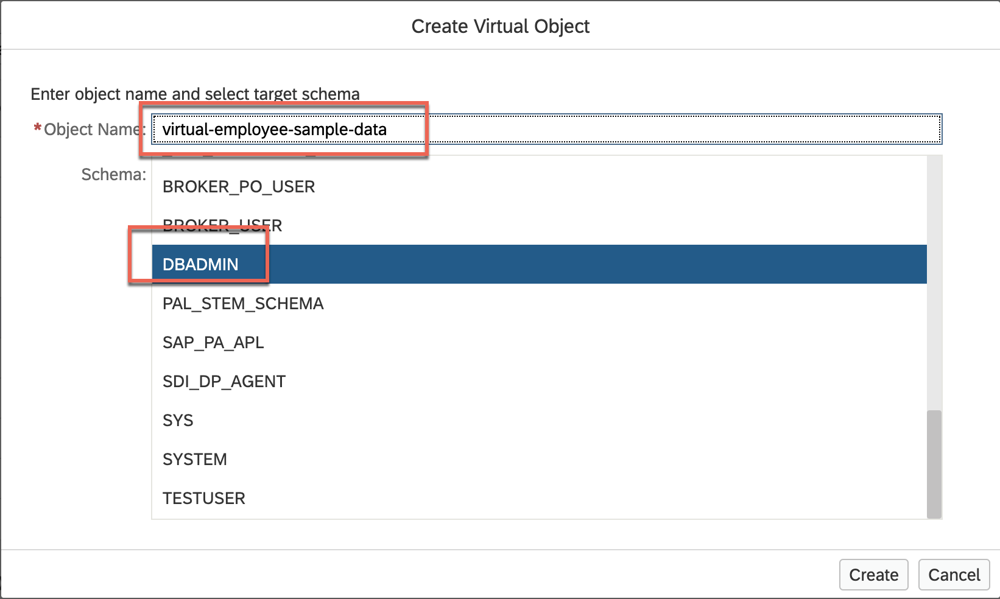
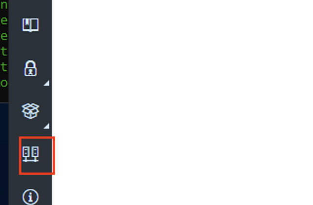
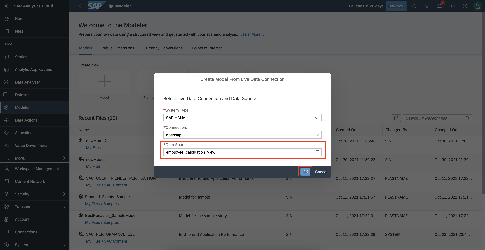
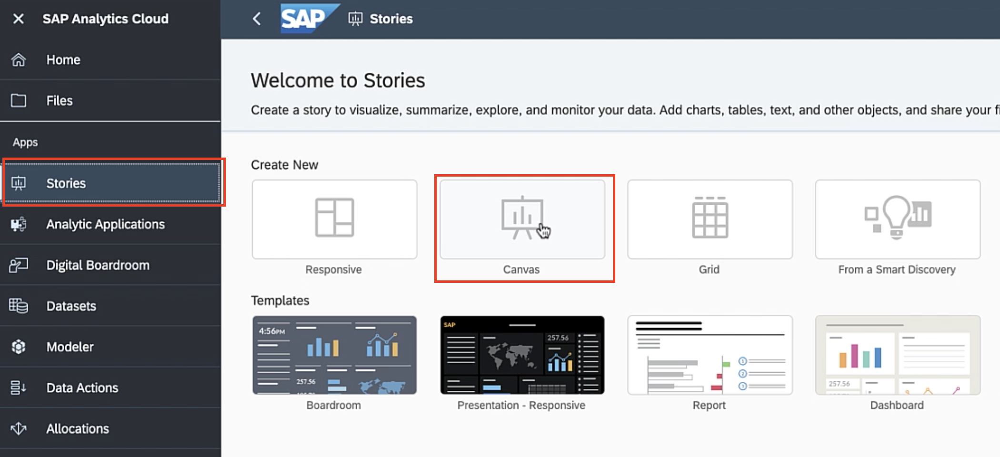
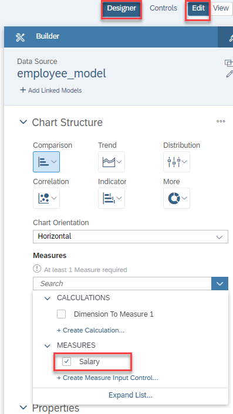
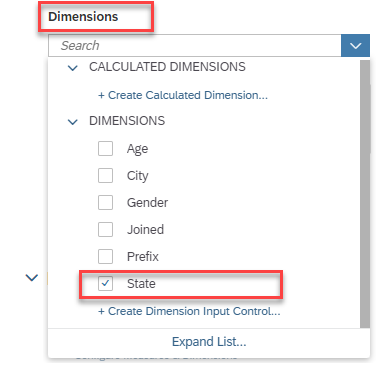

---

Even though the course is now closed, you can still access the videos and PDFs in self-paced mode via the openSAP course itself. The hands-on exercises will continue to be available for some time. However, certain steps and screenshots may be out of date as products continue to evolve. Therefore, we cannot guarantee that all exercises will work as expected after the end of the course.

---

This exercise is part of the openSAP course [Building applications on SAP Business Technology Platform with Microsoft services](https://open.sap.com/courses/btpma1) - there you will find more information and context. 

# Implementation of an end-to-end flow via Federation


In this exercise we will implement an end-to-end flow. We will create a Virtual Table for the ADX table in SAP HANA Cloud and consume the Virtual Table via a Calculation View in SAP Analytics Cloud.
 
## Step 1 - Create a Virtual Table (aka Remote Table) for ADX table in SAP HANA Cloud

1.1 Make sure that all your involved artefacts are running.

- SAP HANA Cloud is running [Week 4, Unit 3](../Unit3/README.md#hanacloudstatus)
- Azure VM is running - [Week 4, Unit 3](../Unit3/README.md#restartvm)
- Data Provisioning Agent is started 
    
- SAP HANA Cloud connection is healthy. When your SAP HANA Cloud instance was stopped/restarted, you need to go back to the DPAgent configuration and re-initiate the connection to SAP HANA Cloud. [Week 4, Unit 3](../Unit3/README.md#hanaconnectioninit) shows you how to initiate the connection. 
    

1.2 Open your SAP HANA Cloud instance in the SAP HANA Database Explorer. 
    

1.3 Open the **Remote Connection** you created in the previous unit and locate the table of Azure Data Explorer created in [Week 4, Unit2](../Unit2/README.md).


1.4 Select the table and click **Create Virtual Object(s)**.


1.5 Enter **virtual-employee-sample-data** as table name, select **DBADMIN** as the schema and click **Create**.



1.6 Double-click **Tables** in the catalog and open the Virtual Table that you have created previously.


1.7 Open **SQL Editor**. To create a view, paste the below SQL in the SQL Editor and click the **Run** button. If you have created the table with a different name or have renamed your columns adjust the SQL before running it.

>**Hint**: In a real-world project, you probably wouldn't create an SQL View via the SQL console, but would use design-time objects like **hdbview** within an SAP Business Application Studio project. For the sake of simplicity, in this tutorial the SQL console is used. 

```SQL
CREATE VIEW EMPLOYEE_VIEW AS 
SELECT 
	TO_NVARCHAR("Name Prefix") AS "Prefix",
	TO_NVARCHAR("Gender") AS "Gender",
	TO_NVARCHAR("City") AS "City", 
	TO_NVARCHAR("State") AS "State", 
	CAST(LEFT("Age in Yrs.", 2) as integer) AS "Age",
	"Year of Joining" AS "Joined",
	"Salary" AS "Salary"
FROM "DBADMIN"."virtual-employee-sample-data"
```


## Step 2 - Create a Calculation View

2.1 [Follow steps outlined here to setup Business Application Studio and create a user-provided service](./BusinessApplicationStudioSetup.md)

2.2 [Follow steps outlined here to create a Calculation View](./CalculationViewCreation.md)


## Step 3 - Create a Model in SAP Analytics Cloud

Now that we have created the Calculcation View, let's use it to create a Live Data Model in SAP Analytics Cloud.

---

3.1 Logon to SAP Analytics Cloud using the credentials from Week 4, Unit1. 

**NOTE:** In Week 5, Unit 1 we connected SAP HANA Cloud to SAP Analytics Cloud using DBADMIN as technical user in the connection details. The Calculation View that we created in SAP Business Application Studio and deployed in an HDI Container schema of our HANA Cloud (in step 2.3) is accessible only by an HDI Container runtime user. Hence we will now "edit" the connection we created earlier, by changing the DBADMIN to the HDI Container runtime user as shown below.

3.1.1 Navigate to the SAP BTP Cockpit and navigate to the **Instances** section of the **hanaspace** space. Find the existing **HDI Container** service instance and click on it. Select the **View Credentials** button.


3.1.2 Copy the **user** and **password** information from the JSON shown.


3.1.3 Open SAP Analytics Cloud and click on the **Connections** icon at the bottom of the navigation panel.



3.1.4 Edit the SAP HANA Cloud Live connection **opensap** created in Week 4, Unit 4 and replace the user and password values with the values copied in step 3.1.2.

>**Hint**: In a real-world project, you probably wouldn't use the technical runtime user of the HDI Container. Instead you would assign individual privileges to respective database users, who login via Single-Sign-On or their own credentials. For the sake of simplicity, in this tutorial the HDI Container runtime user is used. 


3.1.5 Expand the SAP Analytics Cloud side menu and click on **Modeler**. Create a new **Live Data Model**.

 

3.2 Enter the below details and click **OK**.

System Type : **SAP HANA**
Connection : **opensap** (connection created in Week 4 - Unit 4)
Data Source : **Employee_calculation_view** (Calculation View created in step 2.3)

 

3.3 Once the model is created you will see the **SALARY** column listed in the **Measure** section. Click the **Save** icon in the toolbar and save the model as **employee_model**.

 

 


## Step 4 - Create a Story in SAP Analytics Cloud

4.1 Expand the SAP Analytics Cloud side menu again and click on **Stories**. Select **Canvas** to create a new canvas.

 

4.2 Select **Chart** to add a chart to the story.

 

4.3 Select the **employee_model** created in the step 3.3.

 

4.4 A new canvas with an empty chart widget is created.

 

4.5 Click the **Edit** button of your widget and select the **Designer** section. In the **Measures** section now select **Salary**.

 

4.6 Once a **Measure** is selected, the chart is automatically rerendered.

 

4.7 In the **Dimensions** section now select **State** to render the **Average Salary by State**. 

 

4.8 You should now see the **Average Salary per State** in your story.

 

>**Hint**: Based on your settings, you might see additional decimals for your **Salary** measure. If this is the case (after saving the Story) go to your SAC **Model** in which you can adjust the number of decimals.

4.9 Feel free to enhance your story with additional widgets like charts or tables. An advanced version of this story could look like the following. 

 

4.10 **Save** the story and give it a name of your choice like **employee_story**.

 


---

Finishing the last step, you've have succcessfully visualized data from Azure Data Explorer within SAP Analytics Cloud.


