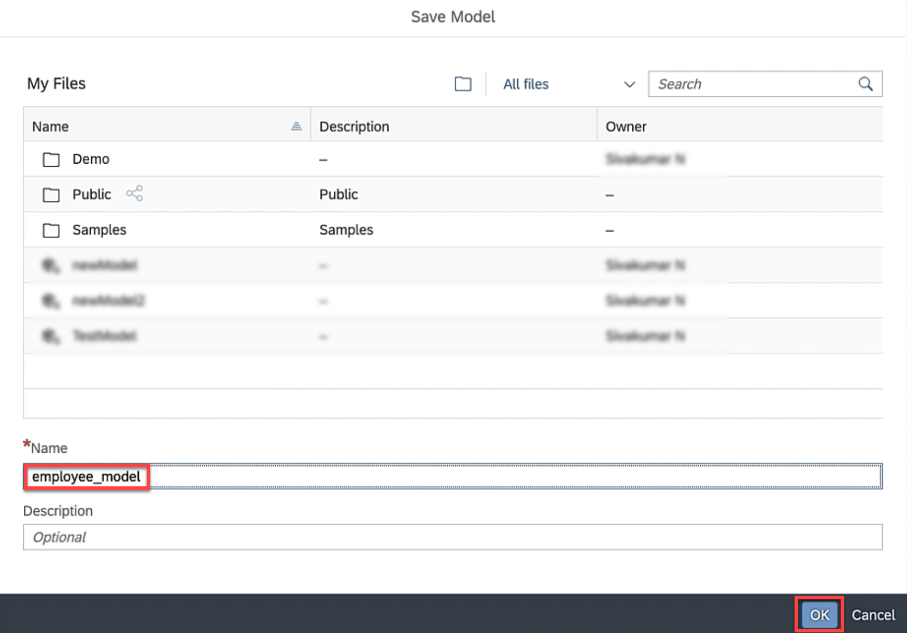

This exercise is part of the openSAP course [Building applications on SAP Business Technology Platform with Microsoft services](https://open.sap.com/courses/btpma1) - there you will find more information and context. 

# Implementation of End to End flow via Federation

In this exercise we will implement the end to end flow. We will create a virtual table for the ADX table in HANA Cloud and consume the virtual table via Calculation view in SAP Analytics Cloud. 

## Problems
> If you have any issues with the exercises, don't hesitate to open a question in the openSAP Discussion forum for this course. Provide the exact step number: "Week4Unit5, Step 1.1: Command cannot be executed. My expected result was [...], my actual result was [...]". Logs, etc. are always highly appreciated. 
 
 
## Step 1 - Create Virtual Table (aka Remote Table) for ADX table in SAP HANA Cloud

1.1. Make sure you that all your involved artefacts are running. 

- SAP HANA Cloud is running [Week 4, Unit 3](../Unit3/README.md#hanacloudstatus)
- Azure VM is running - [Week 4, Unit 3](../Unit3/README.md#restartvm)
- Data Provisioning Agent is started 
    
- SAP HANA Cloud connection is healthy. When your SAP HANA Cloud instance was stopped/restarted, you need to go back to the DPAgent configuration and re-initiate the connection to SAP HANA Cloud. [Week 4, Unit 3](../Unit3/README.md#hanaconnectioninit) shows you how to initiate the connection. 
    
  
  
1.2 Open your SAP HANA Cloud instance in the SAP HANA Database Explorer. 
    

1.2 Open the remote connection you created in the previous unit and locate the table of Azure Data Explorer created in [Week 4, Unit2](../Unit2/README.md).

1.2. Select the table and click **Create Virtual Object(s)**.

1.3. Enter **virtual-employee-sample-data** as table name, select **DBADMIN** as the scheman and click **Create**.

1.4. Double-Click **Tables** in the catalog and open the virtual table that you have created previously.

## Step 2 - Create Calculation View

2.1 Create Calculation view in Business Application Studio :   Follow the tutorials first on ['How to start using SAP Business Application Studio'](https://microlearning.opensap.com/media/How+to+Start+Developing+Applications+with+SAP+Business+Application+Studio+-+SAP+HANA+Cloud/1_gbmyhpa8 ) and then on ['How to create Calculation views'](https://microlearning.opensap.com/media/How+to+Create+Calculation+Views+-+SAP+HANA+Cloud/1_1kyl8ac8 )

2.1.1. Go to SAP BTP cockpit. Open the subaccount 'hanacloud'.

2.1.2. Click on Entitlements on left panel and Click on Configure Entitlements and then on Add Service Plan buttons as shown:

2.1.3 In the resulting screen find Business Application Studio , check the 'trial' plan click on 'Add 1 Service Plan' as shown:

The SAP Business Application Studio entitlement would show up in available entitlements list as shown below:

2.1.4 Now repeat the above process and find SAP HANA Schema and HDI Containers and select all the options as shown and click pn 'Add Service Plans' :

2.1.5 Go to Service Marketplace on left and find SAP Business Application Studio and click on "Create" 

2.1.4  Accept the default values and click 'Create' :

2.1.5 Clicking on Instances and Subscriptions tab on left should show the SAP Business Application Studio as 'Subscribed' as shown. Click on it to bring up the 'Go to Application' button. Click it.

2.1.6 This should take you to the SAP Business Application Studio application in a new tab.

2.1.8  Click on 'Create Dev Space' button.

2.1.11 Once the dev space is created proceed to create Project and select SAP HANA Database project.

2.1.12 Enter name for the project as OPENSAP_WORKSPACE and click next.

2.1.13 Keep the other values as default values and click next button until finish.

2.1.14 Open mta.yaml file and enter the highlighed values.

2.1.15 Click the bind buton next to ups_opensap connection service.

2.1.16 Select Bind to a user provided service

2.1.17 Select ups_opensap from the dropdown

2.1.18 Now its time to deploy the project. Click the rocket icon next to the projecct

[TO DO ]

2.2 Add addtrbutes and measures

2.3 Deploy Calculation View
 

2.4 Verify Deployment
 

## Step 3 - Create Model in SAP Analytics Cloud

3.1 Create Live Data Model
 

3.2 Select Data Source
 

3.3 Save Model
 

## Step 4 - Create Story in SAP Analytics Cloud

4.1 Create Canvas
 

4.2 Add Chart
 

4.3 Select Model
 

4.4 New Canvas with empty chart
 

4.5 Select Measure
 

4.6 Select Dimension
 

4.7 Chart is rendered
 

4.8 Save Canvas
 

